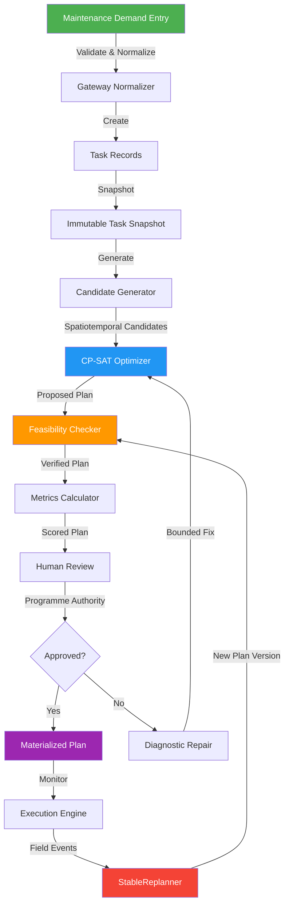
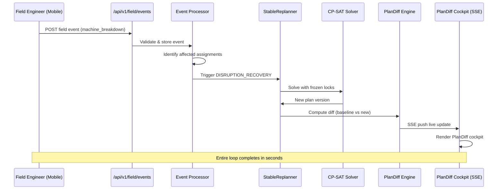
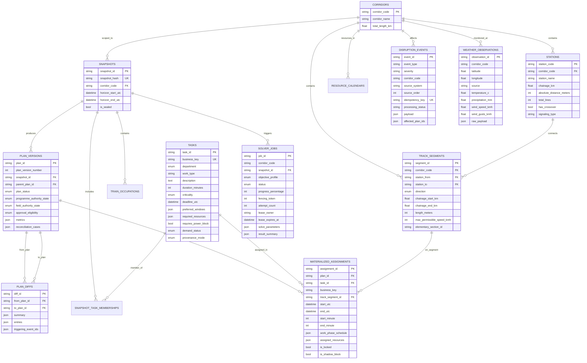
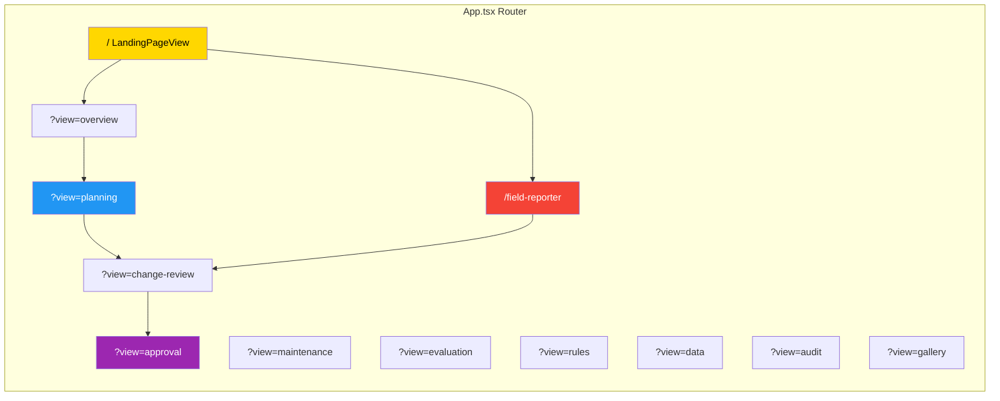

<div align="center">

# 🚄 SAMARATH

### **System for Automated Maintenance Allocation, Rolling Availability, and Track Harmony**

**Smart India Hackathon 2026 • Problem Statement ID: 26027**
**Category: Software • Domain: Transportation & Logistics**

[](https://python.org)
[](https://fastapi.tiangolo.com)
[](https://react.dev)
[](https://developers.google.com/optimization)
[](https://www.postgresql.org)
[](https://www.typescriptlang.org)

---

**AI-Powered Automatic Block Planning Engine to Maximize Asset Availability for Indian Railway Train Operations**

*An intelligent workbench that transforms manual railway maintenance scheduling from weeks of spreadsheet work into optimized, conflict-free plans generated in seconds — while ensuring zero disruption to train services and full G&SR compliance.*

</div>

---

## 📋 Table of Contents

- [Problem Statement](#-problem-statement)
- [Solution Overview](#-solution-overview)
- [Key Features](#-key-features)
- [System Architecture](#-system-architecture)
- [Technology Stack](#-technology-stack)
- [Project Structure](#-project-structure)
- [Database Schema](#-database-schema)
- [API Reference](#-api-reference)
- [Optimization Engine (CP-SAT)](#-optimization-engine-cp-sat)
- [Core Engine Modules](#-core-engine-modules)
- [Frontend Views](#-frontend-views)
- [Live Integrations](#-live-integrations)
- [Safety & Compliance](#-safety--compliance)
- [Getting Started](#-getting-started)
- [Deployment](#-deployment)
- [Team](#-team)

---

## 🎯 Problem Statement

> **SIH 2026 — PS ID 26027:** *Develop an AI-powered system for automatic block planning that maximizes asset availability for train operations while ensuring maintenance activities are efficiently scheduled.*

### The Challenge

Indian Railways operates over **68,000+ route km** of track, scheduling thousands of maintenance activities weekly across Engineering (P.Way, Bridge), Signal & Telecom (S&T), and Electrical (TRD/OHE) departments. The current process suffers from:

| Problem | Impact |
|---------|--------|
| **Manual block requests** via paper forms | 2-3 weeks planning cycle per corridor |
| **No conflict detection** between departments | Overlapping blocks → train detention |
| **No weather awareness** | Unsafe work during adverse conditions |
| **Static plans** that can't adapt to disruptions | Cascading delays when machines break down |
| **No audit trail** for block approvals | Accountability gaps in safety-critical decisions |
| **Greedy first-come-first-served allocation** | Suboptimal infrastructure utilization |

### Our Solution

SAMARATH replaces the entire manual workflow with a **closed-loop, AI-optimized planning engine** that:

1. **Ingests** maintenance demands from all departments
2. **Generates** conflict-free block plans using OR-Tools CP-SAT solver
3. **Validates** against Indian Railway General & Subsidiary Rules (G&SR)
4. **Adapts** in real-time to field disruptions via live mobile reporting
5. **Tracks** every decision through an immutable audit chain

---

## 💡 Solution Overview

```
┌─────────────────────────────────────────────────────────────────────────────┐
│                        SAMARATH — Closed-Loop Architecture                 │
│                                                                             │
│   ┌──────────┐    ┌─────────────┐    ┌────────────┐    ┌───────────────┐   │
│   │  Demand   │───▶│  Snapshot &  │───▶│  CP-SAT    │───▶│  Feasibility  │   │
│   │  Intake   │    │  Candidate   │    │  Optimizer  │    │  Checker      │   │
│   │  Gateway  │    │  Generator   │    │  (OR-Tools) │    │  (Phase 07)   │   │
│   └──────────┘    └─────────────┘    └────────────┘    └───────┬───────┘   │
│        ▲                                                        │           │
│        │                                                        ▼           │
│   ┌──────────┐    ┌─────────────┐    ┌────────────┐    ┌───────────────┐   │
│   │  Field    │◀──│  Stable     │◀──│  PlanDiff   │◀──│  Approval &   │   │
│   │  Reporter │    │  Replanner  │    │  Engine     │    │  Review       │   │
│   │  (Mobile) │    │  (Phase 13) │    │  (Phase 13) │    │  (Phase 15)   │   │
│   └──────────┘    └─────────────┘    └────────────┘    └───────────────┘   │
│        │                                                        │           │
│        ▼                                                        ▼           │
│   ┌──────────┐    ┌─────────────┐    ┌────────────┐    ┌───────────────┐   │
│   │  Weather  │    │  Execution  │    │  Metrics &  │    │  Audit Trail  │   │
│   │  Engine   │    │  Feedback   │    │  Evaluation │    │  (Immutable)  │   │
│   │ (OpenMeteo)│    │  (Phase 16) │    │  (Phase 14) │    │               │   │
│   └──────────┘    └─────────────┘    └────────────┘    └───────────────┘   │
│                                                                             │
└─────────────────────────────────────────────────────────────────────────────┘
```

---

## ✨ Key Features

### 🧠 AI-Powered Optimization
- **Google OR-Tools CP-SAT solver** with finite-placement Boolean formulation
- **Lexicographic multi-objective optimization** (PROGRAMME_IMPROVEMENT & DISRUPTION_RECOVERY profiles)
- **Greedy baseline comparison** — solver results are benchmarked against first-come-first-served
- Handles **mandatory equality constraints**, **hard lock preservation**, and **sparse track collision avoidance**

### 📱 Live Field Reporter (Mobile-First)
- **Mobile-responsive disruption reporting** interface for field engineers
- Real-time event types: Machine Breakdown, Material Delayed, Crew Unavailable, Work Started/Completed
- **SSE (Server-Sent Events)** push live updates to the PlanDiff cockpit
- Events trigger **automatic closed-loop replanning** via `StableReplanner`

### 🌦️ Weather-Aware Planning
- **Open-Meteo API integration** for live hourly corridor forecasts
- Configurable advisory thresholds (OHE wind gust, track ballast rain limits)
- Weather provides **risk advisories for human review** — never automatically certifies work as safe
- All thresholds explicitly tagged as `DEMONSTRATION_CONFIGURATION` for railway specialist verification

### 🔄 Closed-Loop Replanning
- **StableReplanner** engine minimizes disruption to existing plan
- **PlanDiff Engine** computes granular changes: UNCHANGED, SHIFTED, RESOURCE_CHANGED, REPACKAGED, ADDED, CANCELLED, NOW_UNSCHEDULED, COMPLETED
- **Lock conflict escalation** — never automatically unlocks safety-critical assignments
- **Queue debounce/coalescing** prevents solve storms from rapid event bursts

### ✅ Multi-Authority Approval Workflow
- **Programme Authority** (Sr.DEN/Sr.DSTE/Sr.DEE) and **Field Authority** (Section Engineer) dual approval
- **Separation-of-duty enforcement** — admin ≠ approver, self-approval prohibited
- **Versioned content hashing** with ETag-based freshness checks
- **SHA-256 hash-chain audit trail** — every decision is cryptographically linked

### 📊 Defensible Metrics & Evaluation
- **Infrastructure occupation** — interval union per segment without double-counting
- **On-time coverage** — mandatory vs. critical, with permitted lateness thresholds
- **Plan stability index** — measures disruption impact across replans
- **Provenance pinning** — every metric traces to snapshot, plan, rule, calculator version, and hardware

### 🛡️ Safety & Resilience
- **Independent Feasibility Checker** — post-solve verification of all constraints
- **G&SR compliance validation** — Indian Railway rulebook constraints enforced
- **Failure injection harness** — lease expiry, concurrency races, stale publications, retry storms
- **Bounded repair engine** — allowlisted corrections only, never relaxes safety constraints

### 🤖 ML-Powered Urgency Classification
- **Gradient-boosted decision tree** for maintenance criticality prediction
- Features: defect age, severity, traffic density, weather risk, speed restriction status
- **Zero external ML dependency** — model weights embedded for deployment simplicity
- Outputs: Predicted tier with confidence score and feature importance explanation

---

## 🏗️ System Architecture

### High-Level Architecture Diagram

```
                    ┌─────────────────────────────────────────┐
                    │             CLIENT LAYER                 │
                    │                                         │
                    │  ┌──────────┐  ┌──────────┐  ┌───────┐ │
                    │  │ Landing  │  │Workbench │  │ Field │ │
                    │  │  Page    │  │  (SPA)   │  │Reporter│ │
                    │  └────┬─────┘  └────┬─────┘  └───┬───┘ │
                    │       │             │            │      │
                    └───────┼─────────────┼────────────┼──────┘
                            │             │            │
                    ════════╪═════════════╪════════════╪═══════
                            │      REST API + SSE      │
                    ════════╪═════════════╪════════════╪═══════
                            │             │            │
                    ┌───────┼─────────────┼────────────┼──────┐
                    │       ▼             ▼            ▼      │
                    │  ┌────────────────────────────────────┐  │
                    │  │         FastAPI Application         │  │
                    │  │         (app/main.py)               │  │
                    │  └──────────────┬─────────────────────┘  │
                    │                 │                         │
                    │    ┌────────────┼────────────┐           │
                    │    ▼            ▼            ▼           │
                    │ ┌────────┐ ┌─────────┐ ┌──────────┐     │
                    │ │  API   │ │ Engine  │ │ Domain   │     │
                    │ │ Layer  │ │ Layer   │ │ Layer    │     │
                    │ │(20 rtr)│ │(17 eng) │ │(6 svc)  │     │
                    │ └────┬───┘ └────┬────┘ └────┬────┘     │
                    │      │          │           │           │
                    │      └──────────┼───────────┘           │
                    │                 ▼                        │
                    │  ┌────────────────────────────────────┐  │
                    │  │  SQLAlchemy ORM + Async Session     │  │
                    │  │  (13 relational models)             │  │
                    │  └──────────────┬─────────────────────┘  │
                    │                 │                         │
                    │         SERVER LAYER                      │
                    └─────────────────┼────────────────────────┘
                                      │
                              ┌───────▼───────┐
                              │  PostgreSQL   │
                              │    16-alpine  │
                              │  (Docker)     │
                              └───────────────┘
```

### Data Flow: From Demand to Approved Plan



### Replanning Closed-Loop



---

## 🛠️ Technology Stack

| Layer | Technology | Purpose |
|-------|-----------|---------|
| **Frontend** | React 18.3 + TypeScript 5.5 | Single-page application with 12 views |
| **Build Tool** | Vite 5.3 | Lightning-fast HMR and bundling |
| **Charts** | Apache ECharts 5.5 | Interactive data visualization |
| **Icons** | Lucide React | Consistent icon system |
| **Backend** | FastAPI 0.111+ | Async Python API framework |
| **Solver** | Google OR-Tools CP-SAT 9.10+ | Constraint programming optimization |
| **ORM** | SQLAlchemy 2.0 (async) | Database abstraction with relationships |
| **Migrations** | Alembic 1.13 | Schema version management |
| **Database** | PostgreSQL 16 / SQLite (dev) | Relational persistence |
| **Auth** | python-jose + passlib | JWT tokens + bcrypt hashing |
| **HTTP Client** | httpx 0.27+ | Async external API calls |
| **Weather API** | Open-Meteo (free, no key) | Live corridor weather forecasts |
| **Containerization** | Docker Compose | Production deployment |

---

## 📁 Project Structure

```
SAMARATH/
├── README.md                             # This file
├── .gitignore                            # Git ignore rules
│
├── backend/                              # Python FastAPI Backend
│   ├── requirements.txt                  # Python dependencies
│   ├── pyproject.toml                    # Project metadata
│   ├── alembic.ini                       # Migration configuration
│   ├── .env.example                      # Environment template
│   ├── openapi.json                      # Generated OpenAPI spec
│   │
│   ├── app/                              # Application source
│   │   ├── main.py                       # FastAPI entrypoint + CORS + lifecycle
│   │   ├── config.py                     # Pydantic settings (env-driven)
│   │   │
│   │   ├── api/                          # REST API Layer
│   │   │   ├── router.py                 # Central router (20 sub-routers)
│   │   │   └── v1/                       # Versioned endpoints
│   │   │       ├── health.py             # Health check
│   │   │       ├── auth.py               # JWT authentication
│   │   │       ├── tasks.py              # Maintenance task CRUD
│   │   │       ├── snapshots.py          # Immutable snapshot management
│   │   │       ├── gateway.py            # Demand intake & normalization
│   │   │       ├── packages.py           # Work package bundling
│   │   │       ├── planning.py           # CP-SAT solve orchestration
│   │   │       ├── checker.py            # Feasibility validation
│   │   │       ├── rules.py              # G&SR rule configuration
│   │   │       ├── readiness.py          # Block readiness assessment
│   │   │       ├── disruptions.py        # Disruption event management
│   │   │       ├── evaluation.py         # Metric evaluation & comparison
│   │   │       ├── approval.py           # Multi-authority approval workflow
│   │   │       ├── execution.py          # Field execution feedback
│   │   │       ├── diagnostics.py        # Solver diagnostics & repair
│   │   │       ├── resilience.py         # Failure injection testing
│   │   │       ├── ml_predictions.py     # ML urgency predictions
│   │   │       ├── field.py              # Live field reporter events + SSE
│   │   │       ├── weather.py            # Weather advisory endpoints
│   │   │       └── rbac_demo.py          # Role-based access demo
│   │   │
│   │   ├── engine/                       # Core Business Logic Engines
│   │   │   ├── cp_sat_solver.py          # OR-Tools CP-SAT optimizer (548 lines)
│   │   │   ├── candidate_generator.py    # Spatiotemporal candidate enumeration
│   │   │   ├── greedy_baseline.py        # FCFS baseline for benchmarking
│   │   │   ├── stable_replanner.py       # Disruption recovery replanner
│   │   │   ├── plandiff_engine.py        # Plan version diff calculator
│   │   │   ├── approval_engine.py        # Multi-authority approval logic
│   │   │   ├── execution_engine.py       # Execution tracking & residuals
│   │   │   ├── diagnostics_engine.py     # Unscheduled task diagnostics
│   │   │   ├── metrics_calculator.py     # Defensible metric computation
│   │   │   ├── weather_engine.py         # Open-Meteo integration
│   │   │   ├── ml_urgency_classifier.py  # ML criticality prediction
│   │   │   ├── disruption_events.py      # Disruption event processing
│   │   │   ├── monthly_allocator.py      # Monthly block allocation
│   │   │   ├── resilience_harness.py     # Failure injection tests
│   │   │   ├── benchmark_harness.py      # Performance benchmarking
│   │   │   ├── fair_comparison.py        # Solver comparison engine
│   │   │   └── stress_testing.py         # Load & stress testing
│   │   │
│   │   ├── domain/                       # Domain Services
│   │   │   ├── job_service.py            # Solve job lifecycle management
│   │   │   ├── packages.py               # Work package construction
│   │   │   ├── readiness.py              # Block readiness assessment
│   │   │   ├── reconciliation.py         # Plan reconciliation logic
│   │   │   ├── rules.py                  # G&SR rule enforcement
│   │   │   └── spatial.py                # Track footprint resolution
│   │   │
│   │   ├── db/                           # Database Layer
│   │   │   ├── models.py                 # 13 SQLAlchemy ORM models
│   │   │   ├── session.py                # Async session factory
│   │   │   ├── base.py                   # Declarative base
│   │   │   └── seed_data/                # VKC corridor seed data
│   │   │
│   │   ├── schemas/                      # Pydantic Schemas (26 files)
│   │   │   ├── enums.py                  # Domain enumerations
│   │   │   ├── task.py                   # Task schemas
│   │   │   ├── snapshot.py               # Snapshot schemas
│   │   │   ├── candidate.py              # Placement candidate schemas
│   │   │   ├── optimizer.py              # Solver request/result schemas
│   │   │   ├── checker.py                # Feasibility check schemas
│   │   │   ├── approval.py               # Approval workflow schemas
│   │   │   ├── execution.py              # Execution feedback schemas
│   │   │   ├── disruption.py             # Disruption & PlanDiff schemas
│   │   │   ├── metrics_evaluation.py     # Metric computation schemas
│   │   │   ├── resilience.py             # Resilience testing schemas
│   │   │   └── ...                       # Additional domain schemas
│   │   │
│   │   ├── checker/                      # Independent Verification
│   │   │   ├── feasibility_checker.py    # Post-solve constraint verification
│   │   │   ├── tiny_oracle.py            # Compact rule oracle
│   │   │   └── fixtures.py               # Test fixtures
│   │   │
│   │   ├── gateway/                      # Data Intake Gateway
│   │   │   ├── service.py                # Import orchestration
│   │   │   ├── normalizer.py             # Multi-source normalization
│   │   │   └── quarantine_store.py       # Invalid record quarantine
│   │   │
│   │   ├── worker/                       # Background Processing
│   │   │   └── solve_worker.py           # Async job processor with lease mgmt
│   │   │
│   │   └── core/                         # Cross-cutting Concerns
│   │       └── logging.py                # Structured logging
│   │
│   ├── alembic/                          # Database migrations
│   ├── scripts/                          # Utility scripts
│   └── tests/                            # Test suite
│
├── frontend/                             # React + TypeScript Frontend
│   ├── package.json                      # Node dependencies
│   ├── vite.config.ts                    # Vite build configuration
│   ├── tsconfig.json                     # TypeScript config
│   ├── index.html                        # HTML entry
│   │
│   └── src/
│       ├── App.tsx                        # Root component with routing
│       ├── main.tsx                       # React DOM mount
│       │
│       ├── views/                         # Page-level views (12 views)
│       │   ├── LandingPageView.tsx        # Cinematic landing page (196KB)
│       │   ├── FieldReporterView.tsx      # Mobile field disruption reporter
│       │   ├── ChangeReviewView.tsx       # PlanDiff cockpit with SSE
│       │   ├── PlanningView.tsx           # CP-SAT solve orchestration UI
│       │   ├── ApprovalView.tsx           # Multi-authority approval workflow
│       │   ├── EvaluationView.tsx         # Metrics dashboard & comparison
│       │   ├── MaintenanceView.tsx        # Task management interface
│       │   ├── DataView.tsx               # Data exploration & filtering
│       │   ├── RulesView.tsx              # G&SR rule configuration
│       │   ├── OverviewView.tsx           # System overview dashboard
│       │   ├── AuditView.tsx              # Audit trail viewer
│       │   └── ComponentGalleryView.tsx   # Design system reference
│       │
│       ├── components/                    # Reusable components
│       │   ├── AppShell.tsx               # Main layout shell with nav
│       │   ├── common/                    # Shared UI components
│       │   ├── planning/                  # Planning-specific components
│       │   ├── outcomes/                  # Outcome visualization
│       │   └── resilience/                # Resilience testing UI
│       │
│       ├── api/                           # API client layer
│       ├── types/                         # TypeScript type definitions
│       └── styles/                        # CSS stylesheets
│
├── deploy/                                # Deployment Configuration
│   └── docker-compose.yml                # PostgreSQL service definition
│
└── docs/                                  # Documentation & Diagrams
    ├── SCOPE.md                           # Feature scope definition
    ├── DECISIONS.md                       # Architecture Decision Records
    ├── API_CONTRACT.md                    # API specification document
    ├── ACCEPTANCE_MATRIX.md               # Acceptance test matrix
    ├── DEMO_SCRIPT.md                     # Live demo walkthrough
    ├── RUNBOOK.md                         # Operational runbook
    ├── IMPLEMENTATION_STATE.md            # Implementation progress tracker
    ├── diagrams/                          # 20 PlantUML architecture diagrams
    ├── phase-reports/                     # Phase completion reports
    └── SIH_Submission/                    # SIH submission artifacts
```

---

## 🗄️ Database Schema

SAMARATH uses a **13-table relational schema** with full foreign key spine, check constraints, and composite indexes for query performance.

### Entity-Relationship Diagram



### Key Design Decisions

| Decision | Rationale |
|----------|-----------|
| **UUID primary keys** | Distributed generation without coordination |
| **Snapshot immutability** | `is_sealed=True` prevents retroactive modification |
| **Idempotency keys** on disruptions | Prevents duplicate event processing |
| **Fencing tokens** on solver jobs | Prevents stale worker results from overwriting |
| **JSON columns** for resources & windows | Flexible schema for varying department needs |
| **Composite indexes** | `(corridor_code, status)` for fast job queries |
| **Check constraints** | `chainage_end >= chainage_start`, `duration > 0` |
| **Cascade deletes** | Corridor to Stations to Segments cascade correctly |

---

## 🔌 API Reference

SAMARATH exposes **20 API route groups** under `/api/v1/`. Full OpenAPI spec available at `/docs`.

### Core Planning APIs

| Method | Endpoint | Description |
|--------|----------|-------------|
| `GET` | `/api/v1/health` | System health check |
| `POST` | `/api/v1/auth/login` | JWT token authentication |
| `GET/POST` | `/api/v1/tasks` | Maintenance task CRUD |
| `POST` | `/api/v1/gateway/import` | Multi-source demand intake |
| `POST` | `/api/v1/snapshots` | Create immutable task snapshot |
| `POST` | `/api/v1/planning/solve` | Trigger CP-SAT optimization |
| `GET` | `/api/v1/planning/jobs/{id}` | Poll solve job status |
| `GET` | `/api/v1/planning/plans/{id}` | Retrieve materialized plan |
| `POST` | `/api/v1/checker/validate` | Run feasibility checker |

### Disruption & Field APIs

| Method | Endpoint | Description |
|--------|----------|-------------|
| `POST` | `/api/v1/field/events` | Submit field disruption event |
| `GET` | `/api/v1/field/events/stream` | SSE live event stream |
| `POST` | `/api/v1/disruptions` | Create disruption event |
| `POST` | `/api/v1/disruptions/replan` | Trigger stable replanning |
| `GET` | `/api/v1/weather/corridor/{code}` | Get corridor weather advisory |

### Approval & Execution APIs

| Method | Endpoint | Description |
|--------|----------|-------------|
| `POST` | `/api/v1/approval/review` | Submit plan review |
| `POST` | `/api/v1/approval/approve` | Approve/reject plan |
| `GET` | `/api/v1/approval/audit-trail/{plan_id}` | Immutable audit trail |
| `POST` | `/api/v1/execution/record` | Submit execution feedback |
| `GET` | `/api/v1/execution/variances/{plan_id}` | Plan vs. actual variances |

### Analytics & ML APIs

| Method | Endpoint | Description |
|--------|----------|-------------|
| `POST` | `/api/v1/evaluation/compare` | Multi-plan comparison |
| `GET` | `/api/v1/evaluation/metrics/{plan_id}` | Computed plan metrics |
| `POST` | `/api/v1/ml/predict-urgency` | ML criticality prediction |
| `POST` | `/api/v1/resilience/inject` | Failure injection test |
| `GET` | `/api/v1/diagnostics/unscheduled/{plan_id}` | Unscheduled task diagnostics |
| `GET` | `/api/v1/rules` | G&SR rule configuration |
| `GET` | `/api/v1/readiness/{plan_id}` | Block readiness assessment |

---

## ⚙️ Optimization Engine (CP-SAT)

### How the Solver Works

The core of SAMARATH is a **Google OR-Tools CP-SAT** constraint programming solver that formulates weekly maintenance scheduling as a **finite-placement Boolean optimization problem**.

```
┌──────────────────────────────────────────────────────────────────┐
│                    CP-SAT SOLVER PIPELINE                        │
│                                                                  │
│  1. CANDIDATE GENERATION                                         │
│     ┌──────────────────────────────────────────────────┐        │
│     │ For each task T:                                  │        │
│     │   For each eligible time window W:                │        │
│     │     For each qualified resource R:                │        │
│     │       Generate PlacementCandidate(T, W, R)        │        │
│     │       Check: no train collision                   │        │
│     │       Check: resource calendar availability       │        │
│     │       Check: track segment not occupied            │        │
│     └──────────────────────────────────────────────────┘        │
│                          |                                       │
│                          v                                       │
│  2. BOOLEAN FORMULATION                                          │
│     ┌──────────────────────────────────────────────────┐        │
│     │ Variables: x[c] in {0, 1} for each candidate c   │        │
│     │                                                   │        │
│     │ Hard Constraints:                                 │        │
│     │   - At-most-one:  sum x[c] <= 1   for all task T │        │
│     │   - Mandatory:    sum x[c] = 1   if T is TIER_1  │        │
│     │   - Hard locks:   x[c_locked] = 1                 │        │
│     │   - No overlap:   x[c1] + x[c2] <= 1  if collide │        │
│     │   - Resource cap: sum x[c] <= capacity  per slot  │        │
│     └──────────────────────────────────────────────────┘        │
│                          |                                       │
│                          v                                       │
│  3. LEXICOGRAPHIC OPTIMIZATION                                   │
│     ┌──────────────────────────────────────────────────┐        │
│     │ Stage 1: Maximize mandatory task coverage         │        │
│     │ Stage 2: Maximize critical task coverage          │        │
│     │ Stage 3: Maximize optional task coverage          │        │
│     │ Stage 4: Minimize infrastructure occupation       │        │
│     │ Stage 5: Maximize resource utilization            │        │
│     │                                                   │        │
│     │ Each stage locks the previous objective as a      │        │
│     │ constraint before optimizing the next.            │        │
│     └──────────────────────────────────────────────────┘        │
│                          |                                       │
│                          v                                       │
│  4. POST-SOLVE VERIFICATION                                      │
│     ┌──────────────────────────────────────────────────┐        │
│     │ IndependentFeasibilityChecker validates:          │        │
│     │   - No track segment time overlaps                │        │
│     │   - All mandatory tasks scheduled                 │        │
│     │   - Resource capacity not exceeded                │        │
│     │   - Hard locks preserved                          │        │
│     │   - Train path clearance maintained               │        │
│     └──────────────────────────────────────────────────┘        │
│                                                                  │
└──────────────────────────────────────────────────────────────────┘
```

### Objective Profiles

| Profile | Use Case | Priority Order |
|---------|----------|----------------|
| `PROGRAMME_IMPROVEMENT` | Normal weekly planning | Coverage then Occupation then Utilization |
| `DISRUPTION_RECOVERY` | Post-disruption replanning | Stability then Coverage then Minimized changes |

### Solver Configuration

```python
OptimizerSolveRequest(
    objective_profile="PROGRAMME_IMPROVEMENT",
    time_budget_seconds=120,        # Max solve time
    stage_time_budget_seconds=30,   # Per-stage limit
    min_gap_tolerance=0.01,         # 1% optimality gap
    num_search_workers=8,           # Parallel threads
)
```

---

## 🧩 Core Engine Modules

### Module Dependency Graph

```mermaid
graph TB
    subgraph API["API Layer - 20 routers"]
        planning_api["Planning API"]
        field_api["Field API"]
        approval_api["Approval API"]
        weather_api["Weather API"]
    end
    
    subgraph Engine["Engine Layer - 17 engines"]
        cpsat["CP-SAT Solver"]
        cgen["Candidate Generator"]
        greedy["Greedy Baseline"]
        stable["StableReplanner"]
        plandiff["PlanDiff Engine"]
        approval["Approval Engine"]
        exec_eng["Execution Engine"]
        diag["Diagnostics Engine"]
        metrics["Metrics Calculator"]
        weather["Weather Engine"]
        ml["ML Classifier"]
        disrupt["Disruption Events"]
        monthly["Monthly Allocator"]
        resil["Resilience Harness"]
        bench["Benchmark Harness"]
        fair["Fair Comparison"]
        stress["Stress Testing"]
    end
    
    subgraph Domain["Domain Layer - 6 services"]
        jobs["Job Service"]
        pkgs["Packages"]
        ready["Readiness"]
        recon["Reconciliation"]
        rules["Rules"]
        spatial["Spatial"]
    end
    
    subgraph Checker["Verification Layer"]
        fcheck["Feasibility Checker"]
        oracle["Tiny Oracle"]
    end
    
    planning_api --> cpsat
    planning_api --> cgen
    field_api --> stable
    field_api --> disrupt
    approval_api --> approval
    weather_api --> weather
    
    cpsat --> cgen
    cpsat --> fcheck
    cpsat --> greedy
    stable --> disrupt
    stable --> cpsat
    plandiff --> stable
    
    cgen --> spatial
    cgen --> pkgs
    cpsat --> rules
    
    style cpsat fill:#2196F3,color:#fff
    style stable fill:#F44336,color:#fff
    style approval fill:#9C27B0,color:#fff
    style weather fill:#4CAF50,color:#fff
```



### Module Details

| Module | Lines | Description |
|--------|-------|-------------|
| `cp_sat_solver.py` | 548 | Core OR-Tools CP-SAT optimizer with lexicographic stages |
| `approval_engine.py` | 908 | Multi-authority approval with ETag freshness, hash chains |
| `diagnostics_engine.py` | 743 | Root-cause diagnostics for unscheduled tasks with bounded repairs |
| `execution_engine.py` | 609 | Execution feedback, partial work tracking, residual generation |
| `ml_urgency_classifier.py` | 510 | Gradient-boosted criticality prediction (no external ML deps) |
| `plandiff_engine.py` | 445 | 8-category plan version diff with triggering event links |
| `metrics_calculator.py` | 446 | Interval union occupation, on-time coverage, provenance |
| `resilience_harness.py` | 447 | 5 failure injection scenarios for robustness verification |
| `stable_replanner.py` | 305 | Disruption recovery with lock conflict escalation |
| `candidate_generator.py` | 245 | Sparse spatiotemporal candidate enumeration |
| `weather_engine.py` | 222 | Open-Meteo integration with fallback caching |
| `disruption_events.py` | ~400 | Event processing, coalescing, applicability invalidation |
| `monthly_allocator.py` | ~350 | Monthly block hour allocation across departments |
| `greedy_baseline.py` | ~240 | FCFS baseline for solver comparison |
| `benchmark_harness.py` | ~220 | Performance profiling and benchmarking |
| `fair_comparison.py` | ~140 | Side-by-side solver evaluation |
| `stress_testing.py` | ~250 | Load and stress testing utilities |

---

## 🖥️ Frontend Views

### View Architecture



### View Details

| View | Size | Description |
|------|------|-------------|
| **LandingPageView** | 196 KB | Cinematic full-screen landing with animated hero, feature cards, live stats, architecture showcase, and team section |
| **FieldReporterView** | 26 KB | Mobile-responsive disruption reporter with event type selection, affected asset lookup, weather sidebar, and submission workflow |
| **ChangeReviewView** | 63 KB | PlanDiff cockpit with SSE live updates, 8-category diff visualization, timeline comparison, and approval triggers |
| **ApprovalView** | 55 KB | Dual-authority approval workflow with eligibility checks, lock management, audit trail, and evidence export |
| **EvaluationView** | 53 KB | Multi-plan metric comparison dashboard with spider charts, occupation heatmaps, and provenance display |
| **DataView** | 35 KB | Data exploration with corridor topology, train occupations, resource calendars, and segment filtering |
| **RulesView** | 31 KB | G&SR rule configuration with rule editing, validation, and compliance reporting |
| **PlanningView** | 24 KB | CP-SAT solve orchestration with job monitoring, stage progress, and result inspection |
| **AppShell** | 22 KB | Main layout shell with sidebar navigation, breadcrumbs, and notification system |
| **MaintenanceView** | 21 KB | Task management with department filtering, criticality badges, and deadline tracking |
| **OverviewView** | 5 KB | System overview dashboard with navigation shortcuts |
| **AuditView** | 4 KB | Immutable audit trail viewer with hash chain verification |

---

## 🌐 Live Integrations

### Open-Meteo Weather API

```
┌─────────────┐       GET /v1/forecast         ┌──────────────┐
│  SAMARATH   │ ------------------------------>│  Open-Meteo  │
│  Weather    │  lat, lon, hourly params        │  API (Free)  │
│  Engine     │ <------------------------------│              │
│             │  temperature, precipitation,    │  No API Key  │
│             │  wind_speed, wind_gusts         │  Required    │
└──────┬──────┘                                 └──────────────┘
       │
       v
┌──────────────┐
│  Advisory    │  Warning: "Wind gusts 52 km/h exceed OHE limit"
│  Generation  │  Warning: "Precipitation 18mm exceeds ballast limit"
│              │  Info: "Thresholds are DEMONSTRATION_CONFIGURATION"
└──────────────┘
```

> **Important:** Weather provides **risk advisories for human review**. It never automatically certifies a block as safe or unsafe. All thresholds are explicitly tagged as demonstration values requiring railway specialist verification.

### SSE (Server-Sent Events) Live Updates

```
┌────────────┐  POST /field/events   ┌───────────┐  SSE Stream   ┌────────────┐
│   Field    │ -------------------->│  Backend  │ ------------->│  PlanDiff  │
│  Reporter  │  event: machine_down  │  Event    │  data: {...}  │  Cockpit   │
│  (Mobile)  │                       │  Processor│               │  (Browser) │
└────────────┘                       └─────┬─────┘               └────────────┘
                                           │
                                           v
                                    ┌───────────┐
                                    │  Stable   │
                                    │ Replanner │
                                    │  (Auto)   │
                                    └───────────┘
```

---

## 🛡️ Safety & Compliance

### G&SR (General & Subsidiary Rules) Compliance

SAMARATH enforces Indian Railway safety rules at every stage:

| Rule Category | Enforcement Point | Description |
|--------------|-------------------|-------------|
| **Track Isolation** | Candidate Generator | No two maintenance blocks on adjacent tracks without crossover protection |
| **Power Block** | CP-SAT Constraints | OHE work requires explicit power block on elementary section |
| **Speed Restriction** | Task Validation | Post-maintenance TSR (Temporary Speed Restriction) scheduling |
| **Mandatory Deadlines** | Solver Hard Constraint | TIER_1_MANDATORY tasks must be scheduled or solver reports infeasibility |
| **Train Path Clearance** | Collision Avoidance | Maintenance cannot overlap with scheduled train occupations |
| **Setup/Restoration Buffer** | Task Model | 30-min default buffers before and after block work |

### Safety Invariants (Never Violated)

1. **Lock conflicts create escalation, never automatic unlock**
2. **"Work completed" is separate from permission to reopen track**
3. **Bounded repairs never relax safety constraints**
4. **Feasibility checker runs independently post-solve**
5. **Weather advisories do not certify blocks as safe**
6. **Separation-of-duty enforced in approvals**

---

## 🚀 Getting Started

### Prerequisites

- **Python 3.11+**
- **Node.js 18+** and **npm**
- **PostgreSQL 16** (or use SQLite for development)
- **Git**

### 1. Clone the Repository

```bash
git clone https://github.com/Arjundas08/SAMARATH.git
cd SAMARATH
```

### 2. Backend Setup

```bash
cd backend

# Create virtual environment
python -m venv venv
source venv/bin/activate  # On Windows: venv\Scripts\activate

# Install dependencies
pip install -r requirements.txt

# Configure environment
cp .env.example .env
# Edit .env with your database credentials

# Start PostgreSQL (via Docker)
cd ../deploy
docker-compose up -d
cd ../backend

# Run database migrations
alembic upgrade head

# Seed demonstration data (VKC Corridor)
python generate_vkc_seed.py

# Start the backend server
uvicorn app.main:app --reload --host 0.0.0.0 --port 8000
```

The API is now available at `http://localhost:8000/docs`

### 3. Frontend Setup

```bash
cd frontend

# Install dependencies
npm install

# Start development server
npm run dev
```

The frontend is now available at `http://localhost:5173`

### 4. Quick Verification

```bash
# Health check
curl http://localhost:8000/api/v1/health

# Expected response:
# {"status": "healthy", "system": "SAMARATH"}
```

### Development with SQLite (No Docker Required)

For quick local development without PostgreSQL, update your `.env`:

```env
DATABASE_URL=sqlite+aiosqlite:///./samarath.db
```

---

## 🐳 Deployment

### Docker Compose (Production)

```bash
cd deploy
docker-compose up -d
```

This starts:
- **PostgreSQL 16 Alpine** on port `5432`
- Health check with `pg_isready`
- Persistent volume for data

### Environment Variables

| Variable | Default | Description |
|----------|---------|-------------|
| `APP_ENV` | `development` | Environment mode |
| `APP_PORT` | `8000` | Backend port |
| `DATABASE_URL` | `postgresql+asyncpg://...` | Async database URL |
| `SECRET_KEY` | (demo value) | JWT signing key — **change in production** |
| `DEFAULT_CORRIDOR` | `VKC` | Default demonstration corridor |
| `TZ` | `Asia/Kolkata` | Timezone |

---

## 📐 Architecture Decision Records

Key architectural decisions are documented in `docs/DECISIONS.md`:

| ADR | Decision | Rationale |
|-----|----------|-----------|
| ADR-001 | CP-SAT over heuristics | Mathematical optimality guarantees with feasibility proofs |
| ADR-002 | Snapshot immutability | Reproducible plans; prevents retroactive input modification |
| ADR-003 | Lexicographic multi-stage | Avoids weight-tuning; mandatory coverage is always first priority |
| ADR-004 | Fencing tokens on jobs | Prevents stale worker results from overwriting fresher solutions |
| ADR-005 | Independent feasibility checker | Defense-in-depth: solver bugs do not produce unsafe plans |
| ADR-006 | Hash-chain audit trail | Tamper detection without external blockchain infrastructure |
| ADR-007 | SSE over WebSocket | Simpler server push; sufficient for unidirectional event streams |
| ADR-008 | Embedded ML weights | Zero external ML dependency; deploys as pure Python |
| ADR-009 | Lock conflict escalation | Safety-critical locks never auto-removed by automation |

---

## 📊 Key Metrics Tracked

| Metric | Formula | Purpose |
|--------|---------|---------|
| **Infrastructure Occupation** | Union of block intervals per segment / (horizon x segments) | Track utilization percentage |
| **Mandatory Coverage** | scheduled_mandatory / total_mandatory | TIER_1 task completion rate |
| **Plan Stability Index** | unchanged_assignments / total_comparable_assignments | Disruption impact measure |
| **Resource Utilization** | allocated_hours / available_hours per resource | Equipment efficiency |
| **On-Time Delivery** | on_time_tasks / (total_tasks - explicitly_deferred) | Schedule adherence |

---

## 🏆 Team

**Team Nirvikalp** — SIH 2026

| Role | Responsibility |
|------|---------------|
| Backend Architecture | FastAPI, CP-SAT Solver, Database Design |
| Frontend Engineering | React UI, Real-time SSE, Mobile Field Reporter |
| Domain Engineering | G&SR Rules, Approval Workflow, Railway Domain Logic |
| ML Engineering | Urgency Classifier, Feature Engineering |
| DevOps & Testing | Docker, CI/CD, Resilience Testing, Stress Testing |
| Documentation & UX | Architecture Diagrams, Demo Scripts, UI/UX Design |

---

## 📝 License

This project was developed as part of **Smart India Hackathon 2026** for Problem Statement ID **26027**.

---

<div align="center">

**Built with ❤️ for Indian Railways**

*Maximizing asset availability. Minimizing train detention. Ensuring safety.*

🚄 **SAMARATH** — *Where AI meets Rail Infrastructure*

</div>
