# NIRVIKALP - SAMARATH
# Production-Ready Railway Block Planning Solution Blueprint
## SIH26027 - Smart India Hackathon 2026

**Version 1.0 - Final Pre-Implementation Blueprint**

**Research cut-off:** 22 September 2026. **Assembly date:** 25 September 2026. **Document status:** design baseline for implementation; not a completed product, railway certification or operational authority. **Prepared for:** Arjun and Team NIRVIKALP. **Organization named in PS:** Ministry of Railways. **Category/theme:** Software / Transportation & Logistics.

“Production-ready” in this title describes the intended engineering coverage. Production readiness must still be earned through implementation, security testing, authorized data integration, railway rule validation and pilot acceptance.

Evidence legend: **VERIFIED** = directly supported within the source's scope; **STRONGLY SUPPORTED** = credible but limited provenance/coverage; **INFERRED** = analytical interpretation; **PROPOSED DESIGN** = a decision made in this blueprint; **ASSUMPTION** = a test or sizing premise; **UNKNOWN** = not established. All prescriptions, schemas, APIs, role names, targets and algorithms below are PROPOSED DESIGN unless explicitly labelled otherwise. They are not official CRIS interfaces or railway rules.

## 1. Executive solution and frozen decisions

SAMARATH will be a territory-scoped planning assistant that turns versioned maintenance needs, infrastructure occupation, resource readiness and compatibility evidence into reviewable monthly allocations and weekly schedules. Every result comes from an immutable input snapshot through one planning pipeline. Test records and authorized records use the same domain logic, solver, checker and metric calculator.

| Decision | Frozen choice | Delivery stage |
|---|---|---|
| Application architecture | Modular Python backend, separate CPU worker process, React client, PostgreSQL | BUILD NOW |
| Primary optimizer | OR-Tools CP-SAT; finite candidate-placement formulation with explicit search-domain limits | BUILD NOW |
| Baseline | Coordinated priority/deadline-first greedy with grouping and limited repair | BUILD NOW |
| Validation | Separate deterministic checker reading raw snapshot plus proposed assignments | BUILD NOW |
| Planning horizons | Calendar-month allocation and a seven-day detailed refinement; explicit reconciliation | BUILD NOW |
| Data entry | TEST and authorized CSV/JSON import; one normalized contract | BUILD NOW |
| Railway integrations | Owner-approved export first; authenticated interfaces only after contracts | PILOT LATER |
| Identity | Keycloak OIDC, server-side session, functional roles plus territory scope | BUILD NOW |
| Background work | Durable PostgreSQL job/outbox tables with leased workers; no Redis/Celery/Kafka initially | BUILD NOW |
| Spatial model | Versioned topological resources and integer chainage; PostGIS only for later geographic display/query needs | BUILD NOW / PILOT LATER |
| Learned models | No operational ML trained on synthetic labels | FUTURE ONLY, data gated |
| Field authority | Remains in authorized railway processes; read-only external authority observations | ALL STAGES |

The initial product is a real end-to-end bounded system, not a national dispatcher. Default demonstration scope is six fictional stations, both directions, three departments, 60 tasks across a calendar month, with up to 30 in a detailed week. These are ASSUMPTIONS for sizing, not reported railway data. Larger acceptance workloads are specified in Section 42.

## 2. Problem revalidation and compliance contract

**Evidence status:** the official SIH26027 entry was inspected earlier in this research session. Refresh attempts during this final design pass returned access errors. Its previously inspected requirements remain the baseline; a fresh official export is a release gate before submission. The supplied master report is byte-identical to the report prepared in this task; it is supporting work, not an independent authority. [R01]

The official requirement fragments below are condensed; all design interpretations and acceptance evidence are proposed. “AI/ML prioritization” remains a substantive wording issue: constrained search and transparent rules are implemented now, while learned prediction is conditional on valid history. Obtain organizer confirmation rather than silently declaring that distinction accepted.

| Requirement | Component / input / output | Demonstration and evidence | Railway dependency |
|---|---|---|---|
| Defects and maintenance needs | Gateway consumes departmental asset/task records; normalized task revisions | Import malformed and valid records; inspect lineage | TMS/SMMS/TDMS export contracts |
| Overdue work | Priority policy consumes due date and completion status; lateness classification | Change due date; new snapshot changes priority/explanation | Authorized due rules |
| BDMS demand context | Demand linkage preserves request and lifecycle identifiers | Trace task to demand without fabricating grant | Current BDMS/RBS semantics |
| Corridor/block availability | Window model consumes scope, time and conditions | Remove window; solver loses that opportunity | Approved planning calendar |
| Train timetable | Resource occupation inputs from WTT/operating data | Move path; conflict checker and plan recompute | Complete relevant passing/route data |
| Goods forecast from Control Office | Forecast vintages become declared path constraints/scenarios | Change forecast; compare snapshot and impact | Forecast issue-time contract |
| Criticality and urgency | Authorized tiers and mandatory set | Escalate task; mandatory conflict returns infeasibility | Owner-approved policy |
| Availability impact | Union occupation plus transparent operating proxy | Hand-check computed metrics | Local KPI agreement |
| Intelligent prioritization/scheduling | CP-SAT, policy ranking, explanations; later ML gate | Actual solve, honest status, baseline comparison | Clarify AI/ML expectation; future labels |
| Multi-department coordination | Evidence-validated packages and resources | Allowed, prohibited and unknown combinations | Applicable compatibility evidence |
| Weekly plans | Detailed planner and checker | Exact start/end, resources, unscheduled reasons | Current detail/readiness |
| Monthly plans | Allocation planner and reconciliation | Week allocation plus explicit weekly exception | Longer-horizon estimates |
| Reduced downtime / reliable operations | Objective hierarchy and outcome metrics | Compare equal inputs; show no-benefit case | Real-world improvement needs pilot |

No requirement is satisfied by a screen alone. Each row must have an automated acceptance test, a persisted result and a visible user action.

## 3. What Railways already has

**VERIFIED:** the Railway Board's 29 August 2023 procedure prescribes joint rolling-block planning, weekly review, resource preparation and programme approval. CRIS describes departmental maintenance systems and COA operating information. **STRONGLY SUPPORTED:** a third-party-hosted BDMS manual describes shared departmental workflow; exact current product scope remains unverified. [R02][R03][R04][R05][R06][R07]

| Existing owner/system | SAMARATH boundary |
|---|---|
| Engineering / TMS | Consume authorized maintenance/condition records; do not replace asset master |
| S&T / SMMS | Preserve apparatus, route and testing semantics |
| TRD / TDMS | Preserve electrical sections and isolation requirements |
| Operating / COA and timetable sources | Consume authorized occupation, forecast and corridor information |
| BDMS/RBS / competent workflow owners | Link demands/proposals; do not acquire autonomous grant authority |
| Joint planning and approving officials | Present alternatives and record their decisions under configured delegation |

Internal API infrastructure is documented through PRAVAH. This does not establish open maintenance endpoints or entitlement. **No official public API located during this research** for the required complete operational planning inputs. [R08]

## 4. Precise gap and corrections to the dossier

**INFERRED:** the defensible target is better selection, explanation and revision of feasible planning choices. Whether current production BDMS/RBS already provides each proposed function must be established in a walkthrough. Absence of public documentation is not evidence of absence.

| Dossier ambiguity | Final resolution |
|---|---|
| “CP-SAT or MILP” | CP-SAT primary; MILP is not a second implementation in the MVP |
| Redis Streams without workload need | PostgreSQL outbox and leased worker; broker migration only after measured need |
| Lock all unaffected assignments | Initially freeze a repair neighborhood; expand if necessary; report restricted search scope |
| Preserve approved plan after conflicting event | Preserve history, but mark applicability stale/blocked; never imply it remains feasible |
| Exact binding reasons from any solver failure | Separate prefilter facts, proven infeasible cores, counterfactual evidence and timeout uncertainty |
| “Most demos” use unsafe grouping | Unsupported generalization removed; compare only inspected public claims |
| Isolation ready means permit already granted | Planning prerequisites are distinct from actual field isolation/PTW authority |
| Reproducible solve | Replay inputs/artifacts exactly; multithreaded solver need not reproduce identical assignments |
| Production-ready claim | Design completeness only until deployment gates pass |

## 5. Value proposition and invariants

The product answers four operational questions: What can fit? Why was it selected? Why cannot another task fit? What permitted change would help?

Release invariants:

1. No approved proposal references mutable or unidentified input data.
2. UNKNOWN compatibility or missing mandatory rule never becomes ALLOWED by default.
3. No candidate may violate a hard protection, deadline or preserved operational commitment to improve a score.
4. Every publishable proposal passes the independent checker against the exact snapshot used to solve.
5. Every metric is derived from that result and snapshot; a scenario change invalidates the old applicability indicator.
6. No application endpoint, worker credential or UI action can grant, extend or release an operational railway block.
7. TEST data cannot be promoted into a railway proposal by changing a badge or connector setting.

## 6. Prior art and differentiation

Public repository and vendor statements are claims, not tested performance. Current pages were opened; code was not run. Junction and RailOpt-AI describe integrated scheduling and explanatory features. A further SIH26027 project describes timelines, slot search and grouping. RailSys advertises timetable/simulation/construction functions; PODFlo describes possession-delivery workflow. Published MILP studies establish that joint maintenance scheduling itself is established prior art. [R09][R10][R11][R12][R13][R14][R15]

| Capability | Evidence in inspected prior art | Classification for positioning |
|---|---|---|
| Dashboard, Gantt chart, timeline | Multiple public project pages | COMMON |
| CP-SAT, MILP | Public projects / academic work | COMMON |
| XGBoost, SHAP, AI priority score | RailOpt-AI claims | COMMON as a feature claim; effectiveness NOT VERIFIED |
| Integrated grouping, shadow blocks | Junction and other projects | COMMON |
| Resource scheduling | Published scheduling and possession products | COMMON |
| Digital twin, what-if analysis | Vendor/project positioning | COMMON terminology; fidelity NOT VERIFIED |
| Dynamic replanning, human approval | Public project claims | COMMON at claim level |
| Audit log, explainability | Public project/product claims | COMMON at claim level |
| Robustness | Academic field; comparable local implementation unverified | LESS COMMON in this limited team sample |
| Infeasibility explanation, permitted repairs | Complete comparable behavior not established | POTENTIALLY DIFFERENTIATING; uniqueness NOT VERIFIED |
| Monthly-to-weekly consistency | Both horizons claimed; reconciliation depth unverified | POTENTIALLY DIFFERENTIATING |
| Plan stability | Replanning claimed; measured minimum-change behavior unverified | POTENTIALLY DIFFERENTIATING |
| Provenance, compatibility evidence | Exact implemented evidence chain unverified | POTENTIALLY DIFFERENTIATING |
| Readiness, execution feedback | Existing railway/process relevance | COMMON principles; integrated decision value to test |

Freeze five product promises: (1) evidence-aware compatibility; (2) Why-Not with checked permitted repairs; (3) monthly/weekly reconciliation; (4) readiness-aware selection; (5) minimum-change replan with explicit escalation. Stress testing supports these promises and is not a sixth uniqueness claim. The package is differentiated only if implementation and comparisons substantiate it.

## 7. Scope and module ownership

| Module | Keep / merge / defer | Responsibility |
|---|---|---|
| Gateway, provenance, data quality | Keep as ingestion module | Normalize, quarantine, version, publish snapshots |
| Maintenance Demand Graph | Merge into relational dependency/location tables | No graph database or separate service |
| Priority and readiness | Keep policy module | Explicit tiers and prerequisites |
| Compatibility and package formation | Keep eligibility module | Evidence and internal execution recipes |
| Opportunity generator | Keep separate pure-domain component | Complete/capped candidate domain with reason records |
| Monthly and weekly planners | Keep two strategies over common inputs | Coarse allocation and detailed placement |
| CP-SAT engine | Keep worker module | Search only; no approval permissions |
| Independent validator | Separate package and test owner | Recompute acceptance from source-level facts |
| Explanations and repairs | Merge into diagnostics module | Structured evidence and bounded counterfactual solves |
| Stress testing and replanning | Keep bounded worker jobs | Fixed-plan tests, affected-scope solve, PlanDiff |
| Review, audit and versions | Keep governance module | Immutable artifacts and signed decisions |
| Execution feedback | Keep | Imported authority observations and actual outcomes |
| Learned prediction | Defer | Future model registry and validation gates |
| Missing components added | Identity/scope, job orchestration, reconciliation, metric service, stale-data monitor | Required for a reliable end-to-end product |

These are code modules, not eighteen microservices. Separate deployment processes exist only for web/API, CPU worker, identity and database.

## 8. Users and RBAC

The functional roles below are PROPOSED DESIGN. Actual appointment and delegated authority are UNKNOWN until railway-owner mapping. The Board procedure supports a programme-review/approval distinction; it does not authorize this software to assign official powers. [R02]

All users authenticate through OIDC. Access is the intersection of capability, department where applicable, territory and record classification. There is no all-powerful business “Admin.”

| Role | Visible / editable data | Allowed actions | Forbidden / approval boundary |
|---|---|---|---|
| Engineering planner | Own tasks/estimates/readiness; shared planning context in territory | Create revisions, request solve, comment | Cannot edit S&T/TRD authority, rules or grant state |
| S&T planner | Own signalling tasks/route impacts; shared context | Verify own requirements, propose packages | Cannot certify electrical isolation or self-approve programme |
| TRD planner | Own electrical tasks/isolation planning needs | Verify own readiness/requirements | Cannot turn planning intent into PTW |
| Divisional coordinator | All permitted departments in assigned territory | Monthly/weekly solve, alternatives, proposed locks, reconciliation | Cannot override hard rules or imported operational locks |
| Operating planner | Paths, windows, forecast revisions within mandate | Validate operating inputs; review conflicts | Cannot silently move actual train records or issue grant through SAMARATH |
| Operational reviewer | Plans and supporting operating evidence | Review/reject; escalate authority conflicts | Review is not field block authority |
| Programme approver | Reviewed validated versions in delegated territory | Approve/reject programme proposal; approve planner-lock changes | Must not approve own authored changes in pilot; no operational grant |
| Integration administrator | Connector status/contracts and authorized source metadata | Configure mappings, retry imports, quarantine resolution | No plaintext secret read, task reprioritization or programme approval |
| Rule author / rule approver | Rule drafts / evidence in scope | Author or separately approve a rule version | Same person cannot approve own production rule; no arbitrary “allow” override |
| Auditor | Authorized historical snapshots, reasons and audit | Read and controlled export | No mutations |
| System operator | Service health and redacted logs | Deploy, restore under procedure, rotate infrastructure credentials | No business role or routine restricted-record access |

Plans inherit scope from their input snapshots, including every affected boundary resource. Cross-territory plans require the union of authorized scopes, not merely the planner's home division. All mutations log actor, role, scope, old/new revision IDs, reason and correlation ID. Sensitive exports are audited too.

## 9. Login-to-execution workflow and separate lifecycles

| Step / who | Input and action | Module / output / next state |
|---|---|---|
| 1 User | Login through Keycloak; resolve identity and assignments | Identity -> scoped session |
| 2 Planner | Load latest accepted source revisions and freshness | Gateway -> attention queue, not automatic ready state |
| 3 Department owner | Verify task quantity, due policy, mapping and prerequisites | Data quality -> ELIGIBLE or QUARANTINED |
| 4 Coordinator | Evaluate readiness and package evidence | Eligibility -> candidate graph and unresolved items |
| 5 Coordinator | Freeze monthly snapshot; request allocation | Monthly worker -> ALLOCATED_PROVISIONAL with capacity pressure |
| 6 Reviewer/approver | Inspect assumptions and record programme commitments | Governance -> reviewed monthly version/locks |
| 7 Coordinator | Freeze latest weekly snapshot referencing monthly parent | Weekly worker -> PROPOSED or failure artifact |
| 8 Checker | Independently recompute all hard constraints | Validator -> MODEL_VALIDATED or INVALID |
| 9 Planner | Inspect Why/Why-Not, compare alternatives, request repair | Diagnostics -> evidence; revised input needs new solve |
| 10 Reviewer | Review exact immutable version | Governance -> HUMAN_REVIEWED |
| 11 Delegated approver | Approve programme version with freshness recheck | Governance -> PROGRAMME_APPROVED; export proposal if enabled |
| 12 Railway process | Grant/protect/execute/restore/release outside SAMARATH | Imported observations -> separate authority mirror |
| 13 Connector/authorized recorder | Ingest actual times, output and deviation | Feedback -> validated outcomes or reconciliation queue |
| 14 Planner | Compare planned and actual with matching units | Metric service -> outcome report; future estimate review |

**Three state machines, not one misleading chain:**

- Task data: DRAFT -> VALIDATION_PENDING -> ELIGIBLE; exceptions QUARANTINED, DEFERRED, CANCELLED; completion/partial completion comes from accepted outcomes.
- Plan version: DRAFT -> SOLVING -> PROPOSED -> MODEL_VALIDATED -> HUMAN_REVIEWED -> PROGRAMME_APPROVED. Alternative branches INVALID, INFEASIBLE, NO_SOLUTION, REJECTED, SUPERSEDED. Applicability FRESH/STALE/BLOCKED is a separate field; immutable approval history remains intact.
- Railway authority mirror: UNKNOWN -> REPORTED_GRANTED -> REPORTED_IN_EXECUTION -> REPORTED_RESTORATION_PENDING -> REPORTED_RELEASED. These are internal normalized observations, not claimed official field names. Rejected/cancelled/extended events must follow the source's configured transition contract.

Emergency events create an EMERGENCY_EXCEPTION case, notify the appropriate role and invalidate affected applicability. They do not bypass authorization or auto-advance the mirror. A missing release observation never frees a live occupied resource merely because planned time elapsed. Diagram D12 formalizes this separation.

## 10. Final input catalog

Every cadence below is an engineering contract to negotiate, not an asserted source-system refresh rate. “Event/export” means a supported adapter strategy, not a verified public API. Access to operational payloads is UNKNOWN unless provided under agreement. [R01][R03-R08]

| Input / owner | Minimum normalized content | Requiredness, freshness and validation | Use / fallback |
|---|---|---|---|
| TMS / Engineering | Asset ID, defect/work type, location, condition, due/status, source revision | Required if track work included; revision current at snapshot | Task inputs; TEST fixtures only without access |
| SMMS / S&T | Apparatus, task, affected routes, due/status, testing needs | Required for S&T scope; route mapping complete | Signalling footprint; authorized file or test |
| TDMS / TRD | OHE asset, elementary section, work/isolation needs, due/status | Required for electrical scope; no guessed section mapping | Electrical footprint; export or test |
| BDMS/RBS / workflow owner | Demand ID, task links, requested scope/time, status/version | Required for pilot traceability; ordered revisions | Demand lifecycle; authored test demands |
| COA / Operating | Resource occupation and events, effective times, source sequence | Required detailed traffic; negotiated maximum age | Exclusion/impact; test path replay |
| WTT / Operating | Train IDs, operating dates, passing/route intervals, version | Required planned traffic; complete declared scope | Base occupation; public stop schedule insufficient |
| Goods forecast / Control | Path/range, issue time, validity, supersession, scenario semantics | Required forecast representation per PS; never future actuals | Forecast exclusion/stress; explicitly assumed scenarios |
| Windows / Operating | Track/electrical/signal scope, start/end, conditions and status | Required; containment, source authority and valid period | Candidate access; synthetic calendars |
| Backlog/overdue / departments | Task, original due date, authorized deferral, remaining quantity | Required; completed work excluded without erasing history | Selection and priority; test revisions |
| Asset/location master / owners | Stable IDs, chainage route, direction, resource crosswalk/version | Required; ambiguity blocks affected work | All spatial checks; fictional topology |
| Crews / department | Skills, quantity, shift, location, availability and travel basis | Required for assigned competencies; refresh on change | Resource feasibility; pseudonymous test roster |
| Track machines / Engineering | Machine class/ID, calendar, maintenance state, base/travel | Required when demanded; no interchangeable-class assumption | Capacity and movement; test machines |
| Tower wagons / TRD | Equipment/crew availability, traction/location restrictions | Required for relevant work | Distinct resource type; test calendar |
| Materials/equipment / stores & task owner | Required quantity, verified quantity, ready-by and evidence | Required for affected jobs; no stale delivery promise as ready | Readiness; provisional monthly condition |
| Prerequisites/site documentation / owner | Dependency completion, access, quantity, method/restoration plan | Required if applicable; evidence version | Weekly eligibility; unresolved blocks proposal |
| Compatibility / designated rule authority | Rule scope, conditions, decision, effective period, approvals | Required; missing/expired/conflicting rules -> UNKNOWN | Package validation; approved test rules only in TEST |
| Safety references / competent owner | Document/clause, edition/amendment, applicability | Required for model's declared scope; review expiry | Rule provenance, not automatic legal interpretation |
| Existing approved/granted work / authorized source | Exact assignment, affected resources, status, revision, release | Required; stale operational state blocks impacted approval | Hard reservations; never ignore for convenience |
| Execution history / work owner | Requested/granted/actual times, output/unit, release, reasons | Optional for first solve; mandatory for pilot feedback | Outcome metrics; test execution records |
| Train operational events / Control | Delay/path change, effective time, receipt time and ordering | Required when claiming event-aware operation | Applicability/replan; event replay in TEST |

Prototype freshness thresholds are configured and displayed per source, with explicit TEST values. In railway mode, unset owner-approved freshness limits prevent programme approval. An unavailable mandatory source produces a blocked snapshot; it does not trigger silent synthetic substitution.

## 11. Three data modes and adapter contract

Mode is a deployment/data-partition attribute, not a user-editable badge. TEST accepts synthetic fixtures and challenge changes. AUTHORIZED_EXPORT accepts approved source files and records their effective dates. INTEGRATED_RAILWAY uses approved read interfaces. A mixed snapshot carries all constituent provenance classes and the most restrictive output eligibility; it is never summarized as live simply because one feed is live.

Adapter methods, all SAMARATH-internal proposals:

| Method | Contract |
|---|---|
| `capabilities()` | Supported entity types, schema versions, incremental/full semantics and write capabilities |
| `fetch_changes(kind,cursor,as_of,scope)` | Paged typed revisions/tombstones plus next cursor, source watermark and completeness manifest |
| `fetch_tasks/paths/windows/resources/commitments(...)` | Typed wrappers over the same change protocol; no hidden data mutation |
| `fetch_execution_feedback(...)` | Versioned actual outcomes plus authority observations |
| `validate_connection()` | Read-only check of entitlement, schema and timestamp behavior; no “live” badge from TCP success |
| `push_proposal(version_id,external_key)` | Disabled by default; explicitly approved destination only; returns acknowledgement, not operational grant |

Every batch includes `batch_id, connector_id, schema_version, territory_ids, extracted_at, effective_range, watermark, completeness, payload_hash`. At-least-once import is idempotent on connector/source record/source version; same key with different hash is quarantined. Persist the source cursor only in the transaction accepting the batch. Full exports reconcile absence only when the manifest explicitly declares complete coverage; missing rows in a partial export are not deletions.

Three adapters must pass the same contract tests against identical normalized fixtures. Swapping adapters requires mapping and permission validation, not changes to scheduling rules. Railway-mode publication policies are intentionally stricter, but the planning algorithms are identical.

## 12. Provenance and data quality

Every source revision carries `source_system, source_record_id, source_version, source_timestamp, effective_from, effective_to, received_at, connector_id, batch_id, payload_hash, schema_version, provenance_class, authorization_reference, quality_status, last_validated_at, supersedes_revision_id`. Each derived record additionally stores input revision IDs and derivation/rule version.

Truth badges: AUTHORIZED LIVE requires approved interface plus fresh accepted payload; AUTHORIZED EXPORT includes extraction/effective dates; OFFICIAL PUBLIC REFERENCE is contextual unless explicitly certified planning-grade; TEST DATA is synthetic/authored; UNKNOWN/UNVERIFIED is quarantined. Badges derive server-side from evidence. The browser cannot set them.

Quality dimensions remain separate: schema-valid, temporally current, location-resolved, source-authorized, complete-for-scope and rule-applicable. A single 90% quality score cannot conceal a missing safety-critical mapping. Conflicting revisions are reconciled by owner/version rules, never by newest receipt timestamp alone.

## 13. Relational data model and integrity contract

Field legend: **V** verified concept in railway documents; **I** inferred required implementation field; **O** optional/future. All exact names and types are proposed. Unless specified otherwise, each entity has UUID `id` [I], `territory_id` [I], immutable revision identity [I] and provenance reference [I]. Mutable administrative aggregates also have integer `row_version` [I]. Timestamps are `timestamptz`; durations/chainage are integer seconds/metres; quantities use decimal plus unit. No float time arithmetic.

| Entity / important fields | Relations and constraints |
|---|---|
| User: oidc_subject[I], issuer[I], status[I] | Unique issuer+subject; credentials stay in identity provider |
| Role: code[I], capability_set[I] | Functional permission bundle |
| UserRoleScope: user_id[I], role_id[I], territory_id[I], department_id[I], valid_range[I] | Composite authorization; no global wildcard by default |
| Territory: code[I], parent_id[I], boundary_version[I] | Tree plus explicit boundary-resource access |
| Department: code[V], name[V] | ENG/ST/TRD and configured operating roles |
| Asset: source_asset_id[V], type[V], owner_department[V], location_revision_id[I], status[V] | Revisioned; no destructive reassignment |
| TrackResource: route_id[I], line_id[V], km_from/to[V], topology_version[I], exclusivity_group[I] | Normalized elementary planning resources; not claimed official block sections |
| LocationMapping: source_location[I], resource_ids[I], mapping_version[I], evidence_id[I], valid_range[I] | Many-to-many with confidence/status; unknown mapping blocks use |
| SignalRoute / ElectricalSection: source_id[V], affected_resources[I], boundary_version[I] | Distinct scopes; electrical elementary section is a verified concept |
| MaintenanceTask: asset_id[V], department[V], type[I], quantity/unit[I], due_at[I], mandatory[I], criticality[I], authority_ref[I], status[V] | Mandatory policy evidence required; selected revision pinned |
| TaskLocation: task_revision_id[I], chainage/line[V], mapping_revision_id[I] | A task can affect multiple resources |
| WorkEstimate: task_revision_id[I], method[I], phase_recipe_id[I], duration_seconds[V], estimate_version[I], quantiles[O] | Nonnegative durations; no synthetic-trained operational estimate |
| TaskRequirement: task_revision_id[I], kind[I], quantity[I], evidence_id[I] | Crew/machine/material/protection/dependency requirements |
| TaskDependency: predecessor[I], successor[I], lag_seconds[I], kind[I] | Directed acyclic graph; hard/authorized semantics explicit |
| ReadinessAssessment: task_revision[I], dimension[I], state[I], ready_at[I], evidence[I], expires_at[I] | READY/CONDITIONAL/NOT_READY/UNKNOWN per dimension |
| Resource: type[I], skill_set[I], base_location[I], unit_capacity[I] | Parent for Crew and Machine profiles |
| Crew: resource_id[I], competency_refs[I], roster_reference[I] | Pseudonymous planning identity; personnel data minimized |
| Machine: resource_id[I], class[I], restrictions[I], maintenance_state[I] | Track machine/tower wagon distinct |
| ResourceAvailability: resource_revision[I], start/end[I], capacity[I], location[I] | Valid intervals, shift and travel constraints |
| MaterialReadiness: task[I], item[I], required/ready_quantity[I], unit[I], ready_by[I], evidence[I] | Separate from renewable crew capacity |
| TrainPath: external_train_id[V], operating_date[I], path_kind[I], revision[I] | Passenger/base/forecast; no user edit of imported actual record |
| PathOccupation: path_revision[I], resource_id[I], enter/exit[I], exclusion_type[I] | Half-open intervals; geometry and times complete |
| ForecastVintage: issued_at[I], valid_range[I], source_revision[I], uncertainty_kind[I] | Referenced by forecast TrainPath; no duplicate ForecastPath table needed |
| BlockWindow: scope[V], start/end[V], type[V], status[I], authority_ref[I], conditions[I] | Planning opportunity, not grant |
| BlockDemand: external_id[I], requested_scope/time[V], task_links[I], source_status[I] | Distinct demand and task identities |
| AuthorityObservation: demand_id[I], external_event_id[I], raw_state[I], normalized_state[I], source_sequence[I], effective_at[I] | Append-only external lifecycle; application cannot author grant |
| SafetyRuleReference: document/clause[I], edition[I], effective_range[I], owner[I], artifact_hash[I] | Verified document concept; exact implementation metadata inferred |
| CompatibilityRule: predicates[I], effect[I], scope[I], effective_range[I], source_ref[I], approvals[I] | Restricted rule DSL; no arbitrary uploaded Python |
| CompatibilityEvidence: package_revision[I], rule_revision[I], result[I], facts[I], evaluator_version[I] | ALLOWED/PROHIBITED/UNKNOWN; preserves all applicable rules |
| WorkPackage: task_revisions[I], recipe_revision[I], footprint[I], validation[I] | Immutable candidate set; task uniqueness enforced in plan |
| PackagePhase / PhaseEdge: package[I], task[I], duration[I], resources[I], predecessor/lag[I] | Internal execution DAG, including testing/restoration |
| Opportunity: package[I], window_revision[I], candidate_start/end[I], resource_assignment[I], evidence[I] | Immutable generated candidate; rejected reason stored separately |
| Plan: territory[I], horizon_type[V], period[I], current_version_id[I] | Aggregate pointer updated with optimistic concurrency |
| PlanVersion: plan[I], snapshot[I], parent_monthly_version[I], model_version[I], state[I], applicability[I], result_hash[I] | Immutable result; state transitions append events |
| PlanAssignment: version[I], opportunity[I], task/phase intervals[I], resources[I] | Unique version+task coverage; materialized checker input |
| MonthlyAllocation: version[I], task/package[I], week_range[I], capacity_reservation[I], conditions[I] | Explicit provisional allocation |
| PlanLock: assignment/task[I], lock_scope[I], authority_kind[I], reason[I], valid_range[I] | Planner locks and imported operational commitments differ |
| PlanAlternative: parent_version[I], alternative_version[I], changed_policy[I] | References complete independently checked version |
| PlanMetric: version[I], name[I], value[I], unit[I], denominator[I], calculator_version[I] | No standalone editable metric values |
| PlanDiff: from/to_versions[I], task_id[I], change_kind[I], old/new_values[I], reason_refs[I] | Stable task IDs, not package IDs alone |
| SolverRun: snapshot[I], purpose[I], candidate_manifest[I], status[I], stop_reason[I], objective_vector[I], bounds[I], duration[I], parameters[I], artifact_hash[I] | Multiple lexicographic stages and counterfactual children |
| ValidationResult: version[I], checker_version[I], status[I], violations[I], coverage_manifest[I] | VALID/INVALID; missing required fact is a violation |
| InfeasibilityReason: run/task[I], reason_type[I], facts[I], constraint_ids[I], proof_status[I] | Proven versus heuristic versus unknown distinguished |
| RepairSuggestion: reason[I], permitted_edit[I], required_role[I], trial_run[I], impact[I], status[I] | Never applies itself |
| Approval: version_hash[I], actor[I], role_scope[I], decision[I], reason[I], freshness_check[I], signature_ref[O] | No approval of mutable content |
| AuditEvent: actor[I], action[I], object_revision[I], before/after_hash[I], correlation[I], previous_hash[I], timestamp[I] | Insert-only app permission; external digest anchoring in pilot |
| ExecutionRecord: demand[I], requested/granted/actual_duration[V], actual_start/end[I], release_at[I], output[V], unit[I], completion[I], deviation_reason[I] | Corrections append revisions; actual outcome is this record, not duplicate table |
| DataSource / Connector: owner[I], authority_reference[I], mode[I], schema[I], freshness_policy[I], secret_reference[I] | Secrets never in ordinary payloads |
| InputSnapshot / SnapshotMember: manifest_hash[I], cutoff[I], scope[I], revision_ids[I], rule/topology_versions[I], completeness[I] | Immutable exact membership, not “latest” query |
| ImportBatch / Quarantine: hash[I], cursor[I], scope[I], counts[I], errors[I], status[I] | Original payload retained with restricted retention |
| OutboxEvent / Job: event_key[I], aggregate_version[I], payload[I], status[I], lease_until[I], attempt[I], fencing_token[I] | Transactional enqueue; duplicate execution safe |
| ReconciliationCase: parent/child_versions[I], conflicting_allocations[I], reason[I], resolution[I], reviewer[I] | Required for horizon changes and authority conflicts |

Foreign keys pin revisions; ordinary hard deletion is prohibited for planning evidence. Unique keys cover source identity+version and idempotency keys. Indexed fields include territory/time ranges, task due/status, source cursor, pending jobs, plan version and audit correlation. JSONB is reserved for typed evidence/parameters; core relationships, time intervals and authorization remain relational. Diagram D14 shows the principal relationships, with these tables as the complete contract.

## 14. Geographic model and cross-domain mapping

Use a versioned graph: nodes are defined junction/station boundaries; edges are directional line segments; exclusive resources represent the finest verified planning occupation unit needed in the chosen scope. A planning resource is not automatically identical to a station pair, signalling block section or electrical section.

Store line identity and direction separately. Chainage has a route datum/version and integer metres; kilometre resets or discontinuities require explicit mapping. Station areas contain routes, loops and conflict groups. Signal routes map to affected resources and conflicts. Electrical elementary sections map to isolation footprints, which may include several track resources. Coordinates are optional visualization attributes, never the authority for electrical connectivity.

**ASSUMPTION example:** Engineering km 41.2-42.8 DOWN maps to resources D41,D42. Point 104's verified route map affects D42 and junction J1. Elementary section X maps to D40-D44. Their set intersection identifies shared affected infrastructure, but does not establish compatible work. Missing route/isolation mapping returns UNKNOWN. A larger electrical footprint can create conflicts outside the engineering work's kilometre range.

Build candidate footprints from the union of work, machine movement, protection, testing and restoration effects. Imported boundary reservations extend beyond the visible corridor when they constrain access. D19 illustrates the mapping; no geographic nearest-neighbour match may auto-approve a package.

## 15. Evidence-aware compatibility

A compatibility rule is a restricted declarative predicate with `rule_id, revision, applicable_territory, asset/work types, phase conditions, resource scope, effective dates, evidence_reference, effect, author, approver, supersedes`. Effects are ALLOW or PROHIBIT; UNKNOWN is the evaluator result when required facts/rules are missing, expired or inconsistent. Explicit prohibition dominates an allowance. Conflicting authoritative rules require resolution, not arbitrary priority guessing.

Evaluation: resolve scope and versions -> check required evidence -> apply prohibitions -> check all necessary permissions -> validate phase/resource constraints -> record result and facts. Human “verify” opens an evidence workflow; it is not a bypass button. A new rule requires separate approval and creates new package/snapshot revisions.

Pairwise compatibility only prunes impossible pairs. Whole-package validation also checks cumulative crew demand, machine routes, simultaneous isolation effects and the complete restoration DAG. **ASSUMPTION:** capacity two allows each pair of three one-unit jobs, but all three concurrent jobs require three units and fail. This demonstrates why pairwise ALLOWED does not imply package ALLOWED.

ALLOWED means allowed under the identified model/evidence set, not a field safety certificate. D09 is the evaluator activity diagram.

## 16. Readiness engine

Assess crew/competence, machine, material, equipment, planning isolation arrangements, prerequisite completion, work quantity, documentation, site access and restoration resources. Store each dimension's evidence and expiry. READY means every required dimension is confirmed for the proposed time; CONDITIONAL means a specified future condition may be satisfied; NOT_READY means a known failure; UNKNOWN means missing/unreliable evidence. Worst required dimension determines package readiness, with reasons retained.

Monthly allocation can reserve CONDITIONAL work with a named owner and ready-by gate. Weekly publishable proposals require READY planning prerequisites. Actual operational grant and PTW remain future external steps; requiring an already issued PTW for a future weekly proposal would create a circular workflow.

Resource readiness is not just a Boolean: re-evaluate calendars, competence validity, travel and materials at each candidate interval. A free track interval plus unready work is not an executable opportunity. Historical CAG overrun observations motivate measurement, not a claim that this checklist prevents overruns. [R16]

## 17. Priority architecture

Freeze a policy-managed hierarchy, with names explicitly proposed: MANDATORY; CRITICAL; HIGH; ROUTINE_DUE; OPPORTUNISTIC. Mandatory is a hard obligation defined by an authorized rule and deadline, not an enormous weight. Within non-mandatory tiers use due date, authorized consequence class, overdue duration and opportunity scarcity as transparent tie-breakers. Readiness controls feasibility; it must not conceal a mandatory unready task by lowering its priority.

Every classification records authority, evidence, effective date and policy version. A user edit to criticality or deadline creates a revision and event. Unknown mandatory applicability blocks an approval-ready snapshot, rather than assigning the lowest tier.

RULE-BASED NOW: deterministic policy and constrained search. LEARNED LATER: advisory risk/duration estimates only after reliable labels, temporal validation and owner acceptance. The PS's AI/ML wording must be explained honestly; no XGBoost checkbox is added merely to decorate compliance.

## 18. Work package engine

Generate singletons first, then connected pairs/triples with overlapping eligible scope and compatible timing. Do not destructively merge source tasks. Keep alternative package recipes selectable; enforce at-most-once task coverage in the solver. Initial maximum package size is three, an explicit search-domain limit, not a railway rule.

A recipe is a DAG of preparation, task work, testing and restoration phases, with resource demands, precedence and permitted concurrency. Shared preparation/restoration is used only when an approved recipe says it is shared. Material requirements remain additive unless explicitly justified otherwise.

**ASSUMPTION example:** preparation 10 min -> Engineering work 40 min and S&T work 25 min concurrently -> testing 15 min -> restoration 10 min. With separate qualified crews and approved concurrency, occupation is 75 min. With one shared exclusive crew and required sequential work, it is 100 min. These are test values, not railway productivity norms. D20 shows the recipe. Fixed recipe offsets are materialized per candidate; alternative permissible sequences are separate candidates.

## 19. Opportunity generation and completeness

For every package recipe, enumerate window, permitted start tick and eligible resource assignment. Check geography, containment, source freshness, traffic exclusion, electrical/signalling footprint, release/due times, readiness, compatibility, existing commitments and boundary effects. Emit a candidate or a structured rejection with exact facts.

Prototype time representation is integer seconds; candidate starts use a configurable 60-second lattice relative to horizon origin. Round unavailable intervals outward and available windows inward where needed, disclose the discretization and retain original timestamps for checking. This is computational resolution, not an invented safety margin.

Prune only on independently checkable infeasibility or a documented dominance rule preserving relevant objectives and constraints. Initial limits: package size three; 20,000 weekly placements; 50,000 monthly allocation options. If a limit is reached, stop generation with `DOMAIN_TRUNCATED`; retain safe singletons and report that optimality applies only to generated candidates. Never report full physical-problem infeasibility when missing candidates may exist. An optional bounded expansion can retry; it must produce a new candidate manifest.

## 20. Monthly planning

Allocate work to calendar-week intersections within a calendar month using the same task policy and compatibility service. Monthly variables select task/package-to-week options. Constraints include mandatory due-week coverage, predecessor week order, confirmed major commitments and conservative weekly resource/occupation budgets. Reserve durations without assuming shared savings unless a validated package recipe supports them.

The output is ALLOCATED_PROVISIONAL: selected week, budget used/remaining, readiness conditions, deferred jobs, deadlines, resource pressure and unresolved detail. It is never “minute-feasible” based on aggregate hours alone. Validate monthly constraints with a separate monthly checker.

Before reviewing the near-term week, run the detailed weekly feasibility check. If it fails, create a ReconciliationCase identifying the implicated allocations; revise the parent through review. Do not derive a broad automatic capacity cut from one failed heuristic. Monthly KPIs: mandatory allocation, due-week coverage, overloaded budgets, conditional work, unallocated priority and number of detailed weeks actually validated.

## 21. Weekly refinement and reconciliation

The weekly snapshot pins a monthly parent plus latest task, traffic, resource, rule and authority revisions. Preserve completed work and hard commitments; calculate remaining quantities from accepted execution feedback. Candidates must satisfy detailed intervals and READY planning prerequisites.

Within an allocated week, exact start, package and resource choice may change without changing the parent's week allocation. Moving across weeks, changing mandatory coverage or consuming another reserved capacity envelope requires a parent amendment. Emergency intake absent from the parent is explicitly labelled an exception, not silently backfilled.

A weekly result includes phase starts/ends, package/task links, required access types, assigned resources, evidence, Why/Why-Not and unresolved approvals. It may be model-valid while awaiting a parent amendment; in that case programme approval is blocked until reconciliation is accepted. D06 shows this two-level contract.


## 22. Optimization model

PROPOSED DESIGN: CP-SAT is the primary implementation. MILP could express this finite-placement model, but a second solver is outside the MVP. No universal solver superiority is claimed. [T01][T02][R14]

Sets: tasks I, mandatory M, candidate placements C, infrastructure R, capacity resources K, time cells T, dependencies E and incompatible candidate pairs F. Each candidate fixes a validated recipe, start, window, resource assignment and internal phase intervals. Parameters a_ic indicate task inclusion; o_crt infrastructure occupation; d_ckt capacity demand; cap_kt capacity; f_rt fixed excluded occupation; s_ic/e_ic task times; due_i/release_i task bounds. These derive from the snapshot.

Binary y_c selects a candidate, x_i selects a task, b_rt indicates union maintenance occupation. Coverage: sum_c a_ic*y_c=x_i; x_i=1 for mandatory i. Eligibility fixes y_c=0 for incomplete/prohibited requirements or intersections with fixed train/authority occupation. Candidate pairs in F satisfy y_c+y_d<=1. Resource capacity: sum_c d_ckt*y_c<=cap_kt. Dependencies require x_j<=x_i for incomplete prerequisites and forbid pairs violating e_ic+lag_ij<=s_jd. Completed prerequisites need execution evidence.

Lock constraints require candidates matching the specified time/resource/package fields. Missing matching candidate creates escalation, never automatic relaxation. Parent-week changes require an explicit amendment. For occupied cells b_rt>=y_c for each occupying candidate and b_rt<=sum of occupying candidates. Empty cells are zero. Fixed reservations are accounted separately to prevent double counting. Carry-in/out, cross-midnight and travel intervals use absolute seconds.

Window containment includes setup, work, testing and restoration. Different packages cannot share exclusive occupation unless represented by a validated combined candidate. This conservative search restriction is disclosed. Candidate start lattice, package-size cap and truncation status travel with every solve; optimality applies only to that domain.

Lexicographic objectives: hard feasibility/mandatory coverage; critical completion; remaining priority tiers in order; permitted tardiness; weighted union occupation; declared operating-pressure proxy; changed-task count then total start movement; mobilization. Solve sequential stages. Only freeze a stage as proven optimal after OPTIMAL. At FEASIBLE/time limit stop and publish the qualified incumbent after checking; do not claim full lexicographic optimality. Alternatives change explicit lower-tier preferences while retaining hard/higher-tier requirements. Do not manufacture three alternatives if fewer exist.

Monthly m_iw allocates task/package i to week w under due-week, coverage, dependencies, commitments and conservative capacity budgets. Shared savings require a validated recipe. Monthly feasibility remains provisional until detailed weekly validation.

### 22.1 Implementation precision

Let C_i be candidates containing task i. Enforce sum(c in C_i) y_c <= 1, with equality for mandatory tasks. A candidate includes all package members exactly once; it cannot partially select a recipe. Fixed train/authority occupations are exclusions on the original timeline, not optional objective costs. Capacity includes fixed carry-in reservations. For each capacity resource/time cell, candidate demand plus fixed demand cannot exceed availability. Missing capacity is unknown, not infinity.

Use half-open intervals [start,end), absolute UTC integer seconds and Asia/Kolkata display conversion. A train ending exactly at a block start is permitted only if the independently supplied protection/clearance conditions are already represented; adjacency alone does not waive them. The lattice rounds unavailable intervals outward and eligible windows inward. The checker uses original-resolution timestamps. No default safety margin is invented.

Precompute incompatible placement pairs for dependency order, exclusivity, incompatible package overlaps and resource travel transitions. For each incomplete prerequisite i of j, x_j <= x_i; if both selected, candidate pairs that violate completion(i)+authorized lag <= start(j) are forbidden. This covers sequencing across candidates; internal recipe phases are already materialized. Completed prerequisite evidence is immutable. Cross-horizon dependencies require a parent/boundary commitment or make the candidate ineligible.

For a lexicographic stage k, solve its integer objective, store incumbent and bound, and add equality to the achieved value only after OPTIMAL. Stop lower stages after FEASIBLE or UNKNOWN. Record each stage's budget and status. With no incumbent, there is no publishable plan. An OPTIMAL result over a truncated candidate domain is never called globally optimal over all physical schedules.

Monthly variables allocate each task or validated package to a permissible week. Capacity budgets cover infrastructure, qualified resources and known reservations, with explicit units. Due/release weeks, dependencies and fixed commitments remain hard; totals within a budget are only a necessary coarse condition. Weekly failure prompts a parent amendment, never a claim that the monthly programme was minute-level feasible.

## 23. Independent validator

Separate Python package and test owner; no imports from optimizer or candidate predicate implementations. Shared schemas and rule documents are allowed, but overlap, capacity sweep, dependency and rule evaluation are implemented independently. This reduces common-mode bugs; it is not certification.

Inputs are raw snapshot revisions, materialized phases, locks, rule/topology versions and coverage manifest. Output VALID or INVALID with constraint_code, entity_ids, expected, observed, source_refs and checker_version. Missing required information is INVALID. An OPTIMAL solver result cannot override it.

Check duplicate/missing mandatory tasks, deadlines/releases, containment, original-resolution train overlap, capacity/travel, whole-package compatibility, readiness, precedence, geography, parent consistency, locks, external occupation and authority misuse. Monthly checker separately reports its coarse scope. Mutation tests alter a valid plan one field at a time: one-second overlap, missing restoration, duplicate task, changed locked start. Every injected violation must fail.

## 24. Why / Why-Not

Structured evidence, not generated narrative, is authoritative. Selected work shows eligibility, priority, source/rule evidence and objective contribution. Counterfactual comparisons require actual trial solves.

| Reason | Evidence and permitted wording |
|---|---|
| Input blocked | Exact missing/stale mapping, source or rule |
| Candidate rejected | Failed predicate with measured required/available values |
| No candidate | None in generated domain; disclose truncation |
| Model infeasible | Proof for declared model/domain, not the entire physical railway |
| Feasible but unselected | Forced alternative loses at a stated objective tier |
| Search incomplete | Not established within budget |

Assumption literals may diagnose supported constraints; sufficient cores need not be minimal. Do not attach unsupported enforcement literals to global/interval constraints. Bounded deletion/re-solve diagnosis is a separate non-publishable copy. Diagnostic relaxation never becomes a recommended operating plan. Every unscheduled mandatory/high task gets a reason record, even when the honest result is UNKNOWN.

## 25. Permitted repairs

Allowlisted edits: move optional unlocked work; substitute a qualified available resource; use another validated package/window; propose a parent-week amendment; draft a request for more access. External changes remain AWAITING_AUTHORITY and cannot be called feasible against unchanged inputs.

Never relax protection, isolation, prohibited/unknown compatibility, operational locks or mandatory deadlines. Search up to ten single edits then bounded pairs. Each suggestion stores edit, evidence, required role, affected versions, objective change, conflicts and trial solver/checker status. Apply creates revisions and a fresh snapshot, not a direct plan edit. No valid repair means escalation.

## 26. Robustness

Fixed-plan stress tests precede adaptive recovery. TEST perturbations may add 10/20 minutes to specified phases or move a goods path 15/30 minutes; these are assumptions, not distributions. Recompute dependent phases and constraints. Save pass/fail, first/all failures, worst excess, slack and mandatory impact.

Report '8 of 10 declared scenarios pass', not '80% reliability'. Adaptive re-solving is a separate experiment with runtime and PlanDiff. Baseline and optimizer use the same versioned scenarios. Calibrated stochastic optimization is FUTURE ONLY.

## 27. Minimum-change replanning

Impact closure includes changed records, dependencies, packages, shared resources and boundaries. Immediately mark applicability STALE/BLOCKED. Preserve completed history, operational reservations and planner locks. New conflicts with locks require authorized escalation.

Solve the affected neighborhood with outside assignments reserved, then expand deterministically if needed and within budget. Record scope; local/time-limited search does not prove global minimum change. PlanDiff uses stable task IDs: UNCHANGED, SHIFTED, RESOURCE_CHANGED, REPACKAGED, ADDED, CANCELLED_BY_SOURCE, NOW_UNSCHEDULED, COMPLETED. Omission alone is not cancellation. An input change may correctly yield the same schedule.

## 28. Events and jobs

Envelope: event_id, schema_version, type, aggregate_id/version, source_id/sequence, effective_at, received_at, territories, changed_revision_ids, payload_hash, correlation_id. Mutation and outbox insertion commit together.

| Event | Response |
|---|---|
| Defect escalation, resource loss, window cancellation | Immediate applicability invalidation/notification; urgent queued re-evaluation |
| Path/forecast change | Mark affected results stale; coalesce latest-snapshot solve |
| Task/readiness/rule change | Revision, impact and candidate rebuild |
| Lock/rejection | ETag/audit; requested replan |
| Execution/release/completion | Authorized observation; residual work and analytics |
| Historical correction | Preserve revision; replan only if current scope affected |

PostgreSQL FOR UPDATE SKIP LOCKED claims queue jobs in short transactions; solve outside transaction. Leases, heartbeat, fencing tokens and unique result keys prevent obsolete publication. At-least-once delivery requires idempotency; it is not exactly-once processing. [T03] Failed jobs retry boundedly then quarantine. Prototype defaults: two-second ordinary debounce, one active solve per territory/horizon and four pending requests before coalescing. Retain every audit event; old source sequences cannot roll data backward.

## 29. Frozen stack

| Technology | Role / decision |
|---|---|
| React + TypeScript | Typed client, one frontend [T04] |
| Apache ECharts | Time-distance/resource charts; no second D3 stack [T05] |
| Python + FastAPI | API/domain; CPU worker separate [T06] |
| Pydantic | Strict versioned contracts, explicit units [T07] |
| SQLAlchemy + Alembic | Transactions/migrations plus DB constraints [T08][T09] |
| PostgreSQL | Data, snapshots, sessions, outbox/jobs, audit; no initial broker |
| OR-Tools CP-SAT | Primary solver [T01] |
| Keycloak OIDC | Local identity; approved federation later [T10] |
| Nginx + Docker Compose | Same-origin TLS, reproducible offline services |
| pytest/Hypothesis/Playwright | Domain, property, API and browser tests |
| Structured logs/metrics | NOW; OpenTelemetry/Prometheus/Grafana PILOT |
| ReportLab | Immutable evidence exports |
| PostGIS | PILOT if spatial requirements warrant; topology/chainage first |

Foundation locks tested compatible patch releases and image digests. No untested exact-version interoperability is claimed. Evaluate supported Python 3.12 patches; security review may raise the family. No GPU, external LLM, Redis, graph database, Kubernetes or paid solver is required for MVP.

### 29.1 Why these choices

| Choice | Alternative considered / reason for decision | Migration condition |
|---|---|---|
| CP-SAT | MILP is viable; finite placements and discrete constraints fit one CP-SAT implementation | Reconsider only with measured model/workload evidence |
| PostgreSQL queue | Redis/Celery add another failure and deployment domain | Separate broker only after throughput/latency requires it |
| ECharts | D3 offers custom control but more implementation effort | Extend only for a demonstrated chart limitation |
| Topology + chainage | PostGIS cannot supply missing route/isolation semantics | Add geographic indexing when approved maps and queries need it |
| Modular FastAPI | Microservices add contracts/operations before team needs them | Split measured scaling or ownership boundaries |
| Keycloak | Custom passwords/session identity add security work | Federate with approved SSO, preserving domain authorization |
| Compose | Kubernetes adds orchestration overhead to the bounded demo | Production platform follows owner requirements and operations capability |

## 30. Architecture pack

The appendix provides 20 architecture views with PlantUML source, explanations and complete source: D01 context; D02 components; D03 integration; D04 login/RBAC; D05 workflow; D06 horizons; D07 ingestion; D08 solve/check; D09 compatibility; D10 repair; D11 replan; D12 lifecycles; D13 deployment; D14 ER; D15 events; D16 trust; D17 evolution; D18 feedback; D19 geography; D20 package phases.

## 31. Internal APIs

All paths use /api/v1 and are proposed SAMARATH APIs, not CRIS endpoints. Mutations require Idempotency-Key; existing aggregates require If-Match. Same key/body repeats outcome; different body returns 409. Scope is enforced server-side. Error fields: code, message, field_errors, correlation_id, retryable, evidence_refs.

| Endpoint | Role / contract | Response and audit |
|---|---|---|
| GET /session | Authenticated scopes/mode | 200; roles not client supplied |
| POST /imports; GET /imports/{id} | Integration role; CSV/JSON manifest | 202 import_id; IMPORT_SUBMITTED; status/quarantine read |
| GET/POST /tasks; PATCH /tasks/{id} | Own department; typed fields/reason | 200/201 new revision; TASK_CREATED/REVISED |
| POST /snapshots | Coordinator; scope/cutoff/policy | 201 manifest or 422 quality failure; SNAPSHOT_FROZEN |
| POST /plans/monthly/solve | Snapshot/month/policy/budget | 202 run_id; SOLVE_REQUESTED |
| POST /plans/weekly/solve | Snapshot/week/parent/policy/budget | 202 or 409 parent conflict |
| GET /solver-runs/{id}; POST /solver-runs/{id}/cancel | Scoped status or cancellation | 200 state/bounds/result; 202 cancellation |
| GET /plans/{id}/versions/{v} | Immutable result/current applicability | 200 |
| GET /plans/{id}/versions/{v}/validation | Checker report | 200 read-only |
| POST /plans/{id}/versions/{v}/locks | Coordinator; tasks/fields/reason | 201 revision; external locks immutable |
| POST /plans/{id}/versions/{v}/reviews | Reviewer; decision/hash/comment | 201; 409 invalid/stale |
| POST /plans/{id}/versions/{v}/approvals | Delegated approver; hash/decision | 201 after atomic gates; no grant |
| POST /plans/{id}/versions/{v}/replans | New snapshot/events | 202 run |
| GET /plans/{id}/diff | from/to versions | 200 calculated diff |
| GET /assignments/{id}/why; GET /tasks/{id}/why-not | Plan version required | 200 evidence/proof state |
| POST /diagnostics; POST /repairs/{id}/apply | Counterfactual or accepted edit/ETags | 202 trial or 201 input revisions |
| POST /plans/{id}/stress-tests | Versioned scenarios | 202 fixed-plan test |
| POST /events | Authorized source/test role | 202/idempotent outcome; EVENT_ACCEPTED |
| POST /execution-records | Feedback role; actuals/source | 201 or 422 chronology/unit error |
| POST /rules; POST /rules/{id}/approvals | Separate author/approver | 201 version; audit/invalidation |
| GET /sources; GET /audit | Scoped metadata/history | 200; secrets excluded; exports logged |
| POST /exports/proposals | Approved version/destination | 202 only when enabled; acknowledgement not authority |

401 authentication; 403/scoped 404 authorization; 422 semantics; 412 stale ETag; 409 state conflict; 429 limit; 503 dependency outage. INFEASIBLE is a completed job with diagnostics, not HTTP 500.

SolveRequest: snapshot_id, horizon{start,end}, parent_monthly_version_id (weekly), policy_version_id, requested_budget_seconds, reason. Server derives mode/scope and caps budget. Accepted response: run_id, QUEUED, snapshot_hash, status_url. Result: solver_status, stop_reason, domain_status, objective_stage_statuses, validation_status, nullable plan_version_id, applicability, metrics_ref, approval_eligible. Eligibility also requires current sources, parent consistency and no unknown mandatory rule. These are schemas, not fixed demo results.

## 32. Eight UI workspaces

| Workspace | User/action | Boundary |
|---|---|---|
| Overview | Planner; snapshot/freshness/attention/jobs | Provenance always visible; metrics read-only |
| Maintenance | Department; revise tasks/readiness/dependencies | Own scope; imported truth preserved |
| Planning | Coordinator; monthly/weekly charts, solve/compare/locks | Drag proposes revision, not saved-plan edit |
| Evidence drawer | Reviewer; Why/Why-Not and source/rule facts | Unknown/proven/timeout distinct |
| Change review | Approver; PlanDiff/stress/reconciliation | Stale/invalid approval disabled |
| Rules/readiness | Authorized owners; drafts/evidence | Separate author/approver |
| Data/operations | Integration/feedback; imports, quarantine, actuals | No secrets; authority mirror read-only |
| Audit | Oversight; version/event/run trail | Immutable; export audited |

Time-distance uses time x-axis, route/chainage y-axis, train lines and occupation bands. Resource timeline is separate. Accessible tables carry equivalent information; text/shape supplement colour. Desktop editing and compact mobile review. No generic pie chart substitutes for operational evidence.

## 33. Security

OIDC authorization-code flow with PKCE, state/nonce; tokens held server-side; HttpOnly Secure SameSite session cookie, no localStorage tokens. Validate issuer/audience/signature/expiry; session rotation, idle/absolute limits, logout and MFA-compatible privileged roles. Railway federation needs a trust contract. [T10]

Same-origin proxy, CSRF protection on mutations, strict CORS, TLS, least-privilege identities and territory checks in API/worker. RLS adds defence in depth; application must not be table owner/privileged bypass role. [T11] Secret references/rotation, encrypted disks/backups, redacted logs and constrained egress. Validate upload size/type/archive expansion; isolate parsers, quarantine, scan in pilot, prohibit macros and formula-safe exports. [T12]

Solver has no railway write credential. Separate deployment, rule approval and business identities. Cap CPU/RAM/rates; scan dependencies/images, retain SBOM, test restores. Pilot needs independent security assessment.

## 34. Audit and concurrency

Persist source hashes/revisions, snapshot membership, rule/topology/model/candidate/checker/metric versions, solver parameters/stages/bounds, results, human decisions and correlations. Plan versions immutable; current pointer separate. Optimistic ORM versioning assists but does not replace transaction design or protect arbitrary bulk updates. [T08]

Approval atomically rechecks hash, validation, freshness, parent reconciliation, ETag and role, then appends decision/audit. Hash-chain plus insert-only app access is tamper-evident, not proof against a DBA rewriting history. Pilot anchors signed digests in separately controlled immutable storage. Artifact replay is exact; parallel/time-limited re-solving may produce equivalent different assignments. Fixed single-thread regression checks objectives/constraints rather than tie order.

## 35. Execution feedback

Requested/granted/actual duration, output/unit, start/end, release, completion/partial quantity, resources and reasons are versioned. Official recording principles support the basic concepts; schema is proposed. [R02] Physical work end is not release. Partial completion creates owner-confirmed residual task/estimate. Cancelled/zero-output blocks remain; missing is not zero. Corrections append and recalculate outcomes without rewriting plan metrics. Feedback updates estimates only through governed new revisions.

## 36. ML roadmap

| Future model | Data/target | Baseline and validation |
|---|---|---|
| Duration quantiles | Task/execution join, pre-start quantity/type/site/resources | Median-by-type; temporal/location holdout, pinball/coverage/underestimation; no final quantity leakage |
| Overrun | Grant/history and pre-start readiness | Historical/logistic baseline; calibration/decision cost; exclude post-start facts |
| Failure risk | Exposure, inspection, interventions, future failures | Age/type baseline; censoring/confounding, rare-event and calibration checks |
| Priority assistance | Reviewed choices/outcomes/policy history | Past choices not automatically optimal; compare rule tiers/starvation |
| Disruption | Planned context and attributed outcomes | Temporal backtest; no future running leakage; decision benefit |

No operational synthetic-trained claim. Entitlement, representative history and reliable labels gate training; no invented universal sample size. Monitor drift, missingness, label delay and subgroup calibration; rollback to deterministic estimates. ML supplies estimates/scenarios/preferences, never permission or authority.

## 37. Baseline

Mandatory-first, authorized tier, deadline and deterministic ID sorting; same candidates/resources/commitments; first feasible suitable placement, compatible grouping and one bounded repair pass. Independent checker applies. Missing mandatory work is baseline failure, not a valid weak plan. Equal snapshots/domains/scenarios and completion-first comparison. Add expert plans in pilot. Report no-benefit and optimizer-underperformance cases. Hints/fallbacks remain explicitly labelled, never disguised solver results.

## 38. Metrics and SIH guidance

UNKNOWN: current official 2026 numerical rubric/team rules not established. Inspected official guideline PDF is an older edition; confirm with SPOC rather than relying on community summaries. [R17]

Engineering metrics: hard violations by checker code (zero publishable); on-time mandatory/critical/overdue completion; unscheduled counts/reasons; union resource occupation; possession episodes under defined same-scope counting; evidence-complete packages; forbidden train intersections (not accidents); declared disruption proxy (not actual delay); productive resource use with setup/travel separate; readiness failures; fixed-plan scenario passes; changed-task fraction and time movement; preserved lock clauses; runtime/memory/status/bounds/domain size; evidence-backed explanation coverage with UNKNOWN separate. Zero denominators yield N/A. Every metric pins calculator/input/result versions; UI values are not editable.

### 38.1 Metric calculation contract

| Metric | Formula / denominator | Guardrail |
|---|---|---|
| Mandatory on-time coverage | Completed-in-plan on-time mandatory tasks / eligible mandatory tasks | Report infeasible mandatory set separately; zero denominator N/A |
| Critical coverage | Selected on-time critical tasks / eligible critical tasks | Do not hide postponed tasks by redefining eligibility after solving |
| Weighted lateness | Sum authorized weight_i * max(0, planned_end_i - due_i) | Only permitted soft due dates; mandatory deadlines remain hard |
| Union occupation | Sum_r measure(union of affected intervals on r) | Seconds per resource; no sum of parallel task durations |
| Occupation change | (Baseline union - proposed union) / baseline union | Equal horizon/resources/coverage; zero baseline N/A |
| Changed-task fraction | Changed assignments / previously scheduled comparable tasks | Added work shown separately; cancelled/unscheduled count as changed |
| Start movement | Sum abs(new_start - old_start) for tasks scheduled in both | Units seconds; separate cancelled/new tasks |
| Lock preservation | Preserved lock clauses / applicable lock clauses | Any violated hard clause blocks approval regardless of percentage |
| Explanation coverage | Unscheduled tasks with evidence-backed reasons / unscheduled tasks | UNKNOWN/search-incomplete shown separately from proven reasons |
| Stress pass count | Number of passing declared scenarios / number tested | A scenario count, not a probability |
| Readiness failure count | Candidates rejected by readiness code | Distinct candidates and distinct tasks reported separately |
| Actual overrun | max(0, actual release - applicable authorized end) | Needs authoritative timestamps; not inferred from planned duration |

### 38.2 Reproducible evaluation protocol

Freeze a versioned scenario suite before comparing approaches: normal coordination, scarce machine, unknown compatibility, infeasible mandatory work, cross-midnight, lock conflict, partial execution, freight change and no-benefit case. Vary task density and window scarcity within declared TEST limits. Run baseline and optimizer against identical snapshots, candidate domains and budgets, then apply the same independent checker and metric calculator.

Store software versions, hardware, random seed, worker count, candidate counts, runtime, status, objective bounds and raw results. Repeat timed runs to expose variance; report median and tail latency with sample count, not a single best run. Tiny instances use exhaustive enumeration as an independent optimum oracle. Synthetic tests establish behavior/correctness under assumptions, not Railway-wide benefit. Pilot comparisons add accepted historical/expert plans without using future observations at planning time.

## 39. Availability KPI

No SIH-specific official formula established. Prototype A=1-sum_r(w_r*length(U_r))/sum_r(w_r*H_r), with union occupation U_r, horizon H_r and declared weights (default one). Count each affected resource; no double counting concurrent package tasks. Separate fixed closures and keep denominators equal. Electrical footprint can affect multiple tracks. This is modelled resource-time availability, not capacity/reliability/punctuality/safety. Show mandatory completion and backlog beside it.

## 40. Live challenge

Three-minute narrative: provenance/manifest; monthly allocation (label precomputed if used); actual weekly solve; one allowed and one unknown package; judge changes machine/defect/forecast/window/deadline/lock; queued-running-checking states; fresh snapshot/PlanDiff/metrics; Why-Not and human boundary. Arbitrary valid changes use the same API/engine. Invalid changes error; irrelevant changes may leave schedule unchanged. No promised improvement.

Offline: pre-pulled containers, local identity/database and fixtures. Backup recording is labelled recording. Trust: traceable facts and honest status. Suspicion: metrics before solve, fake live badges, scripted outcomes or hidden infeasibility.

## 41. Tests

| Adversarial case | Expected result |
|---|---|
| Invalid units/duration/location; duplicate event | Quarantine or idempotent acceptance |
| Mandatory impossible/zero window | No publishable plan; bounded reason |
| One-second overlap; missing restoration | Independent rejection |
| Unknown rule; three-way capacity conflict | Reject despite pairwise allowances |
| Crew/machine/travel conflict | Reject, no unauthorized substitution |
| Midnight/month boundary | Carry-in/out and parent exception correct |
| Locked work becomes infeasible | Escalate, no auto-unlock |
| Stale/missing source | Block affected approval |
| Event storm/out-of-order | Coalesce jobs, preserve audit/version order |
| Partial work/missing release | Residual task and continued reservation |
| Worker crash/timeout | Safe retry; FEASIBLE incumbent or UNKNOWN |
| Approval/update race | Atomic ETag/freshness gate |
| Unauthorized territory | Deny without information leak |
| Input challenge/mode parity | New run; same normalized logic across adapters |

Unit/schema tests; property generation; tiny exhaustive optimum checks; mutation tests for every checker constraint; real PostgreSQL/API integration; Playwright login/edit/solve/review; load and failure injection; pinned regression scenarios. Adding restrictions cannot expand a complete feasible domain. Synthetic correctness is not field impact.

## 42. Reliability and scale

CP-SAT OPTIMAL/FEASIBLE/INFEASIBLE/MODEL_INVALID/UNKNOWN are separate from stop reason TIME_LIMIT. [T01] OPTIMAL is domain/stage qualified; FEASIBLE is non-optimal; INFEASIBLE yields diagnostics; UNKNOWN does not prove impossibility; MODEL_INVALID is an engineering fault. Crash/cancel never fabricate results.

ENGINEERING TARGETS, not measured or Railway requirements: 8-core/16-GB demo; read API p95 <500 ms at 20 active users excluding solve/import; 30-task week 30-second budget; 60-task month 60 seconds; replan 15-second target/30 cap. Candidate limits define workload. Pilot sizing assumption: 50 users, 100-task corridor week, 120-second budget after profiling; RPO 15 min/RTO 4 h require agreement and restore drills.

Scale corridor to division with explicit shared-resource/boundary reservations and reconciliation. Parallel local optima do not imply global feasibility. National single-solver optimization is excluded.

## 43. Deployment

DEV/DEMO: Compose, local identities, TEST partition, offline fixtures and resource limits. PILOT: approved intranet, read-only authorized input, distinct secrets, encrypted volumes, monitoring/backups. PRODUCTION: owner-approved HA database/API/identity, worker controls, immutable audit storage and tested DR. No mandatory cloud/telemetry.

Reviewed expand-contract migrations, backups and compatible rollback images; no silent reinterpretation of newer records. Worker outage delays proposals only. Database/identity outage disables writes/approval; cached plans are historical/stale. Separate API/queue/source/planning health.


## 44. Exact prototype scope

MUST: real PostgreSQL, OIDC and scoped roles; editable versioned TEST tasks/paths/windows/resources/rules; provenance; snapshots; monthly allocation; detailed weekly CP-SAT; readiness and compatibility; independent checker; structured Why/Why-Not; bounded repair trials; reviewed plan versions/locks; event-triggered replan and PlanDiff; calculated metrics; baseline; execution feedback; time-distance chart; offline operation; audit. This is one end-to-end system, not nineteen polished applications.

SHOULD: two useful alternatives when available, fixed-plan stress tests, signed export manifest, automated source freshness and accessibility polish. COULD: richer geographic map or performance profiling dashboard. PILOT LATER: authenticated railway adapter, approved rules, external audit anchoring, HA/security review. FUTURE ONLY: trained ML, calibrated stochastic optimization and multi-division coordination. Autonomous block authority is excluded at every stage.

## 45. Dependency-aware implementation plan

ASSUMPTION: six workstreams with four preparation weeks; duration is a planning estimate, not SIH's mandated build period. Adjust staffing after official rules confirmation.

| Stage | Owner / prerequisites | Deliverable and exit test |
|---|---|---|
| F0 Evidence/contracts | Domain + lead; none | Freeze PS, terminology, source limits, acceptance IDs; unresolved authority visible |
| F1 Foundation | Backend + security; F0 | Compose, identity, DB, migrations, CI; scoped login and restore smoke test |
| F2 Data/snapshots | Backend + integration; F1 | Revisions/adapters/quarantine; duplicate and mode-parity tests |
| F3 Rules/geography | Domain + backend; F2 | Mapping, readiness, compatibility, recipes; unknown/triple-conflict tests |
| F4 Baseline/checker | OR + independent QA; F3 | Hand-checkable cases; mutation detection; equal inputs |
| F5 Solver | OR; F4 | Complete tiny-instance optimum comparison; honest timeout/status |
| F6 Horizons | OR + backend; F5 | Monthly-parent/weekly-child reconciliation; no silent week changes |
| F7 Diagnostics | OR + domain; F5 | Why-Not proof classes and checked repairs; unknown diagnosis honest |
| F8 Events/versions | Backend + security; F6 | Leases, idempotency, locks, stale-run rejection, PlanDiff |
| F9 UI vertical slices | Frontend; contracts F2, then F5-F8 | Login-import-edit-solve-review browser test; accessible charts |
| F10 Outcomes/evaluation | QA + domain; F6/F8 | Actuals, residual work, calculated baseline/stress results |
| F11 Hardening | Security + QA; all | Load/failure/authorization tests, offline demo and recovery |
| F12 Handover | Lead + documentation; F11 | Runbook, evidence manifest, walkthrough, limitations and reproducible release |

Parallel work follows shared contracts; UI may use contract fixtures during development, but release screens must use actual API responses. Weekly milestones: foundation/data; rules/checker/baseline; solver/horizons; integration/hardening. Do not compress unpassed gates to meet an arbitrary presentation date.

## 46. Team and RACI

Functional seats, not named assignments or verified SIH team rules: B backend/data, O optimization, U frontend, I integration/security, D domain/rules/testing, Q QA/demo/documentation. One person is designated accountable lead per deliverable; people may hold multiple seats.

| Deliverable | Accountable | Responsible | Consulted / informed |
|---|---|---|---|
| Contracts/schema | B | B,I | O,D,U / Q |
| Rules/geography | D | D,B | Railway SME,O / all |
| Solver/baseline | O | O | D,B / Q,U |
| Independent checker | Q | Q,D | O / B,U |
| UI/workflow | U | U | D,B,Q / I |
| Security/deployment | I | I,B | Q / all |
| Evaluation/release | Q | Q,O | D,I,U,B |
| Railway pilot acceptance | Railway owner, not team | Appointed pilot coordinator | All functional seats |

The solver author must not be the only reviewer of checker correctness. Programme/rule authority is not inferred from a developer's title.

## 47. Repository structure

```text
apps/web/                 React screens and generated API types
apps/api/                 FastAPI routes, identity and transactions
packages/contracts/       Pydantic/OpenAPI schemas and examples
packages/domain/          policy, geography, readiness, packages
packages/planning/        candidate generation, monthly, weekly, baseline
packages/validator/       independent constraint checker
packages/diagnostics/     why-not and permitted counterfactuals
packages/metrics/         union intervals, diffs and outcome calculations
workers/                  leased jobs, orchestration and cancellation
adapters/                 test, export and approved integration plugins
db/migrations/            reviewed Alembic migrations
infra/                    Compose, proxy, secrets references, backup
scenarios/                fictional fixtures, manifests and generators
tests/                    unit/property/integration/browser/failure/load
docs/                     ADRs, rules evidence, PlantUML and runbooks
```

One backend package graph, not a microservice per folder. Validator imports contracts only, not planning predicates. CI enforces that dependency boundary. Never commit railway payloads/secrets; test fixtures must be explicitly fictional or licensed and authorized.

## 48. Tool inventory

REQUIRED: editor, Git, pinned Python/Node package managers, React/TypeScript/ECharts, FastAPI/Pydantic/SQLAlchemy/Alembic, PostgreSQL, OR-Tools, Keycloak, Nginx, Docker Engine/Compose, pytest/Hypothesis/Playwright, OpenAPI, ReportLab, PlantUML/Java, dependency/image scanners, offline screen recorder. GitHub Actions may run public TEST-only CI; production CI is owner-controlled.

OPTIONAL: database browser with scoped credentials, design wireframes, profiling tools, local monitoring dashboards. FUTURE: PostGIS, distributed queue, enterprise observability/HA, ML registry and training tooling. A tool is added only for a measured requirement; no GPU or paid solver by default.

## 49. Railway data/resource request

Minimum quantities below are proposed pilot intake, not sufficient ML sample sizes. Prototype can run without all real data in TEST MODE; real pilot cannot substitute invented operating records.

| Request | Proposed minimum / privacy | Unlocks |
|---|---|---|
| Current topology/locations | Complete selected corridor including boundaries; controlled infrastructure data | Valid spatial/route/isolation model |
| Tasks/defects/backlog | All in-scope open tasks and due rules for next month | Representative planning demand |
| WTT/traffic/windows | Complete relevant month and detailed pilot weeks, plus update protocol | Actual occupation feasibility |
| Goods forecasts | Issue-time snapshots through pilot, including revisions | Forecast behavior and vintage validation |
| Demand/authority history | Selected corridor's prior 8-12 weeks, if authorized | Lifecycle mapping and exceptions |
| Resource/competence calendars | All resources required by in-scope task categories | Capacity/travel/readiness |
| Compatibility/current rules | All applicable selected-category clauses, amendments and sign-off | Validated model subset |
| Execution/outcomes | Prior 8-12 weeks plus prospective pilot; task-level chronology/units | Plan-versus-actual evaluation, not automatic ML readiness |
| Roles/delegation | Named functional owners and approval boundaries | Correct RBAC/workflow |
| Interface contracts | One approved export specification, then optional read API | Reliable ingestion |

Minimize personal data: pseudonymous crew planning IDs, role/skill validity rather than unnecessary identity details. Agree retention, permitted use, redaction, storage, export, incident contacts and deletion obligations with the owner before transfer.

## 50. Railway SME questions, ranked

P0 design blockers: (1) Which current BDMS/RBS functions already suggest/optimize plans? (2) Show one demand-to-release walkthrough. (3) Who approves programmes versus actual access? (4) Which local rules/amendments apply? (5) How is mandatory work designated? (6) Which deadlines are truly hard? (7) How are track/signal/electrical locations mapped? (8) Which combinations are prohibited? (9) What evidence allows a combination? (10) Which required facts are commonly missing? (11) What export/interface is authorized? (12) What constitutes a complete traffic input?

P1 model decisions: (13) How are goods forecasts revised? (14) What freeze/lock periods exist? (15) What does monthly planning commit? (16) What may weekly refinement change? (17) Which crews/machines are interchangeable? (18) What travel/setup time applies? (19) How is material/site readiness confirmed? (20) What testing/restoration sequence constrains work? (21) How are extensions and missing releases represented? (22) How is partial work recorded? (23) How are boundary conflicts resolved? (24) What makes a plan useful even when infeasible?

P2 validation/adoption: (25) Which operational KPI matters most? (26) Can officers review our baseline? (27) What rejected/overrun examples can be shared? (28) How fresh must each source be? (29) Which actions require dual approval? (30) What security/retention controls apply? (31) How should overrides be recorded? (32) What pilot result would justify continued adoption?

## 51. Risks and prohibited claims

Qualitative probability/impact are initial assumptions; re-rate with pilot evidence.

| Risk | Probability/impact | Detection | Mitigation / contingency |
|---|---|---|---|
| No data entitlement | High/high | Contract unresolved | TEST-only; approved export pilot gate |
| Wrong/omitted rule | Medium/critical | SME/checker disagreement | Evidence/version review; block affected scope |
| Overclaimed AI | Medium/high | Claim audit | Rules-now label; remove unsupported prediction |
| Candidate explosion | High/high | Counts/memory/time | Caps and domain disclosure; smaller corridor |
| Biased test data | Medium/high | Negative/adversarial gaps | Diverse generators, fixed manifests; no impact extrapolation |
| Integration drift | Medium/high | Schema/watermark alarms | Contract tests/quarantine; stop affected approvals |
| Low trust/adoption | Medium/high | Overrides/task-time study | Reasons, co-design; shadow-only continuation |
| UI/scope overload | High/medium | Unpassed vertical slice | Eight workspaces, freeze optional work |
| Security breach | Medium/critical | Alerts/audit | Least privilege, isolation, incident response; revoke/restore |
| Version/race error | Medium/high | Hash/ETag mismatch | Immutable snapshots, atomic gates; invalidate/recompute |
| Event storm | Medium/high | Queue age/backlog | Coalesce and rate limit; manual controlled solve |
| Timeout/worker loss | High/medium | Status/lease alarm | Honest incumbent/fallback; no result if invalid |
| Source state stale | Medium/critical | Freshness/sequence | Mark BLOCKED; confirm externally |
| Restore failure | Low/high | Restore drill | Encrypted tested backups; documented DR |

| Never say | Say instead |
|---|---|
| Railways has no coordination/APIs | Existing coordination/API infrastructure exists; our exact access/gap needs confirmation |
| We connected live COA | TEST, authorized export, or verified entitled live feed, as applicable |
| 97.8% blocks are wasted | Historical separate-use share does not establish safe combinability |
| Our AI prevents accidents | Checker tests declared constraints; no accident-reduction evidence |
| Railway-approved/safe schedule | Model-validated proposal; actual authority remains external |
| 98% AI accuracy | Defined completion/occupation/status metrics |
| Instant national optimum | Qualified result for this domain, budget and scope |
| 8/10 scenarios means 80% reliable | Eight declared stress cases passed |
| Production-ready today | Pre-implementation design; production gates remain |
| Immutable means impossible to tamper | Access-controlled, tamper-evident with separate anchoring in pilot |

## 52. Evaluator questions and answers

The following are prepared answers, not claims that implementation/testing already exists. Use future tense until evidence is actually available. Each entry contains a short response, an expanded response and evidence required.


### Q01. What is new?

**15-second answer:** A testable combination of evidence and constrained decisions, not a new solver.

**Expanded answer (up to 60 seconds):** Dashboards, grouping and CP-SAT already exist in public claims. We will test compatibility evidence, checked repairs, horizon consistency and stability. Current BDMS/RBS overlap still needs a walkthrough; no global uniqueness claim is made.

**Evidence needed:** R09-R15; comparative tests.

### Q02. Does BDMS do this already?

**15-second answer:** Its complete current optimizer scope is not established.

**Expanded answer (up to 60 seconds):** We credit existing workflow and joint visibility. A current product demonstration is a pilot gate. If overlap exists, narrow the extension to a demonstrated gap rather than pretending railway coordination is absent.

**Evidence needed:** R02,R07; owner walkthrough.

### Q03. Where is the data from?

**15-second answer:** Every record has a provenance badge and manifest.

**Expanded answer (up to 60 seconds):** Demo fixtures are explicitly fictional unless authorized data is supplied. Live status requires entitlement and fresh accepted payloads. Mixed snapshots retain all provenance classes; one live feed cannot make the whole plan live.

**Evidence needed:** Snapshot/connector manifest.

### Q04. Have you connected COA?

**15-second answer:** Only a tested authorized contract permits that claim.

**Expanded answer (up to 60 seconds):** Adapters are internal interfaces, not invented public endpoints. Test/export inputs use the same normalized pipeline. Production access requires schema, permission, scope, refresh and error contracts before a live badge appears.

**Evidence needed:** R06,R08; adapter acceptance.

### Q05. Where is the AI?

**15-second answer:** Current intelligence is constrained search and transparent priority.

**Expanded answer (up to 60 seconds):** We do not claim a trained railway predictor. Clarify the PS's AI/ML wording with the organizer. Learned estimates require historical labels and validation; synthetic-trained XGBoost cannot establish field accuracy.

**Evidence needed:** R01,T01; model policy.

### Q06. Why CP-SAT?

**15-second answer:** It fits the bounded discrete constraint problem.

**Expanded answer (up to 60 seconds):** MILP could express this model too. One primary implementation reduces complexity. Compare it with coordinated greedy and exhaustive tiny cases; neither solver choice nor a library name establishes novelty or universal speed.

**Evidence needed:** T01,T02; benchmarks.

### Q07. Can judges change inputs?

**15-second answer:** Every valid exposed change creates a revision and recomputation.

**Expanded answer (up to 60 seconds):** Tasks, dates, traffic, resources, windows and rules use the same APIs. A new snapshot feeds the solver and checker. Invalid changes error; irrelevant changes may correctly leave the assignment unchanged, without a forced animation.

**Evidence needed:** Browser challenge test.

### Q08. Are metrics hardcoded?

**15-second answer:** Release metrics must derive from stored inputs and results.

**Expanded answer (up to 60 seconds):** Each value pins snapshot, plan and calculator version. The UI cannot set KPIs. Tiny interval-union calculations and unanticipated edit tests independently verify that results follow data rather than a script.

**Evidence needed:** Metric tests.

### Q09. Does synthetic data prove savings?

**15-second answer:** Only conditional software behavior.

**Expanded answer (up to 60 seconds):** Synthetic inputs test constraints and failure handling through real code. Railway impact requires authorized prospective evaluation and a fair baseline. Negative/no-benefit cases are reported; no synthetic percentage is generalized nationally.

**Evidence needed:** Data card; pilot protocol.

### Q10. Who certifies safety?

**15-second answer:** SAMARATH checks declared model constraints only.

**Expanded answer (up to 60 seconds):** Applicable local rules and their completeness require Railway review. ALLOWED means permitted under identified evidence, not field authority. A solver/checker result cannot authorize track occupation, disconnection or isolation.

**Evidence needed:** R18; rule register.

### Q11. What happens to UNKNOWN?

**15-second answer:** It blocks an approval-ready combined package.

**Expanded answer (up to 60 seconds):** The evidence queue names the missing fact. Resolution requires a governed rule/mapping revision, then a new snapshot and solve. There is no force-safe button or automatic conversion from unknown to low risk.

**Evidence needed:** D09; unknown-rule test.

### Q12. Why not group nearby tasks?

**15-second answer:** Distance does not prove compatible execution.

**Expanded answer (up to 60 seconds):** Electrical, signalling and machine movement footprints can exceed the worksite. Explicit mappings and phase requirements govern overlap. Nearby jobs can conflict; shared access needs evidence beyond a geographic threshold.

**Evidence needed:** D19; mapping tests.

### Q13. Why whole-package checks?

**15-second answer:** Pairs can fit while three jobs exceed capacity.

**Expanded answer (up to 60 seconds):** A TEST capacity of two admits each pair of one-unit tasks, not all three. Restoration dependencies and combined footprints add further interactions. Pairwise checks prune candidates; they do not approve the final package.

**Evidence needed:** Triple-conflict test.

### Q14. How is duration calculated?

**15-second answer:** From the phase graph and resource assignments.

**Expanded answer (up to 60 seconds):** Setup, productive work, testing and restoration have explicit precedence. Shared phases require approved recipes. Alternative permitted sequences become separate candidates. Neither sum nor maximum is assumed without checking concurrency.

**Evidence needed:** D20; recipe test.

### Q15. Why weekly and monthly?

**15-second answer:** Both are explicit PS outputs.

**Expanded answer (up to 60 seconds):** Monthly reserves provisional capacity; weekly checks detailed traffic/readiness. A cross-week move requires parent reconciliation. Aggregate monthly hours never imply minute-level operational feasibility.

**Evidence needed:** R01; D06.

### Q16. What if weekly refinement fails?

**15-second answer:** Expose a parent exception.

**Expanded answer (up to 60 seconds):** Diagnostics identify conflicting allocations or missing detail. Revise and review the monthly version before approving the changed child. Old versions remain visible; work is not silently moved while retaining a misleading parent plan.

**Evidence needed:** Reconciliation test.

### Q17. What if mandatory work cannot fit?

**15-second answer:** No publishable feasible plan is claimed.

**Expanded answer (up to 60 seconds):** Mandatory obligations are hard, not high weights. Return scoped reasons and permitted repair trials. Requests for new access remain conditional on authority; no automatic deadline or safety relaxation hides the failure.

**Evidence needed:** Mandatory-infeasible test.

### Q18. Can every infeasibility be explained?

**15-second answer:** Evidence strength is explicit.

**Expanded answer (up to 60 seconds):** Prefilter reasons are exact; sufficient cores need not be minimal. Time-limited counterfactuals can remain unknown. We do not invent a binding cause when the domain was truncated or diagnosis did not finish.

**Evidence needed:** Diagnostic proof states.

### Q19. Are repairs real?

**15-second answer:** They reference actual trial solves and checker results.

**Expanded answer (up to 60 seconds):** The allowlist limits changes. Suggestions record edits, impact and required role. Applying one creates new input revisions and another solve, never directly mutates an approved plan or authority state.

**Evidence needed:** Repair tests.

### Q20. Can it extend a block?

**15-second answer:** No autonomous extension exists.

**Expanded answer (up to 60 seconds):** A hypothetical longer window can explain a useful request, but remains awaiting authority and is not feasible on unchanged inputs. Actual grant, extension and release stay in authorized Railway processes.

**Evidence needed:** RBAC/API contract.

### Q21. What if a lock conflicts?

**15-second answer:** Escalate, do not silently unlock.

**Expanded answer (up to 60 seconds):** History is preserved while current applicability becomes blocked. Authorized users may amend planner-controlled locks through a new revision. Imported operational commitments remain outside autonomous changes.

**Evidence needed:** Lock regression.

### Q22. Is change globally minimal?

**15-second answer:** Only in the declared search domain and completed objective stages.

**Expanded answer (up to 60 seconds):** Affected-neighborhood search may expand within budget. Scope and termination are recorded. Protected commitments remain hard, but local or time-limited optimization cannot justify an unqualified global minimum-change claim.

**Evidence needed:** Run manifest/PlanDiff.

### Q23. What if inputs change mid-solve?

**15-second answer:** The result stays tied to its original snapshot.

**Expanded answer (up to 60 seconds):** New events invalidate applicability and queue a new run. Version/fencing checks stop the old result becoming current. It remains auditable but cannot be approved as if it used the newer data.

**Evidence needed:** Race tests.

### Q24. What if a worker crashes?

**15-second answer:** Lease expiry permits an idempotent retry.

**Expanded answer (up to 60 seconds):** Search is outside the claim transaction. Fencing tokens and unique result keys prevent obsolete publication. Repeated failures become visible failed jobs; no success is invented and field authority is unaffected.

**Evidence needed:** Failure injection.

### Q25. What if the solver times out?

**15-second answer:** FEASIBLE with an incumbent, otherwise UNKNOWN.

**Expanded answer (up to 60 seconds):** TIME_LIMIT is a stop reason. Any incumbent needs independent validation. A baseline fallback is labelled and checked, never called optimal or disguised as a CP-SAT result.

**Evidence needed:** T01; timeout tests.

### Q26. What does OPTIMAL mean?

**15-second answer:** Optimal within the encoded candidate domain and solved stages.

**Expanded answer (up to 60 seconds):** Lattice, package cap and truncation are disclosed. A proof cannot certify omitted rules or every physically possible schedule. It remains model-relative, not an operational approval.

**Evidence needed:** Domain/status manifest.

### Q27. How independent is the checker?

**15-second answer:** Separate checking code and test ownership.

**Expanded answer (up to 60 seconds):** It reads raw facts and assignments instead of solver eligibility flags. Shared schemas/rule documents still create common-assumption risk. Mutation tests and SME review address that limitation; formal certification is not claimed.

**Evidence needed:** Dependency boundary/tests.

### Q28. Why no reinforcement learning?

**15-second answer:** No validated simulator or demonstrated advantage is available.

**Expanded answer (up to 60 seconds):** RL adds environment, reward and training risks before correctness. CP-SAT plus an informed heuristic supplies inspectable constraints and status. A later method change must show measured benefit, not a more impressive label.

**Evidence needed:** Architecture decision.

### Q29. Why no XGBoost now?

**15-second answer:** Relevant task-level historical labels are unavailable.

**Expanded answer (up to 60 seconds):** Synthetic labels test infrastructure, not calibration. The roadmap requires time/location holdouts, baselines, quantile coverage and leakage controls. Predictions would inform estimates and preferences, never safety permission.

**Evidence needed:** ML gate.

### Q30. Is 8/10 stress success 80% reliability?

**15-second answer:** No, only a declared scenario pass count.

**Expanded answer (up to 60 seconds):** Scenarios are not calibrated probability samples. Fixed-plan resilience and adaptive recovery are separate evaluations. This exposes sensitivity without inventing confidence or field success probability.

**Evidence needed:** Scenario results.

### Q31. How is freight uncertainty handled?

**15-second answer:** Consume forecast vintages and declared alternatives.

**Expanded answer (up to 60 seconds):** We do not invent a production predictor. Preserve issue time, validity and revisions. Use identical exclusions/scenarios for baseline and optimizer, without leaking future actual running into planning.

**Evidence needed:** Forecast contract.

### Q32. Are public passenger schedules enough?

**15-second answer:** No, relevant occupation and restrictions are missing.

**Expanded answer (up to 60 seconds):** Stop times are reference material, not complete WTT/control input. A pilot needs relevant routes, passing times, goods traffic and boundaries. Without those, the demonstration remains explicitly synthetic.

**Evidence needed:** Input completeness manifest.

### Q33. Is the baseline deliberately weak?

**15-second answer:** It coordinates compatible work using equal information.

**Expanded answer (up to 60 seconds):** Priority/deadline-first placement includes grouping, commitments and bounded repair. Both methods share candidates, rules and checker. Add expert plans in pilot and report failures/no improvement; do not force historical percentages into the baseline.

**Evidence needed:** Paired experiment.

### Q34. Why not maximize combined share?

**15-second answer:** More grouping is not automatically better.

**Expanded answer (up to 60 seconds):** The objective is important work completed with economical occupation under constraints. Separate access can be correct. Combined share needs an eligibility denominator and cannot replace mandatory completion or traffic/resource effects.

**Evidence needed:** Objective/KPI policy.

### Q35. What is asset availability?

**15-second answer:** A declared resource-time union KPI, not an official SIH formula.

**Expanded answer (up to 60 seconds):** Count occupation once per affected resource using equal horizons/weights. Show mandatory completion and backlog so doing no maintenance cannot win. It is not a claim of punctuality, capacity or reliability.

**Evidence needed:** Metric tests.

### Q36. Do you reduce passenger delay?

**15-second answer:** Only a valid impact model and evidence could support that claim.

**Expanded answer (up to 60 seconds):** The MVP reports forbidden intersections and a declared pressure proxy. Actual delay attribution/propagation needs operating data and a validated model. Prospective evaluation must account for traffic and work-mix differences.

**Evidence needed:** Pilot protocol.

### Q37. Who approves a plan?

**15-second answer:** A configured delegated programme role approves an exact version.

**Expanded answer (up to 60 seconds):** Functional roles need Railway mapping. Review/programme approval remain distinct from actual access authority. Approval binds hash, freshness and validation; a generic application admin cannot be assigned official powers by software.

**Evidence needed:** R02; delegation.

### Q38. Can an administrator approve work?

**15-second answer:** Infrastructure rights do not imply business authority.

**Expanded answer (up to 60 seconds):** Deployment, integration, rule authoring and approval are separated. Territory/department scope is checked per action. Production rule and programme decisions require the owner's separation-of-duty policy and audit.

**Evidence needed:** Authorization tests.

### Q39. How do you secure uploads?

**15-second answer:** Limit, validate, isolate and quarantine them.

**Expanded answer (up to 60 seconds):** Use contracted formats, size/archive expansion limits, safe parsers and no macro execution or embedded-link fetching. Hash and entitlement are retained; pilot adds approved scanning/retention. Invalid data cannot reach planning.

**Evidence needed:** T12; upload tests.

### Q40. Can a division see another's records?

**15-second answer:** Only with explicit combined scope grants.

**Expanded answer (up to 60 seconds):** Authorization is enforced in APIs/workers, not just hidden menus. Non-owner database roles and row policies add protection. Cross-boundary plans and exports require adequate scope and audit.

**Evidence needed:** T11; scope tests.

### Q41. Is the audit immutable?

**15-second answer:** Access-controlled and tamper-evident, with limits.

**Expanded answer (up to 60 seconds):** A hash chain alone cannot defeat a privileged administrator rewriting it. Pilot anchors signed digests in separately controlled immutable storage and tests restore integrity. Approvals bind exact content hashes.

**Evidence needed:** Audit threat model.

### Q42. Will replay produce the same schedule?

**15-second answer:** Artifacts replay exactly; a fresh solve may differ.

**Expanded answer (up to 60 seconds):** Parallel/time-limited search can choose equivalent assignments or another incumbent. Pin inputs, versions and parameters; use deterministic regression settings and compare validity/objective values rather than arbitrary tie order.

**Evidence needed:** Replay manifest.

### Q43. Can it run offline?

**15-second answer:** The bounded demo has no mandatory network dependency.

**Expanded answer (up to 60 seconds):** Pre-pull containers, use local identity/database and scenario pack. No cloud model is needed for search. Backup recordings remain labelled recordings rather than being presented as live computation.

**Evidence needed:** Offline rehearsal.

### Q44. How much hardware or money?

**15-second answer:** CPU-based sizing must be benchmarked; no procurement quote is invented.

**Expanded answer (up to 60 seconds):** Initial demo assumption is eight cores and 16 GB RAM. Pilot cost includes backups, security, integration and support beyond solver compute. Open-source licensing does not make deployment free.

**Evidence needed:** Sizing/cost worksheet.

### Q45. Why no message broker initially?

**15-second answer:** A database outbox/queue meets the initial architecture need.

**Expanded answer (up to 60 seconds):** It avoids another consistency boundary before throughput justifies it. Leases, fencing and idempotency are still essential. A broker can be introduced later without changing planning semantics if measured requirements warrant.

**Evidence needed:** T03; queue tests.

### Q46. How does it scale?

**15-second answer:** Decomposition with explicit boundary reconciliation.

**Expanded answer (up to 60 seconds):** Local plans exchange reservations for shared machines and cross-boundary trains. Coordination must resolve conflicts before publication. Parallel local optima are not globally feasible by definition; this phase follows corridor validation.

**Evidence needed:** Scaling gate.

### Q47. What about partial completion?

**15-second answer:** Create a governed residual-work revision.

**Expanded answer (up to 60 seconds):** Keep original plan and actual observations. Owner confirms remaining quantity, estimate and dependencies. Missing release does not free infrastructure, and physical work completion is not operational release.

**Evidence needed:** Outcome regression.

### Q48. What would stop the pilot?

**15-second answer:** Data, rule, security, validity or adoption failure.

**Expanded answer (up to 60 seconds):** Go/no-go requires complete scoped inputs, zero model violations in published proposals and owner-accepted explanations/latency. No benefit is also a legitimate outcome. Existing planning remains authoritative throughout rollback.

**Evidence needed:** Pilot acceptance.

### Q49. What if an existing product is better?

**15-second answer:** Narrow or stop the extension based on evidence.

**Expanded answer (up to 60 seconds):** The goal is a useful planning improvement, not defending novelty. Current-system comparison is a gate. Integrate with effective existing functions or pursue only a demonstrated remaining gap.

**Evidence needed:** Owner walkthrough/comparison.

### Q50. What proves this is not just a report?

**15-second answer:** The implemented vertical slice and evidence are still required.

**Expanded answer (up to 60 seconds):** This blueprint freezes contracts, not a completed product. Before success claims, demonstrate login, changed inputs, real solve/check, reasons/diff and calculated metrics offline. Publish failures and limitations beside passing cases.

**Evidence needed:** Release checklist/live challenge.


## 53. Presentation story and evaluator experience

PROPOSED DESIGN: six core slides plus evidence backups. This is a content recommendation, not a verified SIH 2026 slide limit. Apply the current organizer template when supplied; older guidance in R17 cannot establish current rules.

| Slide / one message | Evidence and visual | Live demonstration |
|---|---|---|
| 1. Planning across existing systems | TMS/SMMS/TDMS/COA ecosystem and rolling-programme context, R02-R06 | Source badges and bounded corridor |
| 2. One monthly-to-weekly pipeline | Requirement matrix and two-horizon flow | Monthly allocation, then its child week |
| 3. Recommendations with evidence | Allowed package, UNKNOWN compatibility, permitted repair | Rule version, Why-Not and trial result |
| 4. Working engineering, bounded scope | Adapters, snapshot, CP-SAT, independent checker | Actual snapshot/run/checker IDs and status |
| 5. Measured behavior under change | Paired baseline results on identical inputs | Evaluator edits a resource or train path; re-solve and PlanDiff |
| 6. Practical adoption | Build/pilot/future gates and data requests | Human review and remaining Railway dependencies |

Backup slides: formulation, RBAC, package sequence, invalid-plan mutation test, source ledger, API contracts and pilot gates. Before measurements exist, show metric definitions and say results are pending; never invent a result percentage.

### 53.1 Trust in 30 seconds

Opening: "SAMARATH helps a planner combine maintenance needs into a checked weekly programme consistent with the monthly plan. These records are TEST DATA. Schedules, explanations and metrics come from the current snapshot. Railway officers retain programme review and operational authority."

Trust comes from source age, genuine solver status, a rejected option's evidence and an editable scenario. Suspicion comes from an unauthorized LIVE badge, unexplained scores or perfect results for every input. Let the evaluator choose a valid edit without scripting its outcome. An infeasible result with a precise reason is useful evidence.

### 53.2 Engineering depth in three minutes

Identify the snapshot, inspect one candidate, change one input, invalidate applicability immediately, recompute, independently check, compare assignments and show recalculated metrics. Keep formulation and audit records accessible. Do not announce an improvement before the run finishes.

## 54. Demo-video storyboard

PROPOSED DESIGN: 180 seconds of actual application recording. This report supplies a storyboard; recording follows implementation.

| Time | Screen recording | Purpose |
|---|---|---|
| 0-20 s | Corridor, TEST badge, ecosystem | Problem and existing Railway systems |
| 20-40 s | Monthly allocation and weekly child with shared IDs | Horizon consistency |
| 40-65 s | Real solve, run ID, status and checker | Computational evidence; label any time compression |
| 65-90 s | Package phases and rejected candidate evidence | Why and Why-Not |
| 90-125 s | Edit machine calendar or train path, save, replan | Input-driven recomputation and visible stale state |
| 125-150 s | New version, locks and PlanDiff | Stability and unresolved conflicts |
| 150-170 s | Baseline/optimized metrics with shared snapshot | Measured comparison including regressions |
| 170-180 s | Human review and authority boundary | Accountable decision support |

Keep a continuous evidence recording of edits, pending states and results. A shortened video can skip waiting only with a time-compression label. Label any precomputed run; it cannot replace the live challenge. Use fictional assets/users and obtain permission before recording Railway data. Keep an infeasible scenario as backup, demonstrating escalation rather than relaxed protection.

## 55. Bounded Railway pilot

PILOT LATER: one division, one agreed corridor/section cluster, Engineering, S&T and TRD, and a few SME-selected maintenance categories. Weekly planning is the primary trial horizon; monthly allocation supplies context. No Railway acceptance or access commitment is implied.

Assume eight weeks after access approval: weeks 1-2 map roles, data, topology, rules and baseline; weeks 3-4 replay selected historical weeks without hindsight leakage; weeks 5-8 run prospective shadow plans beside the existing process. Extend the trial rather than waive gates for insufficient samples.

Functional seats: a planner from each department, an Operating/Control reviewer, coordinator, authorized programme reviewer, data steward and auditor. Railway owners map these seats to actual designations. Train with normal, infeasible, stale-data and rollback exercises.

| Gate | Measurement / owner | Go/no-go |
|---|---|---|
| Data readiness | Steward signs mapping, age, completeness, access | No prospective run with unknown required geography/rules |
| Constraint integrity | Checker and SME review of every proposal | Any protection/authority violation stops use and triggers root-cause analysis |
| Explanation usefulness | Sample reasons against source evidence; log corrections | No unexplained mandatory omission; agree sampling before trial |
| Performance/usability | Runtime, review time and actual workload | Meet pre-agreed thresholds; engineering targets are not mandates |
| Value | Paired coverage, union occupation, stability and review effort | Measure benefits; occupation proxy alone is insufficient |
| Security/recovery | Role tests, audit reconciliation and restore drill | Unresolved high-severity access flaw or failed recovery blocks adoption |

Store snapshots, rejected proposals, overrides and outcomes under owner-approved access and retention. Minimize personal roster information; use skills and availability where names are unnecessary. Weekly review prioritizes false feasibility and missing rules before convenience.

Rollback: stop using recommendations, mark affected versions unusable, and continue the established Railway process. Shadow use never changes grants, signals or traction state. Sponsor owns acceptance; team owns software defects; SMEs validate rule interpretation.

## 56. Gated production roadmap

| Phase | Entry and scope | Exit evidence |
|---|---|---|
| 0 - Hackathon | BUILD NOW; fictional fixtures, bounded domain | Vertical slice, regressions and live challenge |
| 1 - Shadow pilot | Authorized exports, topology/rules, sponsor | Section 55 gates; no automatic adoption |
| 2 - Decision support | Pilot accepted, procedures and training | Monitored use, overrides, support and recovery |
| 3 - Integration | Written interface contracts and security review | Contract/freshness tests, reconciliation and rollback |
| 4 - Historical ML | Representative labels, rights and model owner | Temporal evaluation gain, drift checks and fallback |
| 5 - Multi-division | Boundary and shared-resource governance | Reconciliation, measured scale and HA/DR drills |

No phase introduces autonomous operational authority. Phase 4 is optional: do not deploy a model that adds no reliable value. Phase 5 uses decomposition with boundary reconciliation, not one nationwide solver. Every phase has a support owner and rollback to accepted capability.

## 57. Infrastructure and cost model

ASSUMPTIONS FOR BENCHMARKING, not procurement specifications or measured requirements. CP-SAT is CPU-bound; the chosen prototype needs no GPU. Run workers outside API request processes and bound concurrency by available memory.

| Environment | Indicative resources/workload | Measure before acceptance |
|---|---|---|
| Development/demo | 8 cores, 16 GB RAM, 20-40 GB free SSD; 60 monthly/30 weekly tasks | Candidate memory, startup, solve/check time, offline behavior |
| Initial pilot | 8-16 cores, 32 GB RAM, 200 GB encrypted storage plus separate backup; up to 50 users | API/worker contention, snapshot/audit growth and restore time |
| Production | Pilot-sized capacity and approved redundancy | Failover, recovery, support and peak event bursts |

Size storage from measured bytes per snapshot/run, runs per day, retention, indexes, backups and growth allowance. Do not extrapolate demo volume to a zone without measurement.

Budget categories: hardware/VM allocation, storage, backup, internal networking/TLS, integration, rule/topology curation, security review, officer training, support, patching and recovery exercises. Open-source licence cost is not total ownership cost. Seek owner-approved quotations after workload and availability requirements are agreed; no invented rupee total is provided.

## 58. Sustainability and ownership

Deploy on approved infrastructure without mandatory external cloud. Versioned JSON/CSV and PostgreSQL exports preserve portability. Keep rules and migrations in version control, document recovery, and require no language-model service for planning or explanations.

PostgreSQL has its own permissive licence; OR-Tools uses Apache 2.0 [T13][T14]. Verify exact versions of all dependencies, fonts, images and renderers in a software bill of materials. Preserve notices. This is not licence clearance for an unbuilt distribution.

Rule steward: approves applicability and effective dates. Data steward: owns interface quality. Delivery team: patches software and maintains tests. Operations owner: manages access, backup and incidents. Rule changes create versions and invalidate affected applicability, never silently edit past evidence. Rehearse schema migration and rollback with representative exports.

Measure worker CPU time, runtime, hardware and utilization before energy claims. Throttle duplicate/event-storm solves. Operational energy benefits require a separately validated model and observed data; reduced occupation is not automatically fuel savings.

Maintain backend/web, OR, Railway validation, testing and administration skills. A new maintainer should reproduce a run and explain rejection. Future ML needs a model owner, temporal/geographic drift checks, controlled retraining and a rule-based fallback.

## 59. Final differentiation and red-team closure

SAMARATH's value is a reviewable planning decision: monthly commitments refined into a checked weekly programme, evidence behind each package, reasons alternatives failed, and controlled responses to changed inputs. Demonstrate that chain on editable inputs and disclose unresolved data/rule dependencies. Uniqueness and operational benefit require comparison and pilot evidence.

| Red-team question | Resolution / proof still needed |
|---|---|
| Every PS requirement? | Section 2 traceability; learned AI/ML remains an explicit clarification/data gate |
| Inaccessible data? | TEST vertical slice; authorized exports/integration remain gated |
| Existing functionality? | Sections 3-6 comparison; owner walkthrough can narrow or stop scope |
| Buildable scope? | One bounded solver, database and queue; staged acceptance, substantial workload |
| Fake ML/results? | No learned model in BUILD NOW; edits traverse real solve/check/metrics |
| Credible roles/states? | Functional RBAC and separate lifecycles; owner maps actual authority |
| DB/API/UI aligned? | Shared snapshot/run/version/check/reason/diff IDs; contract tests required |
| Trustworthy metrics? | Snapshot lineage, denominators, union occupation and baseline parity |
| Infeasibility? | No publishable plan; reasons, permitted repair or escalation |
| Locks under change? | Preserve commitments; new conflict blocks applicability, no auto-unlock |
| Monthly/weekly consistency? | Parent links, reconciliation and explicit amendments; monthly provisional |
| Three modes? | Common contracts and logic; adapters, authorization and provenance differ |
| Diagrams agree? | Appendix models the same modules, states and external authority boundary |
| Safety authority? | Checker is not certification; Railway operational authority remains external |

This is a design baseline, not implementation acceptance. Claims must be earned through tests, paired baseline experiments, the live challenge and authorized pilot. No national optimum, accident prevention, guaranteed selection or production certification is asserted.

## 60. Source ledger and evidence boundaries

Research foundation cut-off: 22 September 2026. Document assembly: 25 September 2026. Sources below were inspected in the research pass, not inferred from search snippets. Publication/version dates are shown where established. The official PS was read earlier; a later refresh returned HTTP 403, so its latest revision remains a confirmation dependency.

The supplied master report, 33-page solution dossier, previous research and ten-slide team deck were audit inputs, not independent authorities. The dossier architecture was inspected visually and through extracted text. Official descriptions, historical evidence, third-party mirrors, repository claims and proposed engineering decisions are distinguished below.

### R01. SIH26027 problem statement

**Organization:** Smart India Hackathon / Ministry of Railways. **Date/version:** 2026 listing; inspected 22 Sep 2026. **Locator:** SIH26027 background and expected solution.

**Evidence level:** VERIFIED in earlier inspection; latest revision UNKNOWN.

**Claim supported / what it proves:** Named inputs, coordination, prioritization, weekly/monthly planning and availability intent.

**What it does not prove:** Access to data, current APIs, acceptance of this architecture or latest listing revision; refresh returned 403.

**Source:** [SIH26027 problem statement](https://www.sih.gov.in/sih2026PS)

### R02. Joint rolling-block planning procedure

**Organization:** Railway Board. **Date/version:** 29 Aug 2023; No. 2020/Track-III/TK/2. **Locator:** Three-page order, clauses (a)-(l).

**Evidence level:** VERIFIED policy text.

**Claim supported / what it proves:** Existing joint planning, rolling programme, weekly review, readiness and responsibilities.

**What it does not prove:** Uniform implementation, local amendments or authority delegated to SAMARATH.

**Source:** [Joint rolling-block planning procedure](https://www.iricen.gov.in/iricen/other_manual/ircm_ref_docs/1801.pdf)

### R03. Track Management System

**Organization:** CRIS. **Date/version:** Undated. **Locator:** TMS product description/functions.

**Evidence level:** VERIFIED published description.

**Claim supported / what it proves:** Existing track-maintenance information functions.

**What it does not prove:** Public API, complete fields or coverage at a particular division.

**Source:** [Track Management System](https://cris.org.in/loadpage?page=proTMS)

### R04. Signal Maintenance Management System

**Organization:** CRIS official app listing. **Date/version:** Listing update Aug 2026. **Locator:** App description and developer identity.

**Evidence level:** VERIFIED published description.

**Claim supported / what it proves:** Existing S&T maintenance application and stated purpose.

**What it does not prove:** Access rights or backend schema.

**Source:** [Signal Maintenance Management System](https://play.google.com/store/apps/details?hl=en_SG&id=org.cris.smms)

### R05. Traction Distribution Management System

**Organization:** CRIS. **Date/version:** Undated. **Locator:** TDMS product functions.

**Evidence level:** VERIFIED published description.

**Claim supported / what it proves:** Electrical asset/defect/maintenance system context.

**What it does not prove:** All described integrations are rolled out everywhere.

**Source:** [Traction Distribution Management System](https://cris.org.in/loadpage?page=proTDMS)

### R06. Control Office Application

**Organization:** CRIS. **Date/version:** Undated. **Locator:** COA functions and control-chart description.

**Evidence level:** VERIFIED published description.

**Claim supported / what it proves:** Operating/control information extends beyond a train tracker.

**What it does not prove:** A public realtime feed or a validated simulation of delay.

**Source:** [Control Office Application](https://cris.org.in/loadpage?page=proCOA)

### R07. BDMS user manual, third-party mirror

**Organization:** CRIS-attributed manual hosted by Scribd. **Date/version:** Date/version not established. **Locator:** Departmental views and approval workflow.

**Evidence level:** STRONGLY SUPPORTED, provenance limited.

**Claim supported / what it proves:** A published manual describes shared block-demand workflow.

**What it does not prove:** Current official product completeness, production optimizer scope or API access.

**Source:** [BDMS user manual, third-party mirror](https://www.scribd.com/document/938691657/BDMS-User-Manual)

### R08. Progress of IT projects of CRIS

**Organization:** Railway Board / CRIS. **Date/version:** Apr 2022. **Locator:** Section 15.1, printed page 5 (PRAVAH).

**Evidence level:** VERIFIED historical official document.

**Claim supported / what it proves:** Internal API infrastructure existed; absence of all Railway APIs is a false claim.

**What it does not prove:** A public API entitlement, present endpoint count or availability of required feeds.

**Source:** [Progress of IT projects of CRIS](https://indianrailways.gov.in/railwayboard/uploads/directorate/cis/Progress_of_IT_projects_CRIS.pdf)

### R09. Junction repository

**Organization:** Repository authors. **Date/version:** Inspected 22 Sep 2026; unpinned web state. **Locator:** README architecture/features.

**Evidence level:** VERIFIED public claims only.

**Claim supported / what it proves:** Comparable integrated/shadow-block, MILP, explanation and replanning claims appear publicly.

**What it does not prove:** Correct execution, Railway use or benchmark performance.

**Source:** [Junction repository](https://github.com/samyakmisal/Junction)

### R10. RailOpt-AI repository

**Organization:** Repository authors. **Date/version:** Inspected 22 Sep 2026; unpinned web state. **Locator:** README features/stack.

**Evidence level:** VERIFIED public claims only.

**Claim supported / what it proves:** XGBoost/SHAP/CP-SAT and weekly/monthly assistance are not unique labels.

**What it does not prove:** Implemented quality, safety, access or measured impact.

**Source:** [RailOpt-AI repository](https://github.com/subham120/RailOpt-AI)

### R11. SIH26027 block-planning repository

**Organization:** Repository authors. **Date/version:** Inspected 22 Sep 2026; unpinned web state. **Locator:** README design and claims.

**Evidence level:** VERIFIED public claims only.

**Claim supported / what it proves:** Other teams describe slot search, timelines and grouping.

**What it does not prove:** Its numeric safety buffers or performance claims are authorized Railway rules.

**Source:** [SIH26027 block-planning repository](https://github.com/ayusshere/sih26027-block-planning)

### R12. RailSys Suite

**Organization:** RMCon International. **Date/version:** Undated. **Locator:** Suite/product descriptions.

**Evidence level:** VERIFIED vendor description.

**Claim supported / what it proves:** Commercial railway planning/simulation capabilities exist.

**What it does not prove:** Independent impact, feature parity or suitability for this scope.

**Source:** [RailSys Suite](https://rmcon-int.de/railsys-suite/)

### R13. PODFLO

**Organization:** RailAI / publisher. **Date/version:** Published material describes 2024 phased work. **Locator:** Possession planning/workflow description.

**Evidence level:** VERIFIED publisher claims.

**Claim supported / what it proves:** Possession planning workflow is established prior art.

**What it does not prove:** Indian Railways deployment or independently verified benefits.

**Source:** [PODFLO](https://info.railai.co.uk/podflo/)

### R14. Development of a Maintenance Possession Scheduler for a Railway

**Organization:** Cillie and Bekker; SA Journal of Industrial Engineering. **Date/version:** 25 Aug 2023; DOI 10.7166/34-2-2750. **Locator:** Abstract and model/case discussion.

**Evidence level:** VERIFIED academic source.

**Claim supported / what it proves:** MILP maintenance-possession scheduling is established research; case assumptions matter.

**What it does not prove:** Indian Railways performance or universal MILP/CP-SAT superiority.

**Source:** [Development of a Maintenance Possession Scheduler for a Railway](https://sajie.journals.ac.za/pub/article/view/2750)

### R15. A linear programming joint optimization model of overnight train timetabling and maintenance planning on high-speed railway

**Organization:** Zhang et al.; Scientific Reports. **Date/version:** 26 Nov 2025. **Locator:** Model, power sections and simplifying assumptions.

**Evidence level:** VERIFIED academic source.

**Claim supported / what it proves:** Joint timetable/maintenance optimization with electrical constraints is prior art.

**What it does not prove:** Transferable Indian Railways safety values or unconstrained real-world applicability.

**Source:** [A linear programming joint optimization model of overnight train timetabling and maintenance planning on high-speed railway](https://www.nature.com/articles/s41598-025-26026-9)

### R16. Railway audit: maintenance blocks

**Organization:** Comptroller and Auditor General of India. **Date/version:** Report 22 of 2021; observations include 2018-19. **Locator:** Chapter 2, printed pages 30-34.

**Evidence level:** VERIFIED historical audit.

**Claim supported / what it proves:** Documented coordination/overrun observations motivate careful readiness and outcome measurement.

**What it does not prove:** Current nationwide rates, wasted-block percentage or causal benefit from SAMARATH.

**Source:** [Railway audit: maintenance blocks](https://cag.gov.in/uploads/download_audit_report/2021/Chapter%202-0624d8042c49185.46299461.pdf)

### R17. College SPOC guidelines

**Organization:** Smart India Hackathon. **Date/version:** 2024 document. **Locator:** Team/presentation guidance in older edition.

**Evidence level:** VERIFIED older guidance; 2026 rules UNKNOWN.

**Claim supported / what it proves:** An older official guideline is available.

**What it does not prove:** Current 2026 team size, slide cap or scoring rubric.

**Source:** [College SPOC guidelines](https://sih.gov.in/letters/Guidelines-College-SPOC.pdf)

### R18. General and Subsidiary Rules

**Organization:** Eastern Railway. **Date/version:** 2019 edition. **Locator:** GR 1.02, 3.51; SR 4.65 and Chapter XVII context.

**Evidence level:** VERIFIED edition-specific rules.

**Claim supported / what it proves:** Railway operations/protection and electrical work have prescribed authority and procedures.

**What it does not prove:** Current local amendments, universal mapping or authority for a planning tool.

**Source:** [General and Subsidiary Rules](https://er.indianrailways.gov.in/cris/uploads/files/1572612805247-GRSR19.pdf)

### T01. CP-SAT solver

**Organization:** Google OR-Tools. **Date/version:** Undated living documentation. **Locator:** Integer model and solver status definitions.

**Evidence level:** VERIFIED documentation.

**Claim supported / what it proves:** Integer formulation and OPTIMAL/FEASIBLE/INFEASIBLE/UNKNOWN/MODEL_INVALID meanings.

**What it does not prove:** This model is correct or a timed run will solve optimally.

**Source:** [CP-SAT solver](https://developers.google.com/optimization/cp/cp_solver)

### T02. The job shop problem

**Organization:** Google OR-Tools. **Date/version:** Undated living documentation. **Locator:** Intervals, precedence and non-overlap example.

**Evidence level:** VERIFIED documentation.

**Claim supported / what it proves:** Scheduling primitives exist in CP-SAT.

**What it does not prove:** A Railway-specific safety model or performance guarantee.

**Source:** [The job shop problem](https://developers.google.com/optimization/scheduling/job_shop)

### T03. SELECT

**Organization:** PostgreSQL project. **Date/version:** Current documentation inspected 22 Sep 2026. **Locator:** Locking clause / SKIP LOCKED.

**Evidence level:** VERIFIED documentation.

**Claim supported / what it proves:** SKIP LOCKED can serve queue-like consumers with stated view limitations.

**What it does not prove:** Exactly-once processing or automatic fencing.

**Source:** [SELECT](https://www.postgresql.org/docs/current/sql-select.html)

### T04. Using TypeScript

**Organization:** React project. **Date/version:** Living documentation. **Locator:** TypeScript integration.

**Evidence level:** VERIFIED documentation.

**Claim supported / what it proves:** Typed React implementation is supported.

**What it does not prove:** Application correctness.

**Source:** [Using TypeScript](https://react.dev/learn/typescript)

### T05. Features

**Organization:** Apache ECharts. **Date/version:** Living documentation. **Locator:** Visualization capabilities.

**Evidence level:** VERIFIED documentation.

**Claim supported / what it proves:** Charting library suitability as a chosen building block.

**What it does not prove:** A ready-made Railway time-distance implementation.

**Source:** [Features](https://echarts.apache.org/en/feature.html)

### T06. Server workers

**Organization:** FastAPI. **Date/version:** Living documentation. **Locator:** Deployment/server workers.

**Evidence level:** VERIFIED documentation.

**Claim supported / what it proves:** API worker deployment context.

**What it does not prove:** CPU optimization should run inside requests.

**Source:** [Server workers](https://fastapi.tiangolo.com/deployment/server-workers/)

### T07. Models

**Organization:** Pydantic. **Date/version:** Living documentation. **Locator:** Validation/model concepts.

**Evidence level:** VERIFIED documentation.

**Claim supported / what it proves:** Schema validation building blocks.

**What it does not prove:** Semantic validity of Railway input data.

**Source:** [Models](https://docs.pydantic.dev/latest/concepts/models/)

### T08. Configuring a version counter

**Organization:** SQLAlchemy. **Date/version:** 2.0 documentation. **Locator:** ORM versioning.

**Evidence level:** VERIFIED documentation.

**Claim supported / what it proves:** Optimistic versioning support and limits.

**What it does not prove:** Complete business-level concurrency safety by itself.

**Source:** [Configuring a version counter](https://docs.sqlalchemy.org/en/20/orm/versioning.html)

### T09. Alembic documentation

**Organization:** Alembic project. **Date/version:** Living documentation. **Locator:** Migration framework.

**Evidence level:** VERIFIED documentation.

**Claim supported / what it proves:** A chosen migration framework.

**What it does not prove:** Safe migrations without testing.

**Source:** [Alembic documentation](https://alembic.sqlalchemy.org/en/latest/)

### T10. Securing applications and services with OIDC

**Organization:** Keycloak. **Date/version:** Living documentation. **Locator:** OIDC layers.

**Evidence level:** VERIFIED documentation.

**Claim supported / what it proves:** OIDC integration capabilities.

**What it does not prove:** Authorized Railway identity federation or this RBAC configuration.

**Source:** [Securing applications and services with OIDC](https://www.keycloak.org/securing-apps/oidc-layers)

### T11. Row security policies

**Organization:** PostgreSQL project. **Date/version:** Living documentation. **Locator:** RLS behavior and bypass considerations.

**Evidence level:** VERIFIED documentation.

**Claim supported / what it proves:** Database row-policy enforcement with privileged-role caveats.

**What it does not prove:** Security without correct role and policy configuration.

**Source:** [Row security policies](https://www.postgresql.org/docs/current/ddl-rowsecurity.html)

### T12. File Upload Cheat Sheet

**Organization:** OWASP. **Date/version:** Living documentation. **Locator:** Validation, limits, storage and upload controls.

**Evidence level:** STRONGLY SUPPORTED security guidance.

**Claim supported / what it proves:** Defense-in-depth for untrusted imports.

**What it does not prove:** Security certification or comprehensive threat coverage.

**Source:** [File Upload Cheat Sheet](https://cheatsheetseries.owasp.org/cheatsheets/File_Upload_Cheat_Sheet.html)

### T13. PostgreSQL licence

**Organization:** PostgreSQL project. **Date/version:** Current licence text inspected 22 Sep 2026. **Locator:** Licence text.

**Evidence level:** VERIFIED licence source.

**Claim supported / what it proves:** PostgreSQL licence terms.

**What it does not prove:** Licence clearance for all application dependencies.

**Source:** [PostgreSQL licence](https://www.postgresql.org/about/licence/)

### T14. OR-Tools licence

**Organization:** Google OR-Tools. **Date/version:** Stable branch inspected 22 Sep 2026. **Locator:** LICENSE.

**Evidence level:** VERIFIED licence source.

**Claim supported / what it proves:** Apache 2.0 terms for this component.

**What it does not prove:** Clearance of every bundled component or future release.

**Source:** [OR-Tools licence](https://github.com/google/or-tools/blob/stable/LICENSE)

## Appendix A. Architecture models and PlantUML sources

All diagrams are proposed designs. Sequence views show message order, not measured timing. Arrows never confer Railway authority. Exact editable source files accompany the report.

### D01. System context

SAMARATH consumes approved information and proposes programmes. It does not grant or release operational blocks.

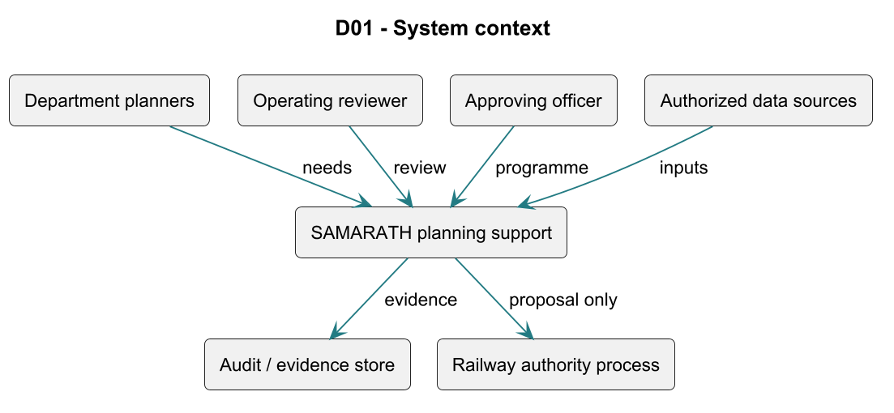

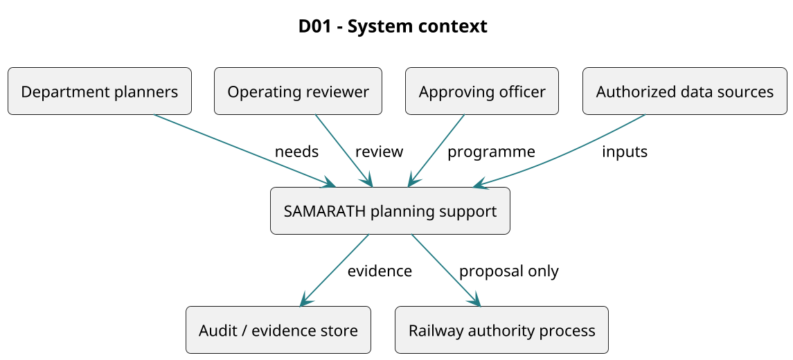
```plantuml
@startuml
skinparam dpi 180
!pragma layout smetana
skinparam backgroundColor white
skinparam shadowing false
skinparam defaultFontName Arial
skinparam defaultFontSize 12
skinparam ArrowColor #237B83
skinparam roundcorner 8
top to bottom direction
title D01 - System context
rectangle "Department planners" as n0
rectangle "Operating reviewer" as n1
rectangle "Approving officer" as n2
rectangle "SAMARATH planning support" as n3
rectangle "Authorized data sources" as n4
rectangle "Audit / evidence store" as n5
rectangle "Railway authority process" as n6
n0 --> n3 : needs
n1 --> n3 : review
n2 --> n3 : programme
n4 --> n3 : inputs
n3 --> n5 : evidence
n3 --> n6 : proposal only
@enduml
```

### D02. Core components

The checker independently interprets raw inputs. It does not import optimizer predicates.

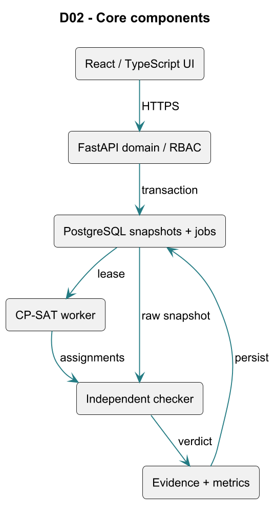

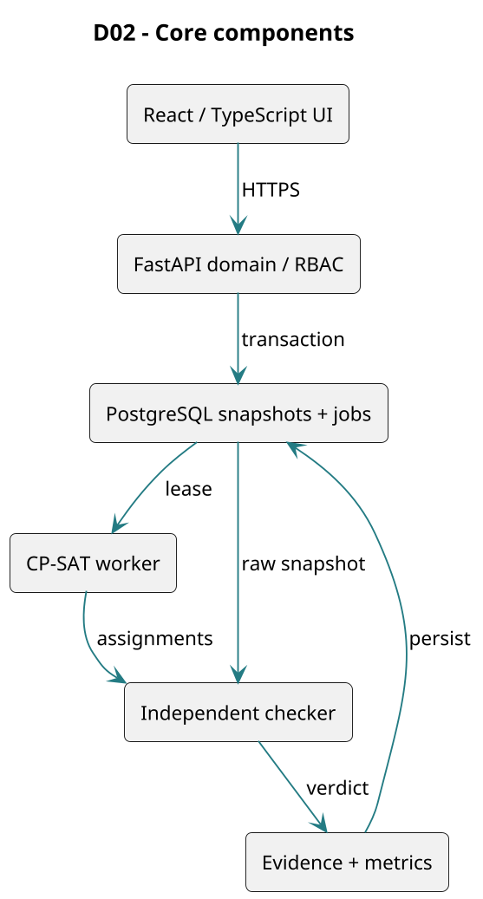
```plantuml
@startuml
skinparam dpi 180
!pragma layout smetana
skinparam backgroundColor white
skinparam shadowing false
skinparam defaultFontName Arial
skinparam defaultFontSize 12
skinparam ArrowColor #237B83
skinparam roundcorner 8
top to bottom direction
title D02 - Core components
rectangle "React / TypeScript UI" as n0
rectangle "FastAPI domain / RBAC" as n1
rectangle "PostgreSQL snapshots + jobs" as n2
rectangle "CP-SAT worker" as n3
rectangle "Independent checker" as n4
rectangle "Evidence + metrics" as n5
n0 --> n1 : HTTPS
n1 --> n2 : transaction
n2 --> n3 : lease
n2 --> n4 : raw snapshot
n3 --> n4 : assignments
n4 --> n5 : verdict
n5 --> n2 : persist
@enduml
```

### D03. Three input modes

Adapter choice changes input provenance and access controls. Planning logic is shared.

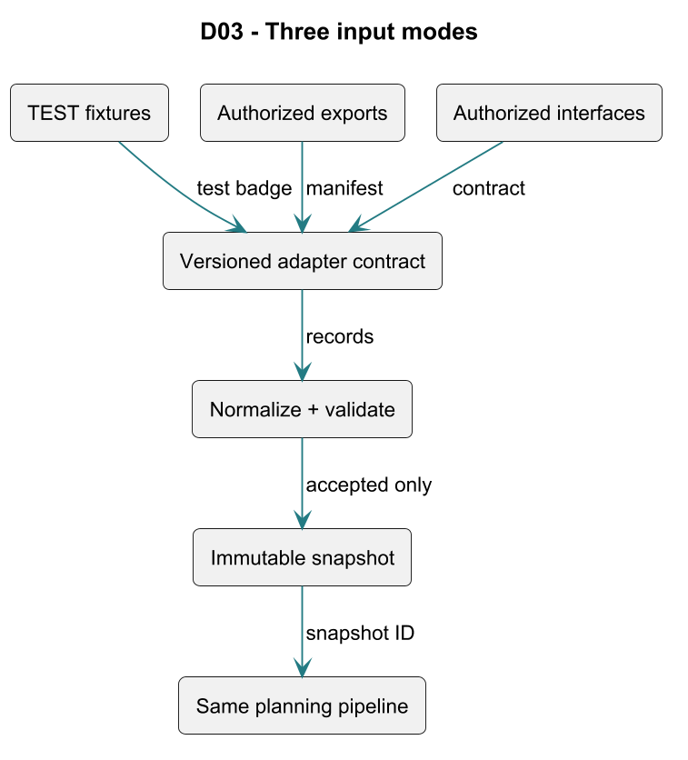

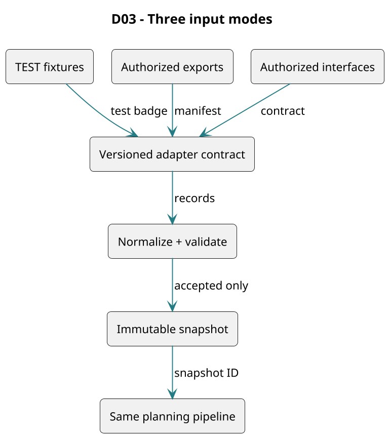
```plantuml
@startuml
skinparam dpi 180
!pragma layout smetana
skinparam backgroundColor white
skinparam shadowing false
skinparam defaultFontName Arial
skinparam defaultFontSize 12
skinparam ArrowColor #237B83
skinparam roundcorner 8
top to bottom direction
title D03 - Three input modes
rectangle "TEST fixtures" as n0
rectangle "Authorized exports" as n1
rectangle "Authorized interfaces" as n2
rectangle "Versioned adapter contract" as n3
rectangle "Normalize + validate" as n4
rectangle "Immutable snapshot" as n5
rectangle "Same planning pipeline" as n6
n0 --> n3 : test badge
n1 --> n3 : manifest
n2 --> n3 : contract
n3 --> n4 : records
n4 --> n5 : accepted only
n5 --> n6 : snapshot ID
@enduml
```

### D04. Login and scope

Server-derived roles and territory scope protect every request; browser-supplied role names are not authority.

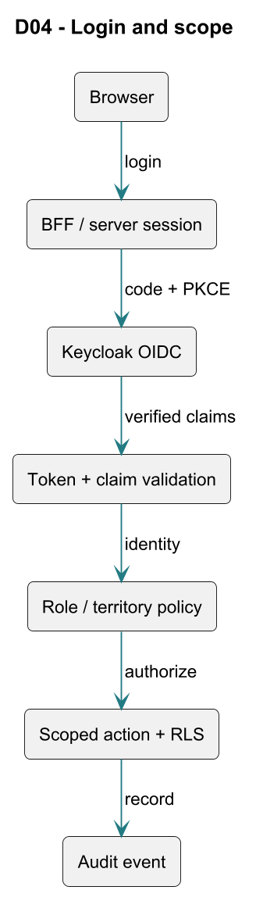

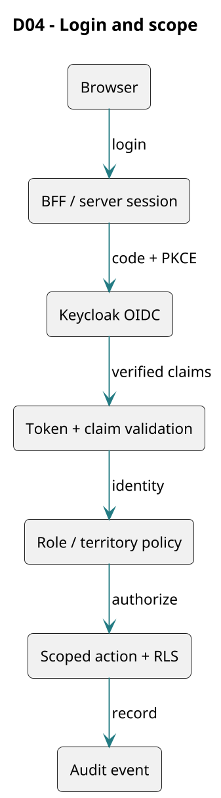
```plantuml
@startuml
skinparam dpi 180
!pragma layout smetana
skinparam backgroundColor white
skinparam shadowing false
skinparam defaultFontName Arial
skinparam defaultFontSize 12
skinparam ArrowColor #237B83
skinparam roundcorner 8
top to bottom direction
title D04 - Login and scope
rectangle "Browser" as n0
rectangle "BFF / server session" as n1
rectangle "Keycloak OIDC" as n2
rectangle "Token + claim validation" as n3
rectangle "Role / territory policy" as n4
rectangle "Scoped action + RLS" as n5
rectangle "Audit event" as n6
n0 --> n1 : login
n1 --> n2 : code + PKCE
n2 --> n3 : verified claims
n3 --> n4 : identity
n4 --> n5 : authorize
n5 --> n6 : record
@enduml
```

### D05. End-to-end planning workflow

Programme approval is a SAMARATH review state; operational authority remains external.

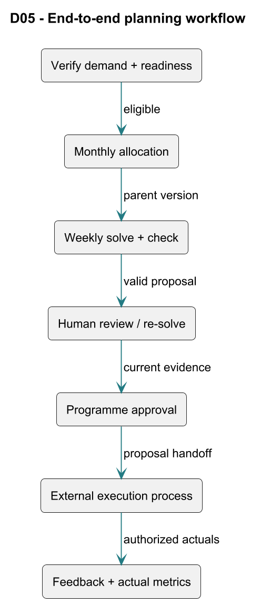

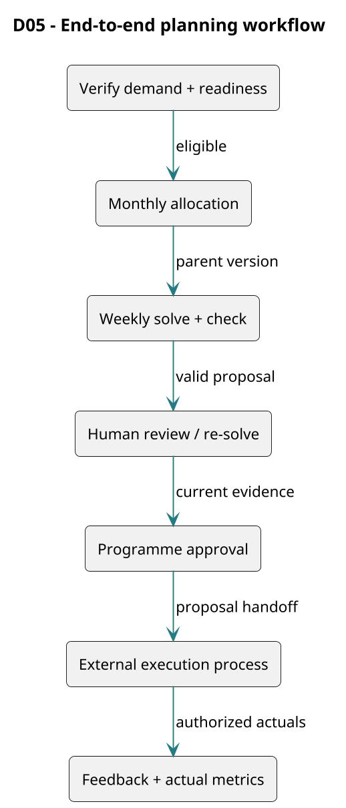
```plantuml
@startuml
skinparam dpi 180
!pragma layout smetana
skinparam backgroundColor white
skinparam shadowing false
skinparam defaultFontName Arial
skinparam defaultFontSize 12
skinparam ArrowColor #237B83
skinparam roundcorner 8
top to bottom direction
title D05 - End-to-end planning workflow
rectangle "Verify demand + readiness" as n0
rectangle "Monthly allocation" as n1
rectangle "Weekly solve + check" as n2
rectangle "Human review / re-solve" as n3
rectangle "Programme approval" as n4
rectangle "External execution process" as n5
rectangle "Feedback + actual metrics" as n6
n0 --> n1 : eligible
n1 --> n2 : parent version
n2 --> n3 : valid proposal
n3 --> n4 : current evidence
n4 --> n5 : proposal handoff
n5 --> n6 : authorized actuals
@enduml
```

### D06. Monthly-to-weekly consistency

Monthly capacity feasibility is provisional. Changes outside the parent allocation require an explicit amendment.

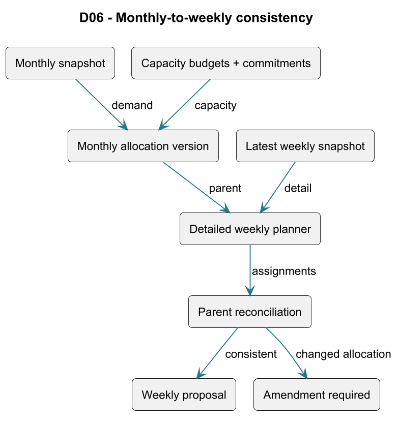

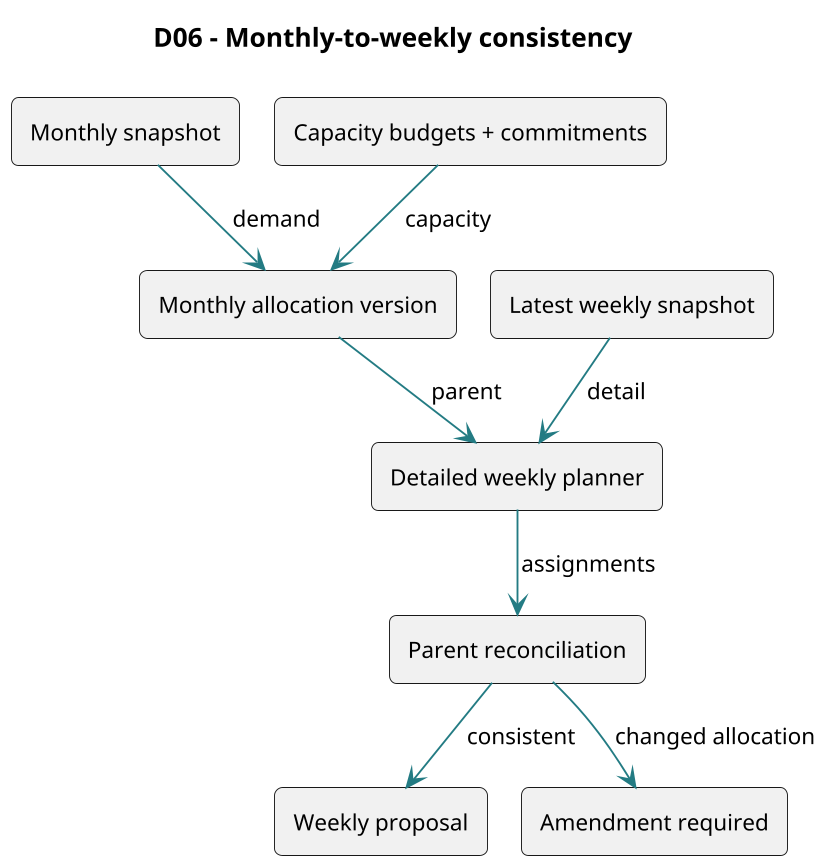
```plantuml
@startuml
skinparam dpi 180
!pragma layout smetana
skinparam backgroundColor white
skinparam shadowing false
skinparam defaultFontName Arial
skinparam defaultFontSize 12
skinparam ArrowColor #237B83
skinparam roundcorner 8
top to bottom direction
title D06 - Monthly-to-weekly consistency
rectangle "Monthly snapshot" as n0
rectangle "Capacity budgets + commitments" as n1
rectangle "Monthly allocation version" as n2
rectangle "Latest weekly snapshot" as n3
rectangle "Detailed weekly planner" as n4
rectangle "Parent reconciliation" as n5
rectangle "Weekly proposal" as n6
rectangle "Amendment required" as n7
n0 --> n2 : demand
n1 --> n2 : capacity
n2 --> n4 : parent
n3 --> n4 : detail
n4 --> n5 : assignments
n5 --> n6 : consistent
n5 --> n7 : changed allocation
@enduml
```

### D07. Ingestion and provenance

Invalid records remain quarantined and traceable; they cannot silently enter an eligible snapshot.

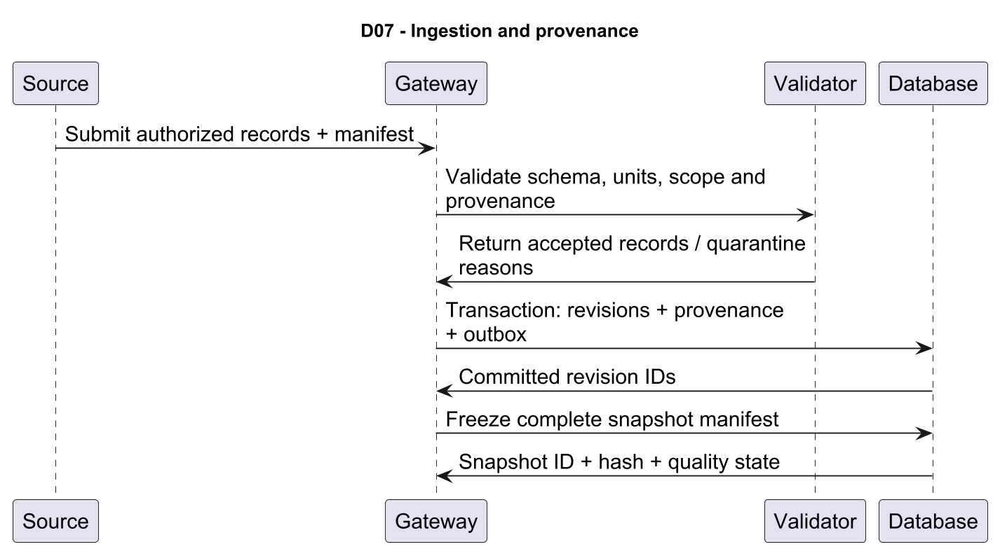

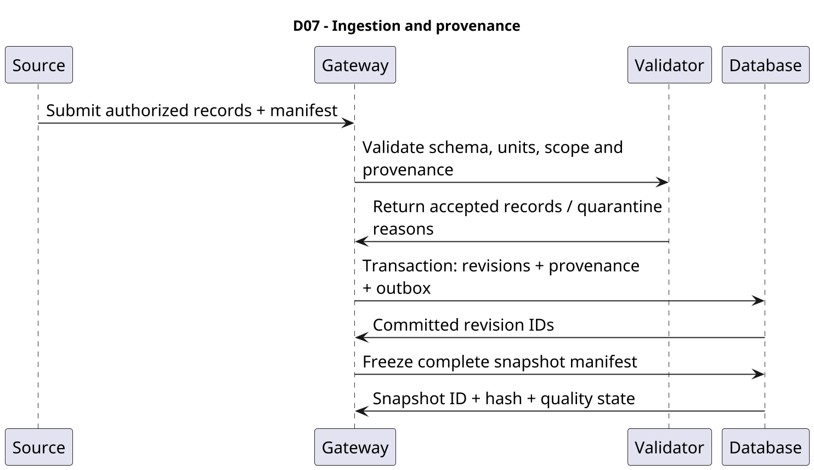
```plantuml
@startuml
skinparam dpi 180
skinparam backgroundColor white
skinparam shadowing false
skinparam defaultFontName Arial
skinparam defaultFontSize 16
title D07 - Ingestion and provenance
participant "Source" as p0
participant "Gateway" as p1
participant "Validator" as p2
participant "Database" as p3
p0 -> p1 : Submit authorized records + manifest
p1 -> p2 : Validate schema, units, scope and\nprovenance
p2 -> p1 : Return accepted records / quarantine\nreasons
p1 -> p3 : Transaction: revisions + provenance\n+ outbox
p3 -> p1 : Committed revision IDs
p1 -> p3 : Freeze complete snapshot manifest
p3 -> p1 : Snapshot ID + hash + quality state
@enduml
```

### D08. Solve and independently check

A solver incumbent is not publishable until the checker passes and currentness/approval gates also hold.

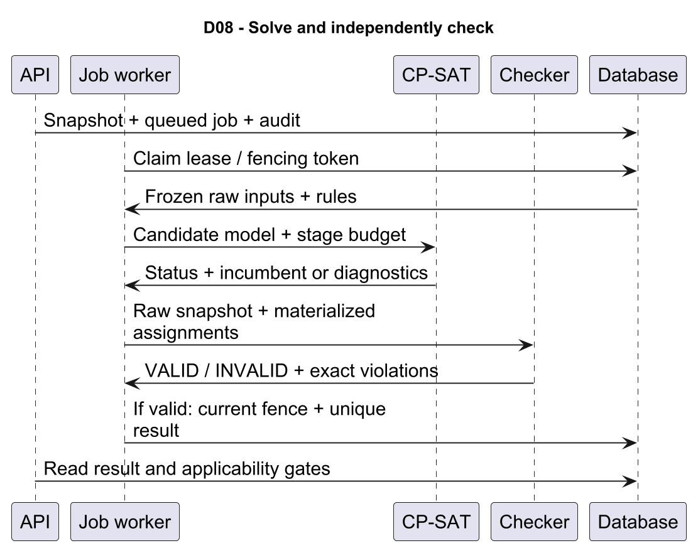

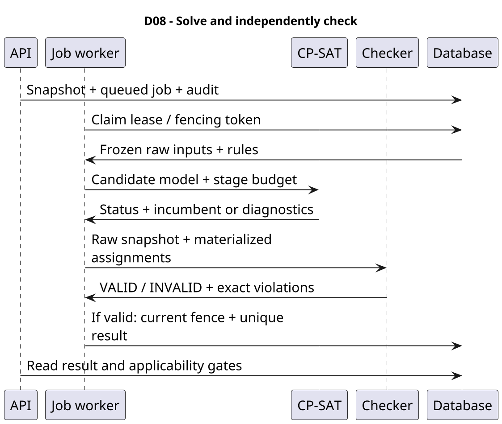
```plantuml
@startuml
skinparam dpi 180
skinparam backgroundColor white
skinparam shadowing false
skinparam defaultFontName Arial
skinparam defaultFontSize 16
title D08 - Solve and independently check
participant "API" as p0
participant "Job worker" as p1
participant "CP-SAT" as p2
participant "Checker" as p3
participant "Database" as p4
p0 -> p4 : Snapshot + queued job + audit
p1 -> p4 : Claim lease / fencing token
p4 -> p1 : Frozen raw inputs + rules
p1 -> p2 : Candidate model + stage budget
p2 -> p1 : Status + incumbent or diagnostics
p1 -> p3 : Raw snapshot + materialized\nassignments
p3 -> p1 : VALID / INVALID + exact violations
p1 -> p4 : If valid: current fence + unique\nresult
p0 -> p4 : Read result and applicability gates
@enduml
```

### D09. Evidence-aware compatibility

Missing evidence yields UNKNOWN. Pairwise permission is necessary but not sufficient for a complete package.

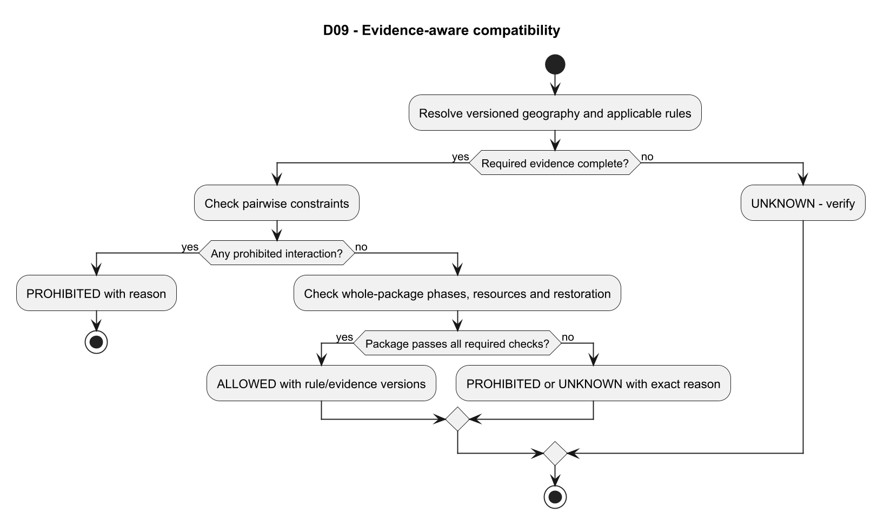

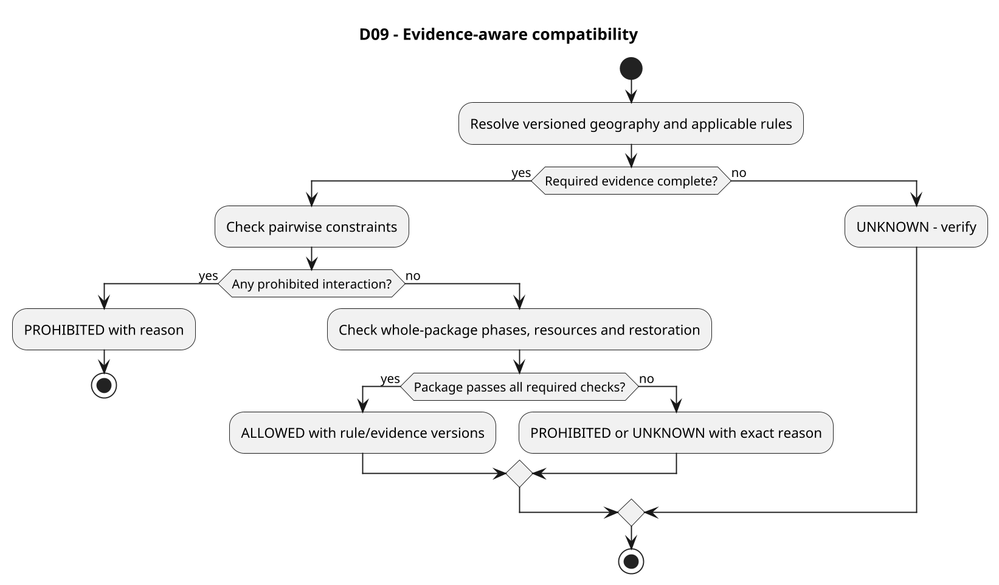
```plantuml
@startuml
skinparam dpi 180
title D09 - Evidence-aware compatibility
start
:Resolve versioned geography and applicable rules;
if (Required evidence complete?) then (yes)
 :Check pairwise constraints;
 if (Any prohibited interaction?) then (yes)
  :PROHIBITED with reason;
  stop
 else (no)
  :Check whole-package phases, resources and restoration;
  if (Package passes all required checks?) then (yes)
   :ALLOWED with rule/evidence versions;
  else (no)
   :PROHIBITED or UNKNOWN with exact reason;
  endif
 endif
else (no)
 :UNKNOWN - verify;
endif
stop
@enduml
```

### D10. Permitted repair

A repair changes inputs or proposes an authority request; it never relaxes protection or grants itself access.

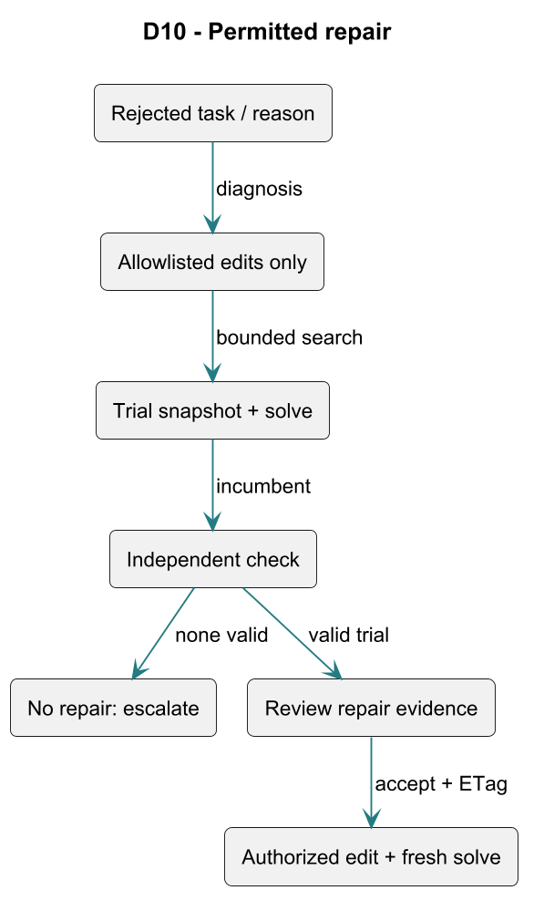

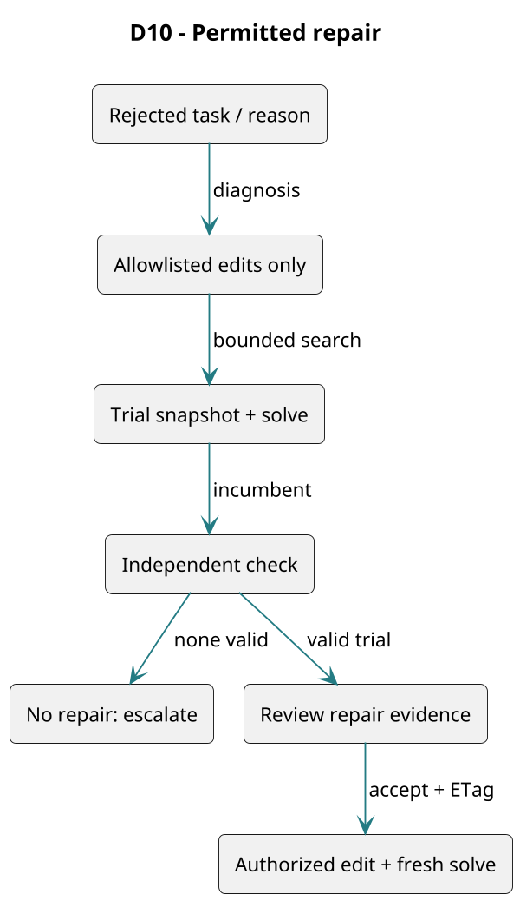
```plantuml
@startuml
skinparam dpi 180
!pragma layout smetana
skinparam backgroundColor white
skinparam shadowing false
skinparam defaultFontName Arial
skinparam defaultFontSize 12
skinparam ArrowColor #237B83
skinparam roundcorner 8
top to bottom direction
title D10 - Permitted repair
rectangle "Rejected task / reason" as n0
rectangle "Allowlisted edits only" as n1
rectangle "Trial snapshot + solve" as n2
rectangle "Independent check" as n3
rectangle "No repair: escalate" as n4
rectangle "Review repair evidence" as n5
rectangle "Authorized edit + fresh solve" as n6
n0 --> n1 : diagnosis
n1 --> n2 : bounded search
n2 --> n3 : incumbent
n3 --> n4 : none valid
n3 --> n5 : valid trial
n5 --> n6 : accept + ETag
@enduml
```

### D11. Stable replanning

History and operational commitments persist. A conflicting new event blocks applicability; it does not unlock work.

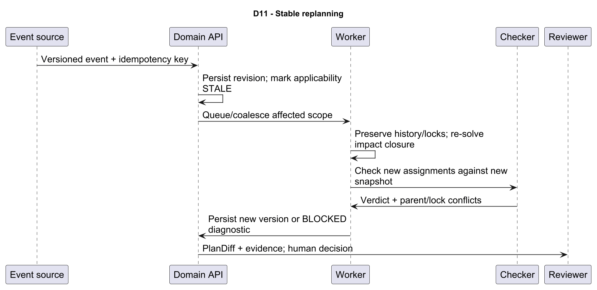

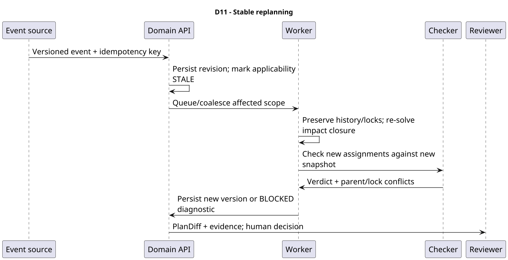
```plantuml
@startuml
skinparam dpi 180
skinparam backgroundColor white
skinparam shadowing false
skinparam defaultFontName Arial
skinparam defaultFontSize 16
title D11 - Stable replanning
participant "Event source" as p0
participant "Domain API" as p1
participant "Worker" as p2
participant "Checker" as p3
participant "Reviewer" as p4
p0 -> p1 : Versioned event + idempotency key
p1 -> p1 : Persist revision; mark applicability\nSTALE
p1 -> p2 : Queue/coalesce affected scope
p2 -> p2 : Preserve history/locks; re-solve\nimpact closure
p2 -> p3 : Check new assignments against new\nsnapshot
p3 -> p2 : Verdict + parent/lock conflicts
p2 -> p1 : Persist new version or BLOCKED\ndiagnostic
p1 -> p4 : PlanDiff + evidence; human decision
@enduml
```

### D12. Separate lifecycle state domains

Three separate internal state domains. Programme approval never advances the Railway authority mirror. Applicability is separate from immutable approval history; missing release observations retain reservations.

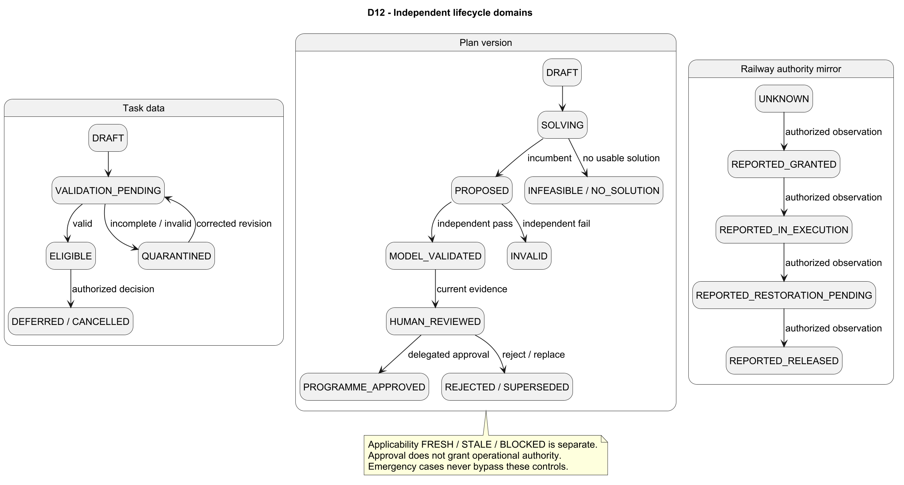

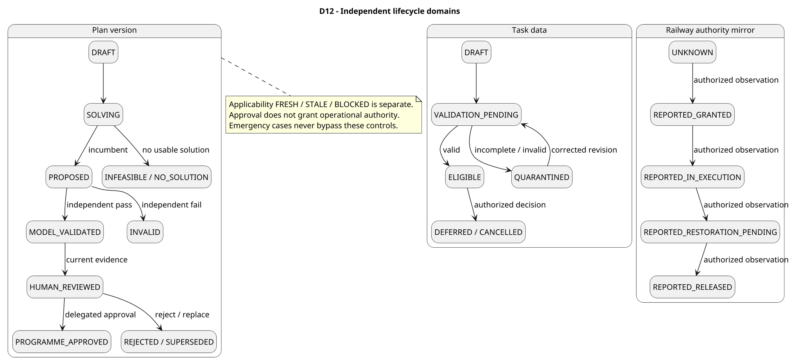
```plantuml
@startuml
skinparam dpi 180
!pragma layout smetana
skinparam backgroundColor white
skinparam shadowing false
skinparam defaultFontName Arial
skinparam defaultFontSize 14
hide empty description
title D12 - Independent lifecycle domains
state "Task data" as Task {
 state "DRAFT" as TD
 state "VALIDATION_PENDING" as TV
 state "ELIGIBLE" as TE
 state "QUARANTINED" as TQ
 state "DEFERRED / CANCELLED" as TX
 TD --> TV
 TV --> TE : valid
 TV --> TQ : incomplete / invalid
 TE --> TX : authorized decision
 TQ --> TV : corrected revision
}
state "Plan version" as Plan {
 state "DRAFT" as PD
 state "SOLVING" as PS
 state "PROPOSED" as PP
 state "MODEL_VALIDATED" as PV
 state "HUMAN_REVIEWED" as PR
 state "PROGRAMME_APPROVED" as PA
 state "INFEASIBLE / NO_SOLUTION" as PN
 state "INVALID" as PI
 state "REJECTED / SUPERSEDED" as PX
 PD --> PS
 PS --> PP : incumbent
 PS --> PN : no usable solution
 PP --> PV : independent pass
 PP --> PI : independent fail
 PV --> PR : current evidence
 PR --> PA : delegated approval
 PR --> PX : reject / replace
}
state "Railway authority mirror" as Authority {
 state "UNKNOWN" as AU
 state "REPORTED_GRANTED" as AG
 state "REPORTED_IN_EXECUTION" as AX
 state "REPORTED_RESTORATION_PENDING" as AT
 state "REPORTED_RELEASED" as AR
 AU --> AG : authorized observation
 AG --> AX : authorized observation
 AX --> AT : authorized observation
 AT --> AR : authorized observation
}
note bottom of Plan
 Applicability FRESH / STALE / BLOCKED is separate.
 Approval does not grant operational authority.
 Emergency cases never bypass these controls.
end note
@enduml
```

### D13. On-premises deployment

Development/demo uses Compose. Pilot redundancy and disaster recovery are acceptance work, not assumed properties.

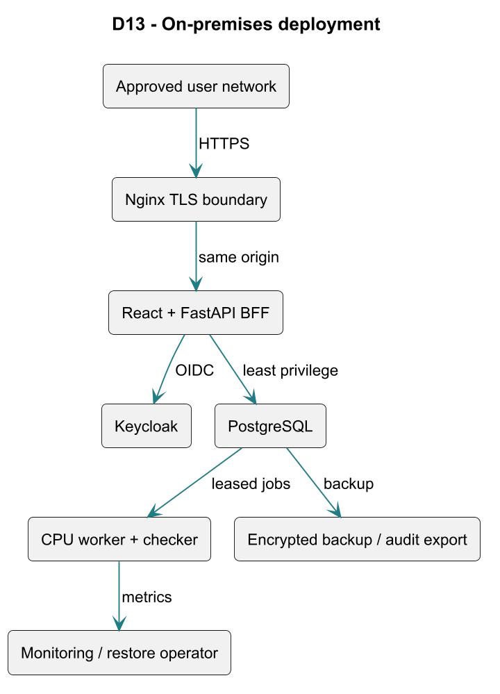

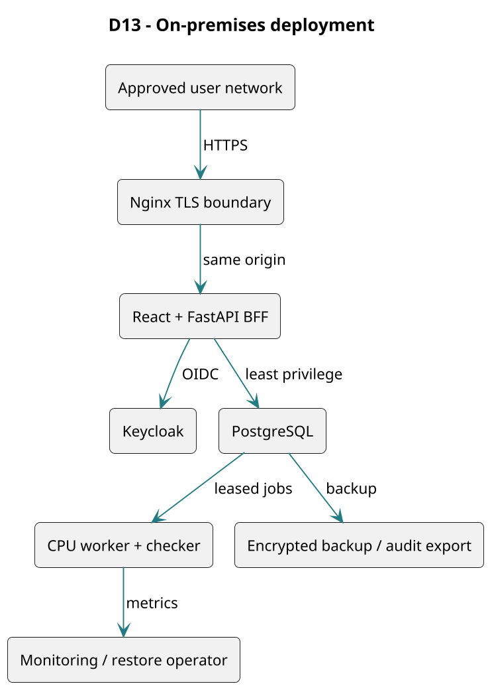
```plantuml
@startuml
skinparam dpi 180
!pragma layout smetana
skinparam backgroundColor white
skinparam shadowing false
skinparam defaultFontName Arial
skinparam defaultFontSize 12
skinparam ArrowColor #237B83
skinparam roundcorner 8
top to bottom direction
title D13 - On-premises deployment
rectangle "Approved user network" as n0
rectangle "Nginx TLS boundary" as n1
rectangle "React + FastAPI BFF" as n2
rectangle "Keycloak" as n3
rectangle "PostgreSQL" as n4
rectangle "CPU worker + checker" as n5
rectangle "Encrypted backup / audit export" as n6
rectangle "Monitoring / restore operator" as n7
n0 --> n1 : HTTPS
n1 --> n2 : same origin
n2 --> n3 : OIDC
n2 --> n4 : least privilege
n4 --> n5 : leased jobs
n4 --> n6 : backup
n5 --> n7 : metrics
@enduml
```

### D14. Relational model: planning spine

This view shows the main foreign-key spine. The full field catalogue and supporting resources/rules are in Section 13.

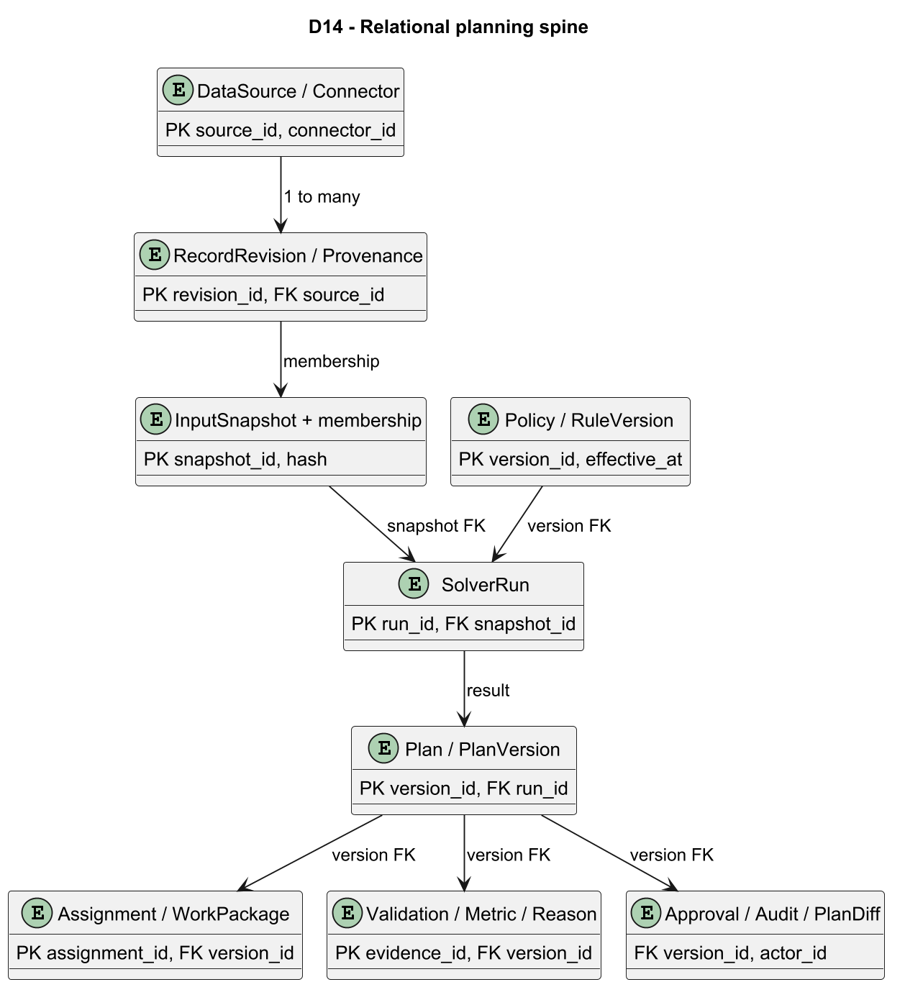

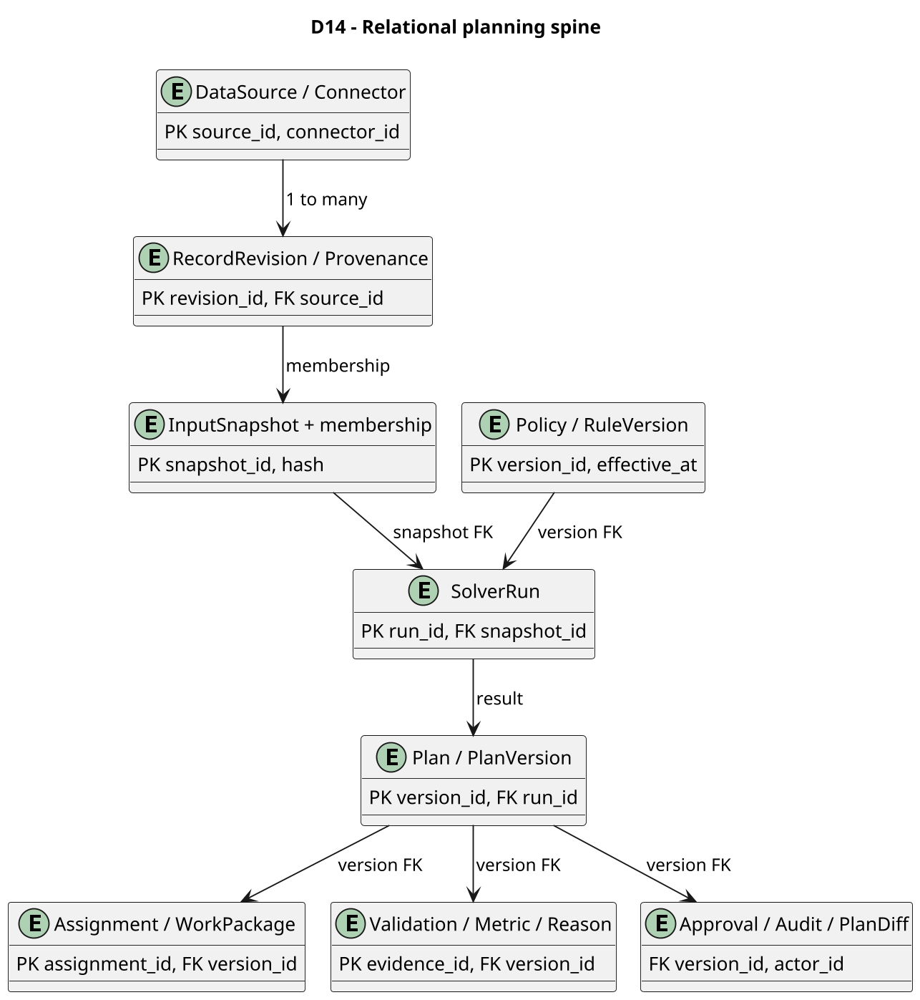
```plantuml
@startuml
skinparam dpi 180
!pragma layout smetana
title D14 - Relational planning spine
entity "DataSource / Connector" as n0 {
 PK source_id, connector_id
}
entity "RecordRevision / Provenance" as n1 {
 PK revision_id, FK source_id
}
entity "InputSnapshot + membership" as n2 {
 PK snapshot_id, hash
}
entity "Policy / RuleVersion" as n3 {
 PK version_id, effective_at
}
entity "SolverRun" as n4 {
 PK run_id, FK snapshot_id
}
entity "Plan / PlanVersion" as n5 {
 PK version_id, FK run_id
}
entity "Assignment / WorkPackage" as n6 {
 PK assignment_id, FK version_id
}
entity "Validation / Metric / Reason" as n7 {
 PK evidence_id, FK version_id
}
entity "Approval / Audit / PlanDiff" as n8 {
 FK version_id, actor_id
}
n0 --> n1 : 1 to many
n1 --> n2 : membership
n2 --> n4 : snapshot FK
n3 --> n4 : version FK
n4 --> n5 : result
n5 --> n6 : version FK
n5 --> n7 : version FK
n5 --> n8 : version FK
@enduml
```

### D15. Durable event and job processing

At-least-once delivery requires idempotency. A lease and fencing token prevent an obsolete worker from publishing.

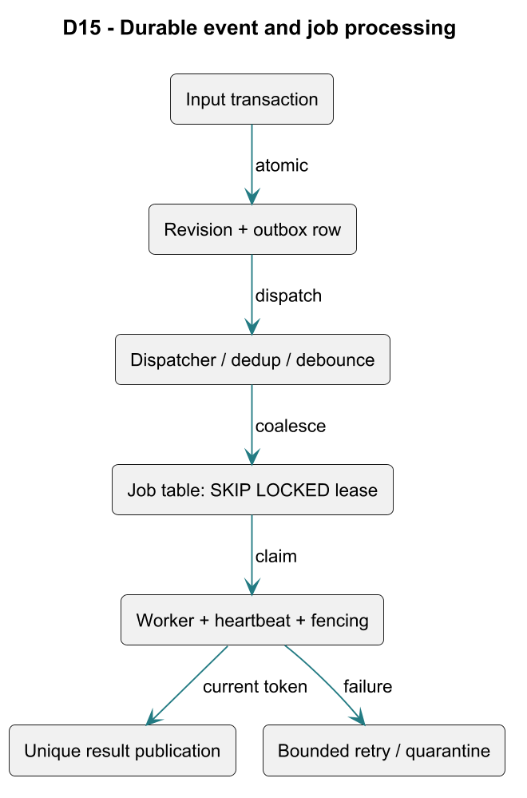

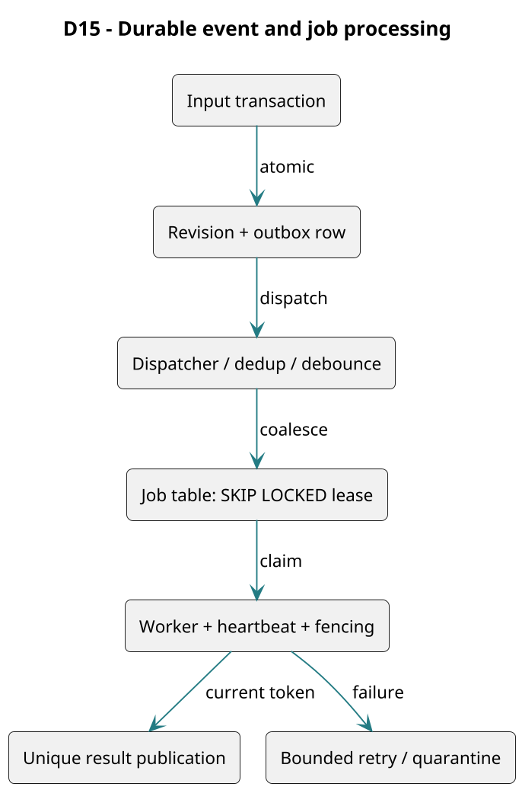
```plantuml
@startuml
skinparam dpi 180
!pragma layout smetana
skinparam backgroundColor white
skinparam shadowing false
skinparam defaultFontName Arial
skinparam defaultFontSize 12
skinparam ArrowColor #237B83
skinparam roundcorner 8
top to bottom direction
title D15 - Durable event and job processing
rectangle "Input transaction" as n0
rectangle "Revision + outbox row" as n1
rectangle "Dispatcher / dedup / debounce" as n2
rectangle "Job table: SKIP LOCKED lease" as n3
rectangle "Worker + heartbeat + fencing" as n4
rectangle "Unique result publication" as n5
rectangle "Bounded retry / quarantine" as n6
n0 --> n1 : atomic
n1 --> n2 : dispatch
n2 --> n3 : coalesce
n3 --> n4 : claim
n4 --> n5 : current token
n4 --> n6 : failure
@enduml
```

### D16. Trust and security boundaries

Domain authority, software administration and operational railway authority remain separate.

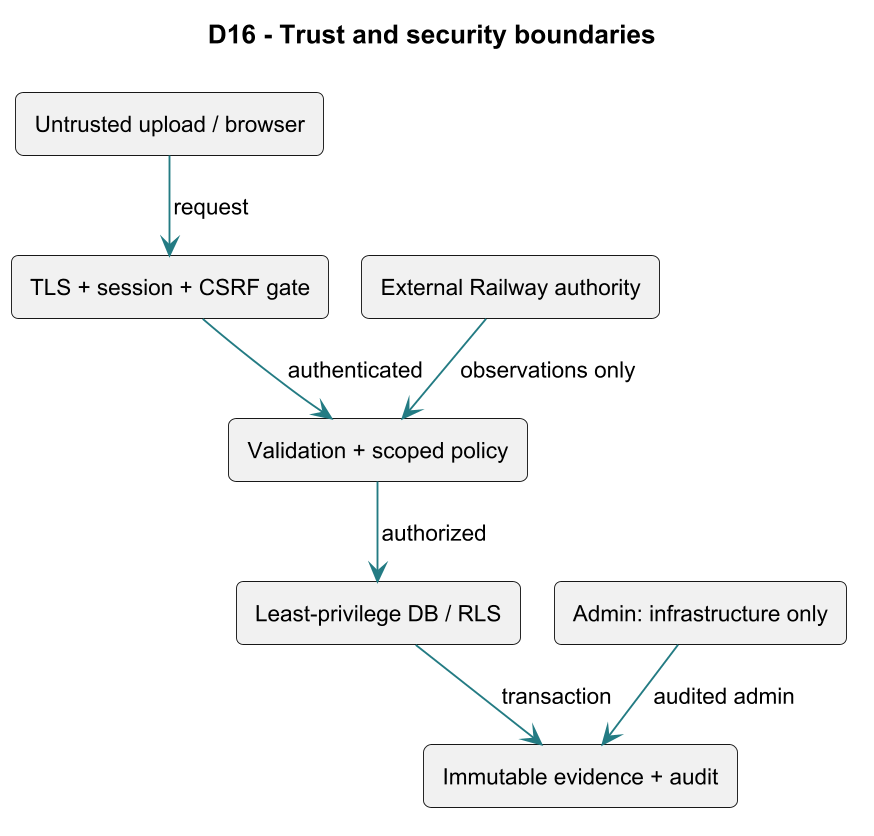

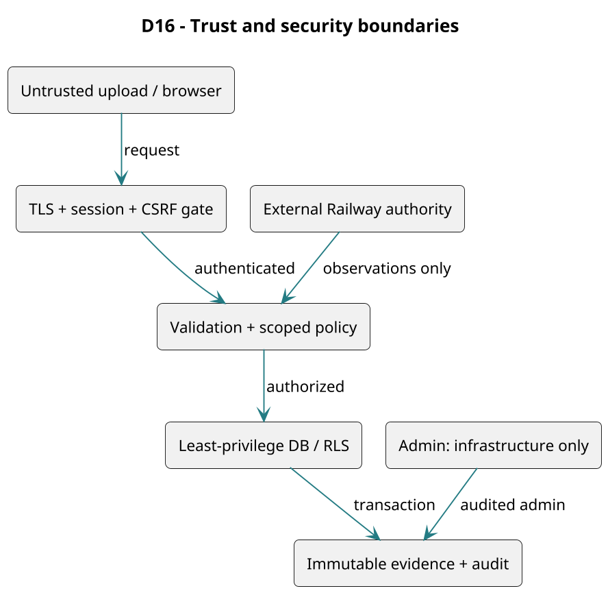
```plantuml
@startuml
skinparam dpi 180
!pragma layout smetana
skinparam backgroundColor white
skinparam shadowing false
skinparam defaultFontName Arial
skinparam defaultFontSize 12
skinparam ArrowColor #237B83
skinparam roundcorner 8
top to bottom direction
title D16 - Trust and security boundaries
rectangle "Untrusted upload / browser" as n0
rectangle "TLS + session + CSRF gate" as n1
rectangle "Validation + scoped policy" as n2
rectangle "Least-privilege DB / RLS" as n3
rectangle "Immutable evidence + audit" as n4
rectangle "Admin: infrastructure only" as n5
rectangle "External Railway authority" as n6
n0 --> n1 : request
n1 --> n2 : authenticated
n2 --> n3 : authorized
n3 --> n4 : transaction
n5 --> n4 : audited admin
n6 --> n2 : observations only
@enduml
```

### D17. Capability evolution

Progress is gated by evidence. ML and multi-division coordination are separate optional workstreams after the core is accepted.

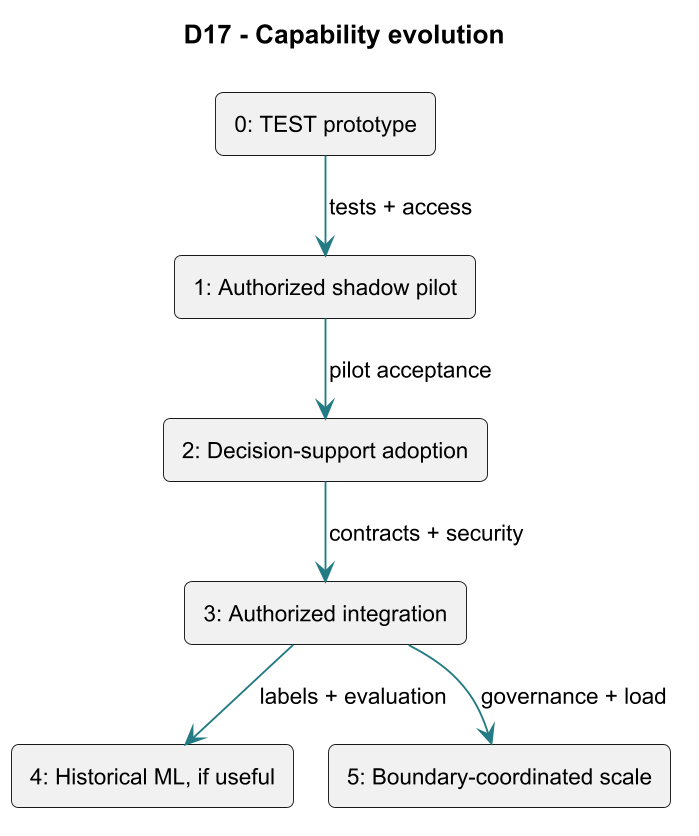

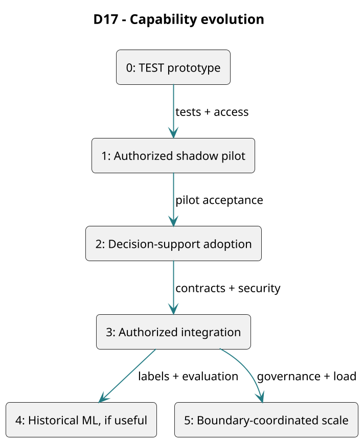
```plantuml
@startuml
skinparam dpi 180
!pragma layout smetana
skinparam backgroundColor white
skinparam shadowing false
skinparam defaultFontName Arial
skinparam defaultFontSize 12
skinparam ArrowColor #237B83
skinparam roundcorner 8
top to bottom direction
title D17 - Capability evolution
rectangle "0: TEST prototype" as n0
rectangle "1: Authorized shadow pilot" as n1
rectangle "2: Decision-support adoption" as n2
rectangle "3: Authorized integration" as n3
rectangle "4: Historical ML, if useful" as n4
rectangle "5: Boundary-coordinated scale" as n5
n0 --> n1 : tests + access
n1 --> n2 : pilot acceptance
n2 --> n3 : contracts + security
n3 --> n4 : labels + evaluation
n3 --> n5 : governance + load
@enduml
```

### D18. Execution feedback loop

Actuals inform estimates only with traceable corrections. A release does not automatically prove all planned work is complete.

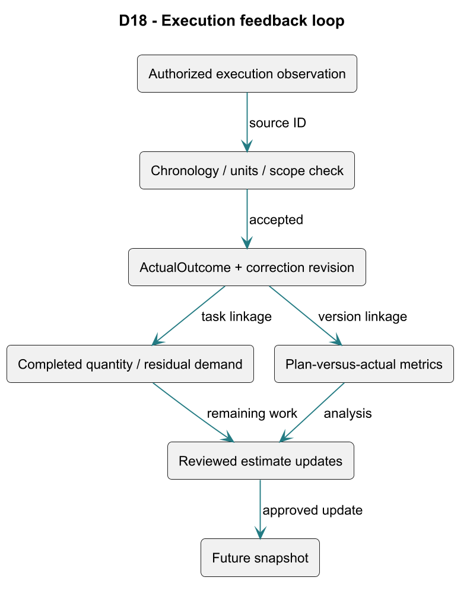

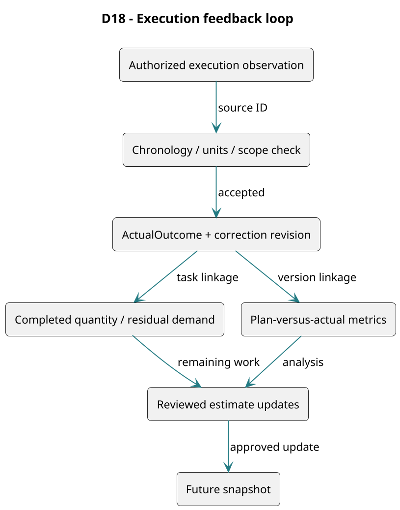
```plantuml
@startuml
skinparam dpi 180
!pragma layout smetana
skinparam backgroundColor white
skinparam shadowing false
skinparam defaultFontName Arial
skinparam defaultFontSize 12
skinparam ArrowColor #237B83
skinparam roundcorner 8
top to bottom direction
title D18 - Execution feedback loop
rectangle "Authorized execution observation" as n0
rectangle "Chronology / units / scope check" as n1
rectangle "ActualOutcome + correction revision" as n2
rectangle "Completed quantity / residual demand" as n3
rectangle "Plan-versus-actual metrics" as n4
rectangle "Reviewed estimate updates" as n5
rectangle "Future snapshot" as n6
n0 --> n1 : source ID
n1 --> n2 : accepted
n2 --> n3 : task linkage
n2 --> n4 : version linkage
n3 --> n5 : remaining work
n4 --> n5 : analysis
n5 --> n6 : approved update
@enduml
```

### D19. Cross-domain geography

Map all domains onto versioned occupation resources. Coincident station names alone do not establish compatibility.

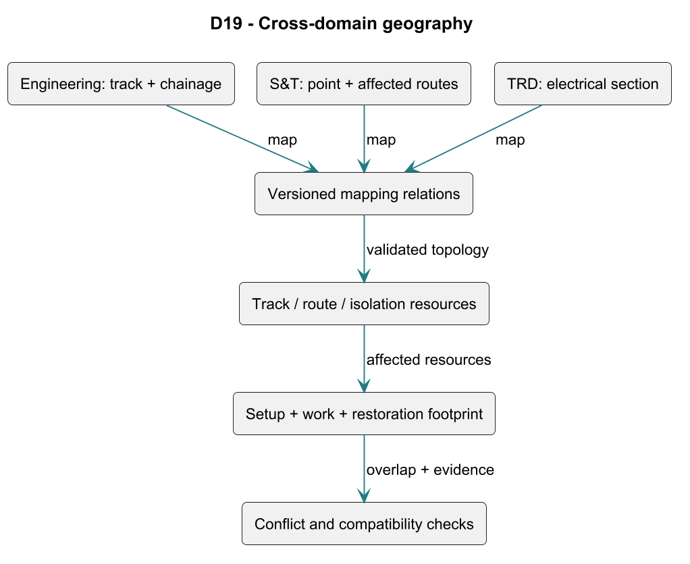

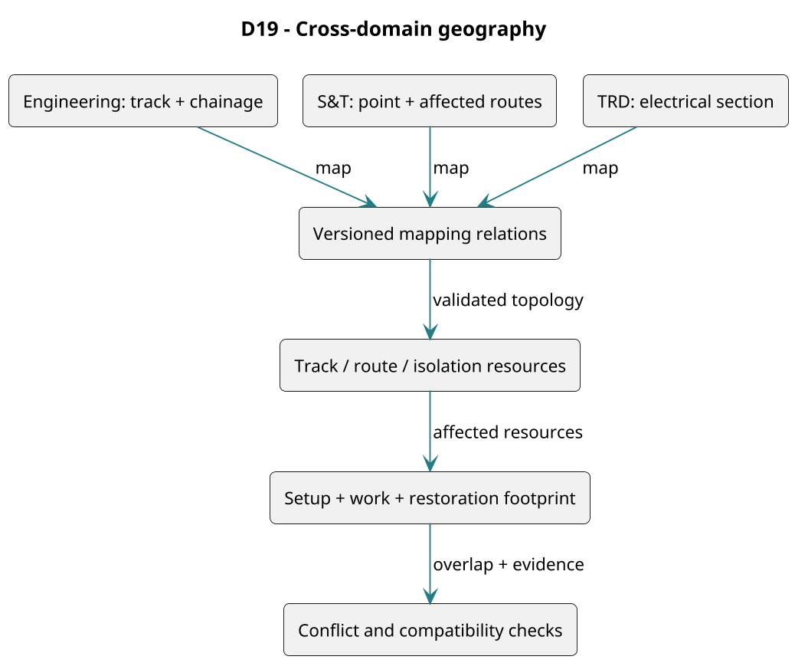
```plantuml
@startuml
skinparam dpi 180
!pragma layout smetana
skinparam backgroundColor white
skinparam shadowing false
skinparam defaultFontName Arial
skinparam defaultFontSize 12
skinparam ArrowColor #237B83
skinparam roundcorner 8
top to bottom direction
title D19 - Cross-domain geography
rectangle "Engineering: track + chainage" as n0
rectangle "S&T: point + affected routes" as n1
rectangle "TRD: electrical section" as n2
rectangle "Versioned mapping relations" as n3
rectangle "Track / route / isolation resources" as n4
rectangle "Setup + work + restoration footprint" as n5
rectangle "Conflict and compatibility checks" as n6
n0 --> n3 : map
n1 --> n3 : map
n2 --> n3 : map
n3 --> n4 : validated topology
n4 --> n5 : affected resources
n5 --> n6 : overlap + evidence
@enduml
```

### D20. Example package execution DAG

Illustrative TEST recipe only: 10 + max(40,25) + 15 + 10 = 75 minutes, permitted only with validated concurrency and separate qualified resources. With one shared exclusive crew and sequential work, the same phases require 100 minutes. These values are not Railway rules.

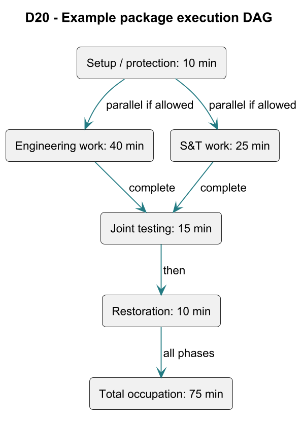

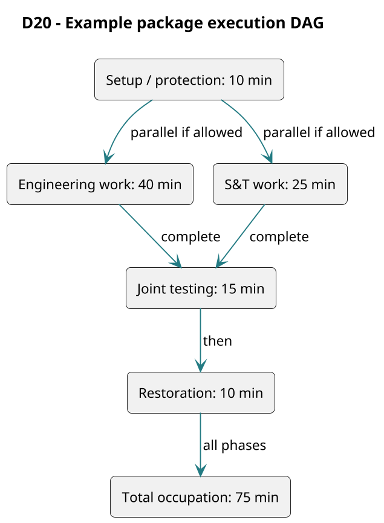
```plantuml
@startuml
skinparam dpi 180
!pragma layout smetana
skinparam backgroundColor white
skinparam shadowing false
skinparam defaultFontName Arial
skinparam defaultFontSize 12
skinparam ArrowColor #237B83
skinparam roundcorner 8
top to bottom direction
title D20 - Example package execution DAG
rectangle "Setup / protection: 10 min" as n0
rectangle "Engineering work: 40 min" as n1
rectangle "S&T work: 25 min" as n2
rectangle "Joint testing: 15 min" as n3
rectangle "Restoration: 10 min" as n4
rectangle "Total occupation: 75 min" as n5
n0 --> n1 : parallel if allowed
n0 --> n2 : parallel if allowed
n1 --> n3 : complete
n2 --> n3 : complete
n3 --> n4 : then
n4 --> n5 : all phases
@enduml
```
